# 	day01

> 今日要点：
>
> 进阶-----总结做好,下次找得到,回忆的起来,配得上百度
>
> 1. 了解什么是JS框架和库
> 2. 了解jQuery背景和优点
> 3. 掌握jQuery引入方式和入口函数的使用
> 4. 掌握jQuery事件绑定语法
> 5. 了解jQuery中的动画函数的使用
> 6. 掌握jQuery中文本内容的访问和写入
> 7. 掌握css和标签属性的修改方法
> 8. 掌握jQuery常用选择器及方法

## 一、什么是JS框架和库

JS框架和库都是将原本JS的部分功能集合成一个JS文件，并且在使用的时候，引入这个文件，便可以使用这里面的功能。

库和框架区别：

- 框架（framework）通常是**强制执行解决方案**的一种方式，就像一个模具，需要你把所需的原材料放在模具里面，然后成品就会出来，由于模具已经建好，所以原材料不能乱加，人家要什么你就给什么，这时控制权在模具，框架就像一门语言，有自己的世界。
- 库（library）的形式就不同，控制权在用户手中，想实现什么功能就实现什么功能，库只是帮你**封装了大量实用的函数**，帮助你实现自己的目的。

> 举例说明：
>
> 假如我们要买一台电脑。框架为我们提供了已经装好的电脑，我们只要买回来就能用，但你必须把整个电脑买回来。这样用户自然轻松许多，但你想自定义某个部件将需要修改这个框架。
>
> 而库就如自己组装的电脑。库为我们提供了很多部件，我们需要自己组装，如果某个部件库未提供，我们也可以自己做。库的使用非常灵活，但没有框架方便。


## 二、什么是jQuery

jQuery也是JS框架中的一种，它是2006年由一个17岁的美国人——约翰·莱西格创作出来的，可以说这是曾经世界上流行最为广泛的JS框架，没有之一，统治了JS十多年时间。


但是，现在jQuery并没有自称自己是个框架——

jQuery is a fast, small, and feature-rich JavaScript **library**——出自[jQuery官网](https://jquery.com/)

[API中文文档](https://jquery.cuishifeng.cn/index.html)

### 2.1、jQuery优点

- 轻量级
- 免费开源
- 完善的文档
- 丰富的插件支持
- 完善的Ajax功能
- 不会污染顶级变量
- 强大的选择器功能
- 出色的DOM操作封装
- 出色的浏览器兼容性
- 可靠的事件处理机制
- 隐式迭代和链式编程操作

**主旨口号：write less，do more（写的更少,干的更多，以更少的代码,实现更多的功能)**

### 2.2、jQuery的基本功能

1. **访问和操作DOM元素**
   既减少了代码的编写,又大大提高 了用户对页面的体验度。
2. **控制页面的CSS样式**
   更方便快捷的来操作CSS样式，且jQuery 已经完成了浏览器兼容性处理。
3. **完善的Ajax网络请求**
   使用AJAX可以极大提高用户体验和程序性能，jQuery框架中提供了专门处理网络请求的AJAX组件，使用jQuery中提供的方法来实现AJAX网络请求。
4. **页面标签事件处理**
   让表现层与功能开发分离
5. **整套的动画特效实现**
   可以满足开发中常见的动画效果实现，而且使用简单方便。
6. **好用的工具方法和强大的插件支持**
   利用插件机制程序员可以方便的对原有的框架和功能进行扩展。这些插件的使用,极大丰富了页的展示效果

## 三、第一个jQuery程序

### 3.1、引入方式

1. 引入jquery-3.5.1.min.js文件，通过script标签的src属性引入；
2. 建议在body的尾部引入，效率更高；
3. 注意：不要在引入文件的那个script标签之间书写代码！
4. 版本问题：
   1. 要做IE兼容性处理，建议引入1.0版本
   2. 涉及安全性问题，需要3.0以上

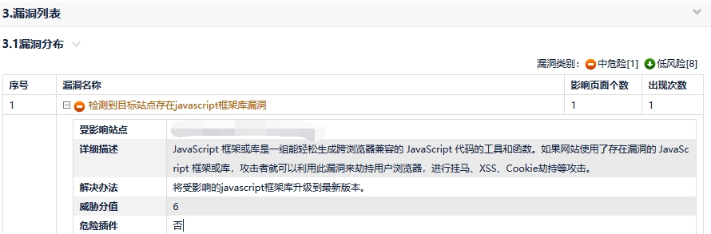

### 3.2、入口函数

JQ的入口函数相当于原生JS的window.onload事件。

```js
// 原生JS写法：
window.onload = function(){...}
  
// jQuery写法一：
jQuery(document).ready(function(){...})

console.log(jQuery===$);//说明$就是jQuery对象的简写
                                  
// jQuery写法二：
$(document).ready(function(){...})

// jQuery写法三：
$().ready(function(){...})

// jQuery写法四*重点*：
$(function(){...})
```

## 四、常用方法

### 4.1、事件绑定

语法：

```js
$(selector).事件(function(){...});
$(selector).on('事件', function(){...});
```

代码举例：

```js
// 原生的事件绑定
var btns = document.getElementsByTagName('button');

for(var i=0;i<btns.length;i++){
    btns[i].onclick=function(){
     	console.log(this);
    }
}

// onclick事件在JQ里可以直接写成click
$('button').click(function(){
    console.log(this);
})

// 没有封装的事件需要用on
$('body').on('touchstart', function () {
    $('p').css({'background': '#f00'});
    console.log("用户手指触摸到屏幕...");
});
```

### 4.2、显示、隐藏与切换

语法：

```js
$(selector).show(time); // 显示， time表示动画时长，单位为毫秒，下同
$(selector).hide(time); // 隐藏
$(selector).toggle(time); // 切换
//注意：凡是函数都要加 括号，函数就是所谓的方法，方法就是函数！
```

代码举例：

```js
 // eq(索引)就是获取元素列表对应索引的某个元素——是一个JQ对象
// 点击第1个按钮，让显示的元素隐藏
$('button:eq(0)').click(function(){
    // 参数 - 动画过渡时间(500)
    $('div').hide(500);
})

// 点击第2个按钮，让隐藏的元素显示
$('button:eq(1)').click(function(){
    $('div').show();
})

// 点击第3个按钮，切换元素的隐藏显示
$('button:eq(2)').click(function(){
    $('div').stop().toggle(300);//动画阻断
})
```

## 五、访问html内容和访问文本内容

### 5.1、JQ中访问和修改文本

语法：

```js
$(selector).html();	 // 获取与修改选择器中的html内容
$(selector).text();	 // 获取与修改选择器中的文本内容
```

代码举例：

```js
$('div').text('我是div标签');   // x
$('div').html('<p>我是p标签</p>');   // 解析代码段
```

### 5.2、jQuery对象和DOM对象相互转换

使用jQuery（$）获取的页面元素叫做JQ对象

而原生JS中使用document获取的页面元素称为JS对象（DOM对象）

**不同对象之间是不能使用对方的方法的**。也就是说JS的对象只能JS调用，如果JQ想要用的话，就必须进行对象转换。比如：this<------>$(this)

```js
$("div").click(function(){
	$(this).html("文本内容")
})
```

**JS转JQ对象：**

```js
// 使用$()包裹起来就可以用转成成JQ对象
document.getElementsByTagName(element)    
==>   
$( document.getElementsByTagName(element) )
```

**JQ转JS对象：**

```js
// 方法一：
$(element).get(0)  ==> document.getElementsByTagName(element)
// 方法二：
$(element)[0]  ==> document.getElementsByTagName(element)
```

## 六、css样式修改

语法：

```
$(selector).css()  
```

css本身也是一个函数，其中的格式有两种：

```js
第一种为单属性修改：
$(selector).css('key', 'value');    //只能修改一个属性和一个属性值

第二种为多属性修改：
$(selector).css({
  'key': 'value',
  'key': 'value'
   ....
})                      //可以多属性修改，理论上可以修改无限多个属性
```

**拓展：**

访问某个元素的css属性，可以直接这么写：$(selector).css(k);

举例：

```js
console.log( $('div').css('width') );     //这段代码可以获取div的宽度
```

## 七、标签属性的修改

### 7.1、修改属性的两个方法

src、href、class、style、actin等都属于标签属性，标签属性的修改不包括在css属性修改的范围之内。它的修改方法是：

```js
$(element).attr(“k”,”v”);
$(element).prop(“k”,”v”);
```

**书写格式与css属性修改相同。**

代码举例：

```html
<script src="./jquery-3.5.1.min.js"></script>
<script>
$(function(){	
	$("button").click(function(){	
    // $('a').attr('href', 'http://baidu.cn').attr('target', '_blank');
		$("a").prop({
			"href":"http://baidu.com",
			"target":"_self"
		});
	})
})
</script>

<body>
<button>篡改跳转链接</button>
<div>
    <a href="http://wolfcode.cn" target="_blank">跳转到官网</a>
</div>
</body>
```

### 7.2、prop和attr的区别

- 对于HTML元素本身就带有的固有属性，在处理时，使用prop方法。
- 对于HTML元素我们自己自定义的DOM属性，在处理时，使用attr方法。

```js
<input id="chk1" type="checkbox" />
<input id="chk2" type="checkbox" checked="checked" />
```

像checkbox，radio和select这样的元素，选中属性对应“checked”和“selected”，这些也属于固有属性，因此需要使用prop方法去操作才能获得正确的结果。

```js
console.log($("#chk1").prop("checked"));//false
console.log($("#chk2").prop("checked"));//true
```

如果上面使用attr方法，则会出现：

```js
console.log($("#chk1").attr("checked"));//undefined
console.log($("#chk2").attr("checked"));//"checked"
```

尤其的在设置的时候prop的强大就体现出来了

```js
// $("#chk2").attr("checked",undefined);
$("#chk2").prop("checked",false);
```

## 八、jQuery常用选择器

### 8.1、基础选择器

| 基本选择器       | 语法         | 功能                     |
| ---------------- | ------------ | ------------------------ |
| ID选择器         | $('#ID')     | 找到匹配指定ID的元素     |
| 元素(标签)选择器 | $('element') | 找到指定的元素           |
| class选择器      | $('.class')  | 找到匹配指定class的元素  |
| 通配符选择器     | $('*')       | 匹配所有元素             |
| 并集(组合)选择器 | $('sel,sel') | 多个选择器匹配的元素合并 |

| 层级选择器     | 语法               | 功能                       |
| -------------- | ------------------ | -------------------------- |
| 后代选择器     | $('parent  child') | 当前元素的所有后代元素     |
| 直接后代选择器 | $('parent>child')  | 当前元素所有的子元素       |
| 下一个兄弟     | $('prev+next')     | 当前元素的下一个元素       |
| 后面所有兄弟   | $('prev~siblings') | 当前元素后面的所有兄弟元素 |

提供可练习的html代码：

```html
<button>选择所有段落标签</button>
<button>选择class为left的标签</button>
<button>选择id为box的标签</button>
<button>选择所有不分类型标签</button>
<button>选择ul里面的li标签</button>
<button>选择body下的第一级所有标签并添加边框</button>
<button>选择p后的一个div</button>
<button>选择p后的所有div</button>
<p>段落标签</p>
<p>段落标签</p>
<p>段落标签</p>
<div class="left">类选择器</div>
<div class="left">类选择器</div>
<div id="box">id选择器</div>
<ul>
	<li>列表项</li>
	<li>列表项</li>
	<li>列表项</li>
</ul>
<ol>
	<li>列表项</li>
	<li>列表项</li>
	<li>列表项</li>
</ol>
```

### 8.2、筛选选择器

| 基本筛选选择器       | 语法                               |
| -------------------- | ---------------------------------- |
| 获取第一个元素       | $('ele:first')                     |
| 获取最后一个元素     | $('ele:last')                      |
| 获取指定索引的元素   | $('ele:eq(index)')   方法eq(index) |
| 获取所有元素除某个   | $('ele:not(selector)')             |
| 获取索引为偶数的元素 | $('ele:even')                      |
| 获取索引为奇数的元素 | $('ele:odd')                       |
| 获取大于该索引元素   | $('ele:gt(index)')                 |
| 获取小于于该索引元素 | $('ele:lt(index)')                 |
| 获取所有标题类型元素 | $('ele:header')                    |

提供可练习的html代码：

```html
<button>选择第一个li</button>
<button>选择最后一个li</button>
<button>选择所有li排除最后一个</button>
<button>选择所有li排除第二个</button>
<button>选择所有索引值为偶数个li</button>
<button>选择所有索引值为奇数个li</button>
<button>选择大于第5个的li</button>
<button>选择小于第5个的li</button>
<button>选择等于第5个的li</button>
<button>选择所有标题标签</button>
<ul>
	<li>这是一个li</li>
	<li>这是一个li</li>
	<li>这是一个li</li>
	<li>这是一个li</li>
	<li>这是一个li</li>
	<li>这是一个li</li>
	<li>这是一个li</li>
	<li>这是一个li</li>
	<li>这是一个li</li>
	<li>这是一个li</li>
</ul>
<h1>标题1标签</h1>
<h2>标题2标签</h2>
<h3>标题3标签</h3>
```

### 8.3、级别选择器相关方法

#### 8.3.1、parent方法

`$(selector).parent()`  表示选中所有匹配元素的唯一父元素。

##### 练习（关闭悬浮广告）

提供html与css代码：

```html
<!doctype html>
<html>
<head>
    <meta charset="utf-8">
    <meta name="viewport" content="width=device-width, initial-scale=1.0">
    <title>关闭悬浮广告</title>
    <style>
        div {
            width: 150px;
            height: 300px;
            border: 1px solid #000;
            background: #ccc;
            position: fixed;
            top: 150px;
        }

        .left {
            left: 0;
        }

        .right {
            right: 0;
        }

        .left button {
            float: right;
        }

        .right button {
            float: left;
        }
    </style>
</head>
<body>
    <div class="left">左边的广告<button>×</button></div>
    <div class="right">右边的广告<button>×</button></div>
    <p>段落</p>
  	<!-- ...这里是100个p标签 -->
    <p>段落</p>
</body>
</html>
```

《关闭悬浮广告》解决方案：

```js
// 原生JS方法：
// 选中所有button
var oBtns = document.getElementsByTagName('button');
for(var i=0;i<oBtns.length;i++){
    oBtns[i].onclick = function(){
        // 找到父级，把父级display=none
        // console.log( this.parentNode );
        this.parentNode.style.display = "none";
    }
}

// JQ方法：
$('button').click(function(){
    // 选择这个按钮的父级 - 这个$(this)     父级.parent()
    $(this).parent().hide();
})
```

#### 8.3.2、 siblings方法

`$(selector).siblings()`  表示选中某个元素同级的元素，括号内有写元素，表示选中同级的某个元素，如果没有书写，则表示选中同级的所有元素！

##### 练习（排他思想）

提供html与css代码：

```html
<!DOCTYPE html>
<html lang="en">
<head>
    <meta charset="UTF-8">
    <meta name="viewport" content="width=device-width, initial-scale=1.0">
    <title>排他思想</title>
    <style>
        button{background: none;}
    </style>
</head>
<body>
    <button>第1个按钮</button>
    <button>第2个按钮</button>
    <button>第3个按钮</button>
    <button>第4个按钮</button>
    <button>第5个按钮</button>
    <button>第6个按钮</button>
</body>
</html>
```

《排他思想》解决方案：

```js
// 原生JS方法
var btns = document.getElementsByTagName('button');
for(var i=0;i<btns.length;i++){
    btns[i].onclick = function(){
      for(var k=0;k<btns.length;k++){
          btns[k].style.background = "none";
      }
      this.style.background = "pink";
    }
}

// JQ方法：
$('button').click(function(){
    // siblings()兄弟节点，
    // 两个方法都是作用于$(this)的，可以使用链式编程
    $(this).css('background', 'skyblue').siblings('button').css('background', 'none');
})
```

#### 8.3.3、 children方法

`$(selector).children()`  表示选中某个元素的子级元素，括号内有写元素，表示选中子级中的某个元素，如果没有书写，则表示选中子级的所有元素！

##### 练习（书城特效）：

提供html与css代码：

```html
<!doctype html>
<html>
<head>
    <meta charset="utf-8">
    <meta name="viewport" content="width=device-width, initial-scale=1.0">
    <title>书城特效</title>
    <style>
        * {
            margin: 0;
            padding: 0;
            border: 0;
            list-style: none;
        }

        ul {
            background: url(images/top.png) no-repeat;
            width: 320px;
            border: 1px solid #000;
            margin: 50px auto;
            padding-top: 50px;
        }

        li {
            padding-left: 20px;
            line-height: 50px;
            color: #f60;
            cursor: pointer;
        }

        p {
            background: url(images/01.jpg) no-repeat 0 center;
            padding-left: 30px;
        }

        img {
            display: none;
        }
    </style>
</head>
<body>
    <ul>
        <li>
            <p>怎样在不为人知的情况 15.10元</p>
            
        </li>
        <li>
            <p>怎样在不为人知的情况 15.10元</p>
            
        </li>
        <li>
            <p>怎样在不为人知的情况 15.10元</p>
            
        </li>
        <li>
            <p>怎样在不为人知的情况 15.10元</p>
            
        </li>
        <li>
            <p>怎样在不为人知的情况 15.10元</p>
            
        </li>
        <li>
            <p>怎样在不为人知的情况 15.10元</p>
            
        </li>
        <li>
            <p>怎样在不为人知的情况 15.10元</p>
            
        </li>
        <li>
            <p>怎样在不为人知的情况 15.10元</p>
            
        </li>
        <li>
            <p>怎样在不为人知的情况 15.10元</p>
            
        </li>
        <li>
            <p>怎样在不为人知的情况 15.10元</p>
            
        </li>
    </ul>
</body>
</html>
```

《书城特效》解决方案：

```js
// 原生JS方法
var lis = document.getElementsByTagName('li');
for(var i=0;i<lis.length;i++){
    // 鼠标移入
    lis[i].onmouseenter = function(){
        // 让p标签隐藏
        this.children[0].style.display = "none";
        // 让img显示
        this.children[1].style.display = "block";
    }
    // 鼠标移出
    lis[i].onmouseleave = function(){
        // 让p标签显示
        this.children[0].style.display = "block";
        // 让img隐藏
        this.children[1].style.display = "none";
    }
}

// JQ 方法

// 初级解决方案
// mouseover 、 mouseout 是一对儿，机制相同。会冒泡
// mouseenter 、 mouseleave是一对儿，机制相同。不冒泡
$('li').mouseenter(function(){
  $(this).children('img').show().siblings().hide();
})
$('li').mouseleave(function(){
  $(this).children('p').show().siblings().hide();
})

// 中级解决方案
$('li').hover(function(){
  $(this).children('img').show().siblings().hide();
}, function(){
  $(this).children('p').show().siblings().hide();
})

// 高级解决方案
$('li').hover(function(){
  $(this).children().toggle();
})
```

## 九、作业

【黄金】：今天代码（包含课堂写的）写三遍。记得每天都要作总结

【铂金】：预习明天的内容（主要是预习API知识点）

【钻石】：请完成以下效果：


提供html与css代码：

```html
<!DOCTYPE html>
<html lang="en">
<head>
    <meta charset="UTF-8">
    <meta name="viewport" content="width=device-width, initial-scale=1.0">
    <title>导航栏作业</title>
    <style>
        *{margin: 0;padding: 0;border: 0;list-style: none;}
        ul{width: 340px;height: 30px;background: url(./images/bg.jpg) no-repeat;margin: 100px auto;}
        ul>li{margin-left: 10px;float: left;}
        span, ol li{background: url(./images/libg.jpg) no-repeat;width: 100px;height: 30px;display: block;text-align: center;line-height: 30px;cursor: pointer;}
        ol{display: none;}
    </style>
</head>
<body>
    <ul>
        <li>
            <span>一级菜单</span>
            <ol>
                <li>二级菜单</li>
                <li>二级菜单</li>
                <li>二级菜单</li>
            </ol>
        </li>
        <li>
            <span>一级菜单</span>
            <ol>
                <li>二级菜单</li>
                <li>二级菜单</li>
                <li>二级菜单</li>
            </ol>
        </li>
        <li>
            <span>一级菜单</span>
            <ol>
                <li>二级菜单</li>
                <li>二级菜单</li>
                <li>二级菜单</li>
            </ol>
        </li>
    </ul>
</body>
</html>
```


## 十、我的

### 怎么做

> 1.发生的事件是什么
>
> 2.调用了哪些方法
>
> 3.牵涉到哪些对象
>
> 4.发生了什么结果

### 动画连续点击

> 在显示和隐藏中 连续点击会出现队列阻塞 要排队进行
>
> stop() 可以动画阻断 在动画前面加，$('ele').stop().toggle(400);


# day02

> 今日要点：
>
> 1. 掌握索引值的获取方法 
> 2. 必须掌握动态设置class的方法
> 3. 理解链式编程的基本思路
> 4. 掌握表单相关方法
> 5. 必须掌握节点的添加删除操作掌握jQuery的事件委托语法
> 6. 掌握键盘事件和键码(13)的使用

## 一、动态设置class的方法

### 1.1、索引值方法

在JS中，一堆元素的排序是按照索引值来排列的，索引值是从0开始，并且用index来表示.

在JQ中，**index()**是一个方法(函数)，所以必须加括号！用来获取当前元素在父级中的索引值。

语法：

```js
$(selector).index();// 获取索引值方法
```

代码举例：

```js
// 原生方法
var btns = document.getElementsByTagName("button");
for (var i = 0; i < btns.length; i++) {
    btns[i].setAttribute("myindex", i);
    btns[i].onclick = function () {
      	console.log(this.getAttribute("myindex"));
    };
}

// JQ index方法
$("button").click(function(){	
  var index = $(this).index();
  console.log(index);
})
```

索引值可以说是JS里面非常重要的一个组成部分，经常使用于以下几种状况：导航栏、tab栏、焦点图等等功能的实现。

### 1.2、 addClass与removeClass方法

语法：

```js
// 给某个元素添加类名，理论上，一个标签可以添加无数多个类名，用空格分开
$(selector).addClass(“className1  className2  className3”)

// 给某个元素移除类名
$(selector).removeClass(“className1  className2  className3”)
```

#### 练习（Tab栏）

提供html与css代码：

```html
<!DOCTYPE html>
<html lang="en">
<head>
    <meta charset="UTF-8" />
    <meta name="viewport" content="width=device-width, initial-scale=1.0" />
    <title>Tab栏</title>
    <style type="text/css">
        div,
        span,
        ul,
        li,
        h2,
        body {
            padding: 0;
            margin: 0;
            list-style: none;
        }

        .all {
            width: 440px;
            border: 1px solid #000;
            padding: 10px;
            margin: 80px auto;
        }

        .all h2 {
            height: 30px;
            text-align: center;
            display: flex;
            justify-content: space-between;
        }

        .all h2 span {
            width: 100px;
            height: 30px;
            background: #CCC;
            text-align: center;
            cursor: pointer;
        }

        .all h2 span.current {
            background: #FF3366;
        }

        .all ul li {
            display: none;
            background: #FF3366;
            height: 200px;
        }

        .all ul li.current {
            display: block
        }
    </style>
</head>
<body>
    <div class="all">
        <h2>
            <span class="current">新闻</span>
            <span>娱乐</span>
            <span>游戏</span>
            <span>财经</span>
        </h2>
        <ul>
            <li class="current">新闻</li>
            <li>娱乐</li>
            <li>游戏</li>
            <li>财经</li>
        </ul>
    </div>
</body>
</html>
```

《Tab栏》案例代码：

```js
// 原生方法
var btns = document.getElementsByTagName("span");
var pages = document.getElementsByTagName("li");
for (var i = 0; i < btns.length; i++) {
    btns[i].index = i;
    btns[i].onmouseenter = function () {
        for (var j = 0; j < btns.length; j++) {
            btns[j].className = "";
            pages[j].className = "";
        }
        this.className = "current";
        pages[this.index].className = "current";
    };
}

// JQ方法
$("span").hover(function () {
    var index = $(this).index();
    $(this).addClass("current").siblings().removeClass("current");
    $("li").eq(index).addClass("current").siblings().removeClass("current");
});
```

### 1.3、 toggleClass

语法：

```js
// 切换某个元素的类名（添加或删除）
$(selector).toggleClass(“className”)
```

#### 练习（百度风云榜）

提供html和css代码：

```html
<!doctype html>
<html>
<head>
    <meta charset="UTF-8">
    <meta name="viewport" content="width=device-width, initial-scale=1.0">
    <title>百度风云榜</title>
    <style>
        * {
            margin: 0;
            padding: 0;
            border: 0;
            list-style: none;
        }

        ul {
            padding: 10px;
            margin: 100px auto;
            border: 1px solid #000;
            width: 100px;
        }

        ul>li {
            cursor: pointer;
        }

        span {
            background: url(images/close.gif) no-repeat left center;
            padding-left: 20px;
        }

        span.open {
            background-image: url(images/open.gif);
        }

        ol {
            display: none;
            margin-left: 20px;
        }
    </style>
</head>
<body>
    <ul>
        <li>
            <span>音乐</span>
            <ol>
                <li>你好毒</li>
                <li>该死的温柔</li>
                <li>演员</li>
            </ol>
        </li>
        <li>
            <span>电影</span>
            <ol>
                <li>釜山行</li>
                <li>战狼</li>
                <li>杀破狼</li>
            </ol>
        </li>
        <li>
            <span>小说</span>
            <ol>
                <li>天龙八部</li>
                <li>三生三世</li>
                <li>小时代</li>
            </ol>
        </li>
    </ul>
</body>
</html>
```

《百度风云榜》案例代码：

```js
$('span').click(function(){
  // 让当前列表切换收放
  $(this).toggleClass('open').siblings('ol').slideToggle();
  // 让其他列表收起
  $(this).parent().siblings().children('ol').slideUp().siblings('span').removeClass('open');
})

// 代码优化：
// 链式编程：在一个方法后调用另一个方法
// 原理：每一个方法都会去找最近的一个对象(事件源)
	// 本质上是每个函数末尾加了return this，将调用该函数的jquery对象返回
	// 同时由于只对 DOM 进行了一轮查找，性能方面更加出色。
$('span').click(function(){
  $(this).toggleClass('open')// "当前span"
    	 .siblings('ol')// 将事件源"当前span"变成了"当前ol"
          .slideToggle()// "当前ol"
          .parent()// 将"当前ol"变成了"当前父级li"
          .siblings()// 将"当前父级li"变成了"其他父级li"
          .children('ol')// 将"其他父级li"变成了"其他父级的ol"
          .slideUp()// "其他父级的ol"
          .siblings('span')// 将"其他父级的ol"变成了"其他父级的span"
          .removeClass('open');// "其他父级的span"
})
```

## 二、表单相关方法

### 2.1、val获取表单中的值

获取input 或 textarea 的值我们可以通过以下方式获取：

```js
// ()内部写入文本可以实现修改功能
$('input').val()
$('textarea').val()
```

获取select下拉框的值

```html
<select id="selectBrowser">
    <option value="1">pc</option>
    <option value="2">phone</option>
    <option value="3">pad</option>
</select>
<script>
    $("#selectBrowser").change(function(){
        console.log($(this).val());
    })
</script>
```

### 2.2、trim去除前后空格

表单输入时去除前后空格，我们可以用：

```
$.trim()
```

代码示例：

```js
// 通常来说提交表单时，输入框的值是不允许为空的，并且包括空格，这样的数据是无意义的，此时需要做校验，提示用户重新输入
var val = $('input').val();
if( $.trim(val)=="" ){
  	alert('请重新输入');
}
```

## 三、节点控制

### 3.1、什么是节点

关于节点，其实在body里面，任何标签、文字、图片、空格、换行等都是节点，既然是节点，就拥有增、删、改、查这几个功能。

| 节点node         | nodeType | nodeName           | nodeValue                         |
| ---------------- | -------- | ------------------ | --------------------------------- |
| **元素节点**     | 1        | 标签名（大写）     | null                              |
| **属性节点**     | 2        | 属性名             | 属性值                            |
| **文本节点**     | 3        | #text              | 文本内容                          |
| CDATA节点        | 4        | #cdata-section     | CDATA区域内容                     |
| 实体引用名称节点 | 5        | 引用名称           | null                              |
| 实体名称节点     | 6        | 实体名称           | null                              |
| 处理指令节点     | 7        | target             | entire content cluding the target |
| **注释节点**     | 8        | #comment           | 注释内容                          |
| **文档节点**     | 9        | #document          | null                              |
| 文档类型节点     | 10       | doctype的名称      | null                              |
| 文档片段节点     | 11       | #document-fragment | null                              |
| DTD声明节点      | 12       | 符号名称           | null                              |

### 3.2、增加子节点（重点）

语法：

```js
// 在某个元素的子级中，往后面添加节点
$(element).append('子节点')
// 在某个元素的子级中，往前面添加节点
$(element).prepend('子节点')
```

代码举例：

```html
<input type="text">
  <button class="before">往前添加</button>
	<button class="after">往后添加</button>
<ul>
  <li>我本来就存在</li>
</ul>

<script>
  // 点击增加一个li标签在ul的最前
  $('.before').click(function(){
    var val = $.trim($('input').val());
    if(val)$('ul').prepend('<li>'+val+'</li>');
    $('input').val("");
  }) 

  // 点击增加一个li标签在ul的最后
  $('.after').click(function(){
    var val = $.trim($('input').val());
    if(val)$('ul').append('<li>'+val+'</li>');
    $('input').val("");
  })
</script>
```

### 3.3、增加同级节点（重点）

语法：

```js
// 在element之前添加兄弟节点
$(element).before('兄弟节点') 
// 在element之后添加兄弟节点
$(element).after('兄弟节点') 
```

代码举例：

```html
<button>兄弟前添加</button>
<button>兄弟后添加</button>
<div>
  <p class="brother"></p>
</div>

<script>
  // 点击增加一个标签在p.brother之前
  $('button').eq(0).click(function(){
    $('.brother').before('<p>我是前p</p>');
  })

  // 点击增加一个标签在p.brother之后
  $('button').eq(1).click(function(){
    $('.brother').after('<p>我是后p</p>');
  })
</script>
```

### 3.4、节点的删除（重点）

语法：

```js
// 将element节点中的子级节点包括内容清空
$(element).empty();
// 删除element节点包括内容
$(element).remove();
```

代码举例：

```js
$('button').eq(0).click(function(){
  $('ul').empty();  // 清空ul中的内容
})

$('button').eq(1).click(function(){
  $('ul').remove(); // 直接删除ul
})
```

### 3.5、节点的替换

语法：

```js
// 用后者替代前者
$(element1).replaceWith(element2);
```

代码举例：

```js
$('button').click(function(){
    // p替代li
    $('li').eq(1).replaceWith(`<p>这是个p标签</p>`);
})
```

## 四、事件委托

定义：

事件委托是利用事件冒泡，只指定一个事件处理程序来管理某一类型的所有事件。

**为什么使用事件委托：**

1. 考虑一个ul，在li的数量非常少的时候，为每一个li添加事件当然会使用for循环；但是数量多的时候这样做太浪费内存，长到上百上千上万的时候，为每个li添加事件就会对页面性能产生很大的影响。
2. 给一个ul里面的几个li添加了事件但是如果动态又生成了li则刚生成的li不具备事件这时就需要用到委托。

**事件委托的作用：**

1. 性能要好（为多个相同元素绑定事件）
2. 针对新创建的元素，直接可以拥有事件（为不存在的元素绑定事件）

语法：

```js
// 事件和函数是必填的，子级选择器选填（不填就是普通事件绑定）
$(selector).on(事件,children,function(e){...})
```

代码举例：

```js
// 1ms之后再添加一下li元素
setTimeout(function () {
  	$('ul').append('<li>6</li>')
}, 1)
// 普通事件绑定（办不到）
// $('li').click(function(){
//     var index=$(this).index()+1
//     console.log(index);
// })
// 事件委托（重点）
$('ul').on('click', 'li', function () {
    var index = $(this).index() + 1
    // 此时this指向的是‘li’
    console.log(this, index);
})

// 事件解绑
$('ul').click(function(){
    console.log(111);
})
$("button").click(function(){
    $('ul').off('click', 'li')
})

// 另一种诡异写法（JQ项目很多这样的写法）
setTimeout(function () {
  	$('ul').append('<li onclick="getIndex(this)">6</li>')
}, 1)
function getIndex(myThis){
    var index=$(myThis).index()+1
    console.log(index);
}
```

## 五、键盘事件和键码

### 5.1、键盘事件

我们已经讲过了很多鼠标事件，可以直接使用`$(selector).事件(function(){...});` ，接下来我们来学习键盘事件，用法也是类似的：

```js
$(selector).keydown(function(){...});// 键盘按下事件
$(selector).keyup(function(){...});// 键盘松开事件
```

### 5.2、键码

**e.keyCode  -- 键码**

> 这里提供一张键码表，但并不需要专门去记住：

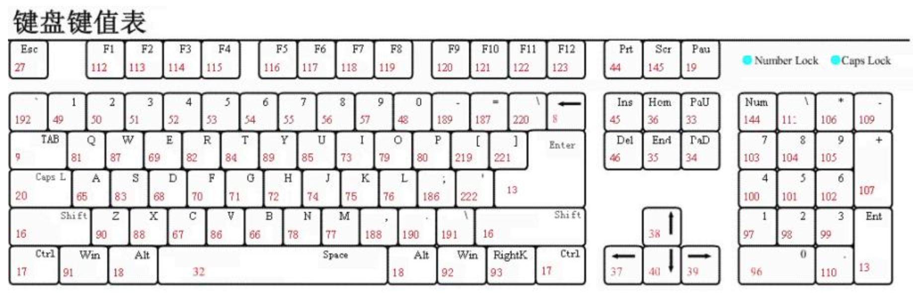

## 六、作业

【黄金】：今天代码（包含课堂写的）写三遍。记得每天都要作总结

【铂金】：预习第三天的内容（了解网络知识）

【王者】：实现下面微博发布功能

项目链接：http://codesohigh.com/weibo/

请完成以下效果：


**思路提示：**

1. 输入框的聚焦(focus)、失焦(blur) 事件设置边框的颜色
2. 输入框输入的时候要判断 “发布” 按钮是否可点击
3. 回车进行发布操作
4. 点击"发布"按钮，进行发布操作
5. 点击删除按钮，删除当前这条数据

提供html+css代码（动画不做要求，主要完成功能）：

```html
<!DOCTYPE html>
<html lang="en">
<head>
    <meta charset="UTF-8">
    <meta name="viewport" content="width=device-width, initial-scale=1.0">
    <title>微博发布</title>
    <style>
        *{margin: 0;padding: 0;border: 0;list-style: none;}
        body{background: #efefef;}
        section{overflow: hidden;width: 800px;padding: 10px;background: #fff;margin: 100px auto 20px;}
        h4{color: #426c81;font-weight: normal;}
        textarea{width: 100%;resize: none;border: 1px solid #ccc;outline: none;margin-top: 10px;margin-bottom: 10px;height: 70px;}
        div{width: 90px;height: 30px;line-height: 30px;text-align: center;background: #ff8140;color: #fff;border-radius: 6px;float: right;opacity: 0.8;cursor: not-allowed;}
        ul{width: 800px;padding: 10px;background: #fff;margin: 0 auto;overflow: hidden;}
        li{border-bottom: 1px dashed #ccc;line-height: 30px;height: 30px;margin-top: 5px;display: flex;justify-content: space-between;align-items: center;padding: 0 10px;width: 100%;box-sizing: border-box;}
        p{width: 95%;overflow: hidden;text-overflow: ellipsis;white-space: nowrap;}
        span{cursor: pointer;width: 20px;height: 20px;text-align: center;line-height: 20px;background: #ccc;border-radius: 3px;}
        textarea.active{border-color: #ff8140;}
        div.active{opacity: 1;cursor: pointer;}
    </style>
</head>
<body>
    <section>
        <h4>有什么新鲜事想告诉大家?</h4>
        <textarea></textarea>
        <div>发布</div>
    </section>
    <ul>
        <!-- <li>
            <p></p>
            <span>x</span>
        </li> -->
    </ul>
</body>
</html>
```

答案

```js
	<script>
        /*  1. 输入框的聚焦(focus)、失焦(blur) 事件设置边框的颜色
         2. 输入框输入的时候要判断 “发布” 按钮是否可点击
         3. 回车进行发布操作
         4. 点击"发布"按钮，进行发布操作
         5. 点击删除按钮，删除当前这条数据 */
        // 聚焦
        $('textarea').focus(function () {
            $(this).addClass('active');
        })
        // 失焦
        $('textarea').blur(function () {
            $(this).removeClass('active');
        })

        // 输入框输入的时候要判断 “发布” 按钮是否可点击
        $('textarea').on('input', function () {
            var text = $.trim($('textarea').val());
            // console.log(text);
            if (text) {
                $('div').addClass('active');
                // $('ul').before('<li><p><p><li>')
            } else {
                $('div').removeClass('active');
            }
        })

        /* 3. 回车进行发布操作
         4. 点击"发布"按钮，进行发布操作 */
        $('textarea').on('keyup', function (e) {
            // 获取文本框内容
            // console.log(e.keyCode);
            if (e.keyCode == 13) {
                fn();
            }
        })
        // 使用点击发布进行发布
        $('div').on('click', fn)

        // 点击删除按钮，删除当前这条数据 
        $('ul').on('click', 'button', function () {
            console.log($('button'));
            // 移除当前button的父亲
            $(this).parent().remove();
        })

        function fn() {
            var text = $.trim($('textarea').val());
            if (text) {
                // console.log($('ul'));
                // 将li放到ul
                $('ul').prepend(`<li><p>${text}</p><button>X</button></li>`);
            } else {
                alert('请重新输入');
            }
            // 清空文本
            $('textarea').val('');
        }
    </script>
```


## 七、我的

.eq()和:eq()区别

> 索引：  .eq(具体数值 或者表达式)  :eq(具体数值)

### 案例

#### Tab栏

提供html与css代码：

```html
<!DOCTYPE html>
<html lang="en">
<head>
    <meta charset="UTF-8" />
    <meta name="viewport" content="width=device-width, initial-scale=1.0" />
    <title>Tab栏</title>
    <style type="text/css">
        div,
        span,
        ul,
        li,
        h2,
        body {
            padding: 0;
            margin: 0;
            list-style: none;
        }

        .all {
            width: 440px;
            border: 1px solid #000;
            padding: 10px;
            margin: 80px auto;
        }

        .all h2 {
            height: 30px;
            text-align: center;
            display: flex;
            justify-content: space-between;
        }

        .all h2 span {
            width: 100px;
            height: 30px;
            background: #CCC;
            text-align: center;
            cursor: pointer;
        }

        .all h2 span.current {
            background: #FF3366;
        }

        .all ul li {
            display: none;
            background: #FF3366;
            height: 200px;
        }

        .all ul li.current {
            display: block
        }
    </style>
</head>
<body>
    <div class="all">
        <h2>
            <span class="current">新闻</span>
            <span>娱乐</span>
            <span>游戏</span>
            <span>财经</span>
        </h2>
        <ul>
            <li class="current">新闻</li>
            <li>娱乐</li>
            <li>游戏</li>
            <li>财经</li>
        </ul>
    </div>
</body>
</html>
```

《Tab栏》案例代码：

```js
// 原生方法
var btns = document.getElementsByTagName("span");
var pages = document.getElementsByTagName("li");
for (var i = 0; i < btns.length; i++) {
    btns[i].index = i;
    btns[i].onmouseenter = function () {
        for (var j = 0; j < btns.length; j++) {
            btns[j].className = "";
            pages[j].className = "";
        }
        this.className = "current";
        pages[this.index].className = "current";
    };
}

// JQ方法
// addClass(class|fn) 为每个匹配的元素添加指定的类名。
// 案例思路：
		/*
            1.找到事件元素进行绑定事件 给当前对象添加类名 给兄弟元素删除类名
            2.获取到当前对象点击的索引
            3.利用下面li对象对应当前索引做类名的添加和删除
        */
 $('span').click(function () {
     $(this).addClass('current').siblings().removeClass('current');
     // 获得当前索引
     console.log($(this).index());
     // 索引  .eq(具体数值 或者表达式)   :eq(具体数值)
     $('li').eq($(this).index()).addClass('current').siblings().removeClass('current');
 })
```

#### 百度风云榜

提供html和css代码：

```html
<!doctype html>
<html>
<head>
    <meta charset="UTF-8">
    <meta name="viewport" content="width=device-width, initial-scale=1.0">
    <title>百度风云榜</title>
    <style>
        * {
            margin: 0;
            padding: 0;
            border: 0;
            list-style: none;
        }

        ul {
            padding: 10px;
            margin: 100px auto;
            border: 1px solid #000;
            width: 100px;
        }

        ul>li {
            cursor: pointer;
        }

        span {
            background: url(images/close.gif) no-repeat left center;
            padding-left: 20px;
        }

        span.open {
            background-image: url(images/open.gif);
        }

        ol {
            display: none;
            margin-left: 20px;
        }
    </style>
</head>
<body>
    <ul>
        <li>
            <span>音乐</span>
            <ol>
                <li>你好毒</li>
                <li>该死的温柔</li>
                <li>演员</li>
            </ol>
        </li>
        <li>
            <span>电影</span>
            <ol>
                <li>釜山行</li>
                <li>战狼</li>
                <li>杀破狼</li>
            </ol>
        </li>
        <li>
            <span>小说</span>
            <ol>
                <li>天龙八部</li>
                <li>三生三世</li>
                <li>小时代</li>
            </ol>
        </li>
    </ul>
</body>
</html>
```

《百度风云榜》案例代码：

```js
$('span').click(function(){
  // 让当前列表切换收放
  $(this).toggleClass('open').siblings('ol').slideToggle();
  // 让其他列表收起
  $(this).parent().siblings().children('ol').slideUp().siblings('span').removeClass('open');
})

// 代码优化：
// 链式编程：在一个方法后调用另一个方法 核心内容找对象
// 原理：每一个方法都会去找最近的一个对象(事件源)
	// 本质上是每个函数末尾加了return this，将调用该函数的jquery对象返回
	// 同时由于只对 DOM 进行了一轮查找，性能方面更加出色。
$('span').click(function(){
  $(this).toggleClass('open')// "当前span"
    	 .siblings('ol')// 将事件源"当前span"变成了"当前ol"
          .slideToggle()// "当前ol"
          .parent()// 将"当前ol"变成了"当前父级li"
          .siblings()// 将"当前父级li"变成了"其他父级li"
          .children('ol')// 将"其他父级li"变成了"其他父级的ol"
          .slideUp()// "其他父级的ol"
          .siblings('span')// 将"其他父级的ol"变成了"其他父级的span"
          .removeClass('open');// "其他父级的span"
})
```

表单非空校验

```js
	<input type="text">
    <button>按钮</button>
<script>
    // 非空检验
    $('button').click(function () {
    // console.log($("input").val());
    // trim  清除首位空格
    var str = $("input").val().trim();
    if (str) {
        console.log('执行');
        $("input").val('');
    } else {
        alert('请重新输入');
        $("input").val('');
    }
})

</script>
```

#### 非空校验

```js
// 非空检验
$('button').click(function () {
    if ($.trim($('input').val())) {
        console.log('执行');
    } else {
        alert('sdf');
        // $('input').val('');
    }
    $('input').val('');
})
```

#### 上面的六作业

```html
```


# day03

> 今日要点：
>
> 1. 了解什么是万维网以及万维网的三要素
> 2. 了解什么是CS 架构和 BS 架构
> 3. 能够**说出**浏览器访问网站的基本过程
> 4. 了解TCP/IP协议三次握手和四次挥手的过程
> 5. 理解**http请求报文和响应报文**
> 6. 掌握常见的**状态码**
> 7. **掌握谷歌浏览器网络调试工具**
> 8. 必须掌握**jQuery ajax的写法**

## 一、计算机网络基础

### 1.1、万维网

万维网（World Wide Web），亦作“WWW”、“Web”，是一个透过互联网访问的，由许多互相链接的超文本组成的系统。

**web服务三要素：**

1. **统一资源标识符（URI）**，这是一个统一的为资源定位的系统，URI可以分为URL和URN或同时具备locators 和names特性的一个东西
   - URN：Uniform Resource Name 是一种使用字符串表示资源名字的方法
   - URL： Uniform Resource Location 是一种使用字符串表示资源所在位置的方法
   - 换句话说：URN确定了东西的身份，URL提供了找到它的方式。
2. **超文本传送协议（HTTP）**，它负责规定客户端和服务器怎样互相交流。
3. **超文本标记语言（HTML）**，作用是定义超文本文档的结构和格式。

### 1.2、CS 架构 VS BS 架构

#### 1.2.1、CS 架构

CS 即 Client/Server（客户机/服务器）结构，C/S 结构在技术上很成熟，它的主要特点是交互性强、具有安全的存取模式、网络通信量低、响应速度快、利于处理大量数据。但是该结构的程序是针对性开发，变更不够灵活，维护和管理的难度较大。通常只局限于小型局域网，不利于扩展。并且，由于该结构的每台客户机都需要安装相应的客户端程序，分布功能弱且兼容性差，不能实现快速部署安装和配置，因此缺少通用性，具有较大的局限性。要求具有一定专业水准的技术人员去完成。比如 QQ，微信，绝地逃生等等。

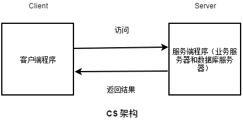

#### 1.2.2、BS 架构

BS 即 Browser/Server（浏览器/服务器）结构，就是只安装维护一个服务器（Server），而客户端采用浏览器（Browse）运行软件。B/S 结构应用程序相对于传统的 C/S 结构应用程序是一个非常大的进步。 B/S 结构的主要特点是分布性强、维护方便、开发简单且共享性强、总体拥有成本低。但数据安全性问题、对服务器要求过高、数据传输速度慢、软件的个性化特点明显降低，这些缺点是有目共睹的，难以实现传统模式下的特殊功能要求。例如通过浏览器进行大量的数据输入或进行报表的应答、专用性打印输出都比较困难和不便。此外，实现复杂的应用构造有较大的困难。企业应用中大多数度使用 BS 架构，比如淘宝，京东，优酷，爱奇艺等等。

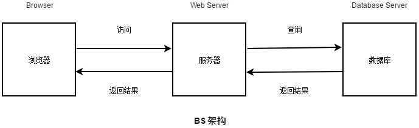

### 1.3、浏览器访问网站的基本过程

#### 1.3.1、基本概念

**IP地址**

> 要想使网络中的计算机能够进行通信，必须为每台计算机指定一个标识号，通过这个标识号来指定接受数据的计算机或者发送数据的计算机。在TCP/IP协议中，这个标识号就是IP地址，它可以唯一标识一台计算机。 相当于电话号码和电话。
>
> - 查看本机IP
>   - 开始菜单-->运行-->cmd
>   - ipconfig

**端口号**

> 通过IP地址可以连接到指定计算机，但如果想访问目标计算机中的某个应用程序，还需要指定端口号。在计算机中，不同的应用程序是通过端口号区分的。
>
> - 查看某个程序的端口号
>
>   - 开始菜单-->运行-->cmd  
>   - 输入 netstat -ano 即会显示所有进程占用的端口和进程的ID，并以数字的形式显示端口和IP。
>   - 然后打开进程管理器，在打开【进程】选项卡，然后点击菜单【查看】-【选择列】勾选 【pid(进程标识符)】。然后自己匹配你要找的那个进程的PID即可查看到它所占用的端口。

**Hosts文件**

> Hosts是一个没有扩展名的系统文件，可以用记事本等工具打开，其作用就是将一些常用的网址域名与其对应的IP地址建立一个关联“数据库”，当用户在浏览器中输入一个需要登录的网址时，系统会首先自动从Hosts文件中寻找对应的IP地址，一旦找到，系统会立即打开对应网页，如果没有找到，则系统会再将网址提交DNS域名解析服务器进行IP地址的解析。
>
> - 查看Hosts
>   - C:\Windows\System32\drivers\etc

**DNS**

> 域名系统（英文：DomainNameSystem，缩写：**DNS**）是互联网的一项服务。它作为将域名和IP地址相互映射的一个分布式数据库，能够使人更方便地访问互联网。DNS使用TCP和UDP端口53。当前，对于每一级域名长度的限制是63个字符，域名总长度则不能超过253个字符。

#### 1.3.2、 基本流程(重点)

​        用户输入网址，
​        浏览器请求DNS服务器, 获取域名对应的IP地址，
​        请求连接该IP地址服务器，
​        发送资源请求. (遵循HTTP协议)
​        web服务器接收到请求, 并解析请求, 判断用户意图，
​        获取用户想要的资源，(链接数据库从数据中获取数据)
​        将资源返回给http服务器程序，
​        http服务器程序将资源数据通过网络发送给浏览器 （响应给浏览器），
​        浏览器解析呈现请求的数据

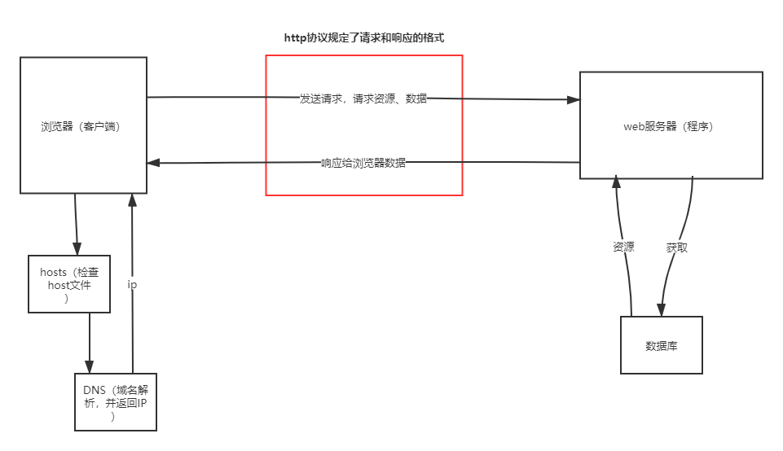

#### 1.3.3、 域名与域名服务器

   	1、网站： www.sina.com.cn

```
-www: 主机名 ，ftp、svn、stmp、xmpp服务
    - sina：机构名
        - com：机构类型 com  net edu  org  xxx
            - cn： 地区名  tw  hk   us  uk  jp 
```

   	2、域名服务器（DNS）   
   		进行域名和与之相对应的IP地址转换的服务器

## 二、Http协议简介

### 2.1、http的认识

> HTTP是万维网的数据通信的基础。设计HTTP最初的目的是为了提供一种发布和接收HTML页面<网页>的方法。
>
> HTTP协议的制作者是**蒂姆·伯纳斯-李**，他供职于CERN(欧洲核子研究组织)
>
> - 1991年发布的0.9版，该版本极其简单，只有一个GET请求方法
> - 1996年5月，HTTP/1.0版本发布
> - 1997年1月，HTTP/1.1版本发布，目前使用就是HTTP/1.1版本
> - 2.0-----未来的趋势


**什么是协议：**

协议就是双方之间的一种约定、一种规则；按照此约定、规则，双方就可以顺畅的、有条不紊的进行交流和通信——

**http协议：**

1. HTTP 超文本传输协议(hypertext transfer protocol) ：用于web服务器与浏览器之间传输数据的协议
2. HTTP协议是基于TCP/IP协议的，发送数据之前需要建立好连接
3. http协议的请求响应模型包含浏览器与http服务器的request、response请求响应模型

### 2.2、TCP/IP协议    三次握手四次挥手（了解）

**TCP/IP协议不仅仅指的是TCP 和IP两个协议，而是指一个由FTP、SMTP、TCP、UDP、IP等协议构成的协议簇， 只是因为在TCP/IP协议中TCP协议和IP协议最具代表性，所以被称为TCP/IP协议。**

http协议是基于TCP/IP协议的，TCP/IP协议是一个可靠的传输协议。

浏览器(客户端)和服务器**建立**连接的时候，发生三次握手：

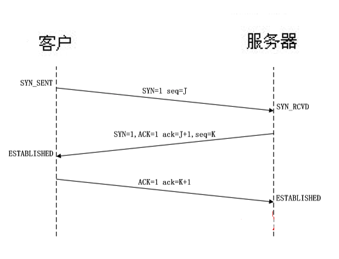

浏览器(客户端)和服务器**断开**连接的时候，发生四次挥手：

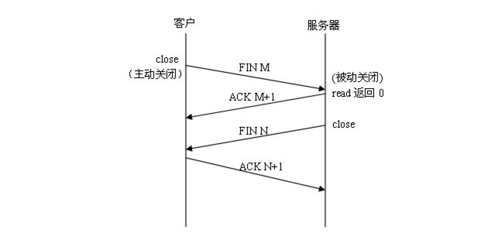


### 2.3、http请求request报文格式

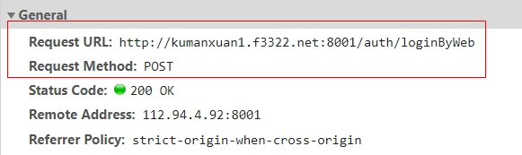

1. 请求行
   - **HTTP 请求的类型——get  post**
     - GET    浏览器仅仅只是获取网页数据(普通)
     - POST   客户端向服务器提交数据(高级)
   - **请求资源的路径——请求url**
   - HTTP 协议版本——1.0  1.1
2. 请求头
   - [头名: 头值]  
3. 空行
   - 分割符"\r\n" 
4. 请求体
   - **浏览器给服务器发送的数据**
   - post才有请求体
   - get的请求参数在url上

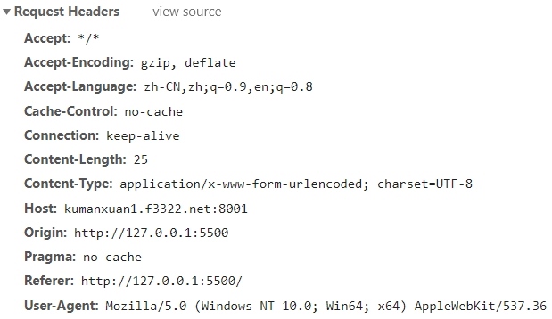

**常见的请求头：**

- Accept：浏览器可以接受的数据类型。
- Accept-Encoding：浏览器支持解码的数据压缩格式 如：gzip。
- Accept-Language：浏览器的语言环境。
- Cache-Control：缓存控制命令
- Host：请求的主机名，允许多个域名同处一个 IP 地址，即虚拟主机。
- Connection：表示是否需要持久连接。如 Keep-Alive。
- Content-Length：表示请求体的长度。
- **Content-Type**：浏览器告诉 WEB 服务器请求数据的类型和字符集。
  - MIME   描述消息内容类型的因特网标准 
    - text/html  超文本
    - text/plain 普通文本
    - text/xml   XML格式
    - application/x-www-form-urlencoded  浏览器默认
    - application/json 来告诉服务端消息主体是序列化后的 JSON 字符串
    - multipart/from-data 表单上传文件时
  - charset:utf-8;
- **Cookie**：浏览器每次都会将 cookie 发送到服务器上，允许服务器在客户端存储少量数据。
- Referer：包含一个 URL，用户从该 URL 代表的页面出发访问当前请求的页面。服务器能知道你是从哪个页面过来的。
- User-Agent：用户代理：浏览器相关信息，客户机相关信息。

### 2.4、http响应response报文格式

1. 响应行
   - 协议版本
   - **状态码**
     - HTTP/1.1 中定义了 5 类状态码。状态码由三位数字组成，第一个数字定义了响应的类别
       - 1XX 提示信息 - 表示请求已被成功接收，继续处理。
       - 2XX 成功 - 表示请求已被成功接收，理解，接受。
       - 3XX 重定向 - 要完成请求必须进行更进一步的处理。
       - 4XX 客户端错误 - 请求有语法错误或请求无法实现。
       - 5XX 服务器端错误 - 服务器未能实现合法的请求。
   - 状态说明
2. 响应头
   - [头名: 头值] 
3. 空行
   -  "\r\n"
4. 响应体
   - **返回给客户端的具体数据**
     - html文本
     - 资源数据

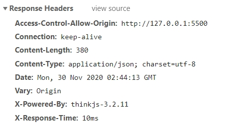

**常见响应头：**

Server：服务器软件的信息和版本。

Accept-Ranges：服务器表明是否接受获取其某个实体的一部分的请求。

Cache-Control：缓存控制命令

**Date**：服务器回复响应报文的时间 -- 格林威治时间

**Content-Type**：返回的响应体的数据类型。text/html text/plain application/json

Allow：服务器支持哪些请求方法（如 GET、POST 等）。

Content-Base：解析主体中的相对 URL 时使用的基础 URL。

Content-Encoding：对响应体数据采用的压缩方式。

Content-Language：告诉浏览器理解主体时最适宜使用的自然语言。

Content-Length：表明响应体的大小，例如 26012。

Content-Location：资源实际所处的位置。

Content-MD5：主体的 MD5 校验和。

Content-Range：表示传送的范围。

Expires：过期相关信息。

Last-Modified：WEB服务器认为对象的最后修改时间。

Connection：keep-alive不关闭TCP连接，长连接  

### 2.5、谷歌浏览器开发者工具的使用（掌握！）


- 元素(Elements):用于查看或修改HTML元素的属性、CSS属性、监听事件、断点等.
- 控制台(Console):控制台一般用于执行一次性代码, 查看JavaScript对象, 查看调试日志信息或异常信息.
- 源代码(Sources):该页面用于查看页面的HTML文件源代码、JavaScript源代码、CSS源代码, 此外最重要的是可以调试JavaScript源代码, 可以给JS代码添加断点等.
- 网络(Network):网络页面主要用于查看 header 等与网络连接相关的信息.

**注意**: **Network 中的每一项就是一次请求/响应过程, 点击每一项, 可查看本次请求响应的报文信息.**

## 三、AJAX技术简介

### 3.1、基本概念

- AJAX 即 “Asynchronous JavaScript and XML”（异步的 JavaScript 与 XML 技术），指的是一套综合了多项技术的浏览器端网页开发技术。AJAX 的概念由 Jesse James Garrett 所提出，说白了就可以**使用 JavaScript 代码发送网络请求并处理响应，由浏览器实现**。
- 出现的很早 `1998` 年出来，首次是`微软`提出来的，并没有引起重视；直到`2005`年左右，谷歌推出 `gmail，gmap` 使得ajax技术一时间流行起来。

**定义：ajax技术就是在页面不刷新情况下，和服务器端进行交互的技术。**

- 传统的 Web 应用允许用户端填写表单（form），当提交表单时就向网页服务器发送一个请求。服务器接收并处理传来的表单，然后送回一个新的网页，但这个做法浪费了许多带宽，因为在前后两个页面中的大部分 HTML 码往往是相同的。由于每次应用的沟通都需要向服务器发送请求，应用的回应时间依赖于服务器的回应时间。这导致了用户界面的回应比本机应用慢得多。

- 与此不同，AJAX 应用可以仅向服务器发送并取回必须的数据，并在客户端采用 JavaScript 处理来自服务器的回应。因为在服务器和浏览器之间交换的数据大量减少，服务器回应更快了。同时，很多的处理工作可以在发出请求的客户端机器上完成，因此 Web 服务器的负荷也减少了。


**所以ajax特点是：异步请求，局部刷新**。

1. 这里的同步是指：发送方发出数据后，等接收方发回响应以后才发下一个数据包的通讯方式。

2. 这里的异步是指：发送方发出数据后，不等接收方发回响应，接着发送下个数据包的通讯方式。

3. 这里局部刷新是指：刷新页面部分内容。


**优缺点：**

优点：Web 应用程序更为迅捷地回应用户动作，并避免了在网络上发送那些没有改变的信息，减轻服务器压力。

缺点：浏览器实现之间有差异处理兼容性问题；不能回退和前进；默认不支持跨域访问---好事（可以自主学习相关知识：[同源策略](https://developer.mozilla.org/zh-CN/docs/Web/Security/Same-origin_policy)）。\

**域名,端口,协议完全相同的两个URL是同源的-----只要不是同源的域名就会发生跨域**

**注意事项**：

ajax 这门技术，必须要在网络协议环境下才可以使用。不能把网页直接拖入到浏览器执行，必须在 web 服务器模式下访问。

### 3.2、原生ajax

#### 3.2.1、兼容处理

JS的Ajax对象：**XMLHttpRequest 对象用于在后台与服务器交换数据。**

创建ajax对象会有浏览器兼容性问题：

```js
function createAjax() {
  	var request;
    if(Windows.XMLHttpRequest){
        request=new XMLHttpRequest();
    }else{
      	request=new ActiveXObject("Microsoft.XMLHTTP"); //IE 5,IE6
    }
}
```

#### 3.2.2、响应处理和响应流程

响应处理，即对服务响应回浏览器的数据根据状态码和 AJAX 对象的状态信息进行不同的处理，在绑定状态改变的处理函数中写对应的逻辑代码即可。

AJAX 对象中有 4 个属性：

- readyState 总共有 5 个状态值，分别为 0 ~ 4，每个值代表了不同的含义：
  - 0：初始化，AJAX 对象还没有完成初始化
  - 1：载入，AJAX 对象开始发送请求
  - 2：载入完成，AJAX 对象的请求发送完成
  - 3：解析，AJAX 对象开始读取服务器的响应
  - 4：完成，AJAX 对象读取服务器响应结束
- status 表示响应的 HTTP 状态码，常见状态码如下：
  - **200 OK：请求成功**
  - **302 Found：重定向**，新的 URL 会在 response 中的 Location 中返回，浏览器将会使用新的 URL 发出新的 Request
  - **304 Not Modified：已缓存**，文档已经被缓存，直接从缓存调用
  - 400 Bad Request：客户端请求有语法错误，不能被服务器所理解
  - **403 Forbidden：服务器收到但拒绝服务**，引用外部资源触发防盗链
  - **404 Not Found：找不到资源**，请求资源不存在
  - 405 ：请求到方式不对，get 、post
  - **500 Internal Server Error：服务端错误**，服务器发生了不可预期的错误
  - 503 Server Unavailable：服务器当前不能处理客户端的请求，一段时间后可能恢复正常
- responseText 获得字符串形式的响应数据。
- responseXML  获得 XML 形式的响应数据。

综合以上，在状态改变的处理函数一般针对 readyState == 4 且 status == 200 的情况才处理，再根据后台返回的数据类型决定从 responseText 或者 responseXML 获取服务器响应回去来的数据。

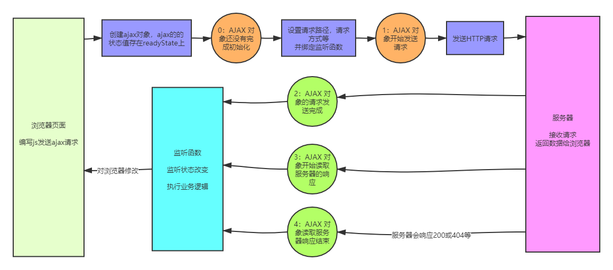

#### 3.2.3、使用ajax发送get请求

步骤：

```js
// 1、创建 AJAX 对象；new XMLHttpRequest()
// 2、设置请求路径，请求方式等；ajax.open(请求方式，路径)
// 3、绑定监听状态改变的处理函数，在处理函数可获取响应数据；ajax.onreadystatechange
// 4、发送请求。ajax.send
```

代码：

```html
<body>
    <button id="btn">发送get请求</button>
  
<script>
    btn.onclick = function(){
        // 1、创建 AJAX 对象；
        var ajax = new XMLHttpRequest();
        // 2、设置请求路径，请求方式等；ajax.open(请求方式，路径)
        ajax.open('get', 'http://kumanxuan1.f3322.net:8809/travels/query');
        // 3、绑定监听状态改变的处理函数，在处理函数可获取响应数据；
        ajax.onreadystatechange = function(){
            // console.log(ajax.readyState);
            if(ajax.readyState==4 && ajax.status==200){
                // 此时获取服务器发过来的数据
                console.log(ajax.responseText)	// 得到的是字符串对象，需要用JSON.parse(txt)转对象
            }
        }
        // 4、发送请求。
        ajax.send();
    }
</script>
</body>
```

#### 3.2.4、使用ajax发送post请求

post请求需要传递参数给后台，

代码：

```html
<body>
	用户名：<input id="user" type="text"><br>
    密码：<input id="pwd" type="password"><br>
    <button id="btn">登录</button>

<script>
    // 后台要求携带参数：
    // 用户名 - username
    // 密码 - password
    btn.onclick = function () {
        // 1、创建 AJAX 对象
        var ajax = new XMLHttpRequest();
        // 2、设置请求路径，请求方式等
        ajax.open("post", "http://kumanxuan1.f3322.net:8809/users/login");
        // 3、设置请求头，不然无法传递参数到后台
        ajax.setRequestHeader('Content-Type', 'application/x-www-form-urlencoded')
        // 4、绑定监听状态改变的处理函数
        ajax.onreadystatechange = function () {
            if (ajax.readyState == 4 && ajax.status == 200) {
                console.log(ajax.responseText);
            }
        }
        // 5、发送请求并携带参数
        ajax.send(`username=${user.value}&password=${pwd.value}`)
    }
</script>
</body>
```

**总结：**

1. 需要获取数据的时候，使用get请求
2. 需要传递参数给后台并完成某些功能的时候，使用post请求

### 3.3、jQuery 中 ajax 使用

#### 3.3.1、基本语法

jQuery 中发送ajax的方法：

```js
// 方法一：什么请求都可以发
$.ajax(url,{[settings]});
// 方式二：只能发送get请求
$.get(url, [data], [callback])
// 方式二：只能发送post请求
$.post(url, [data], [callback])
```

#### 3.3.2、$.ajax的使用

**settings参数的可选项：**

- *async*：默认设置下，所有请求均为异步请求（true）。
- *contentType*：发送信息至服务器时内容编码类型，默认为 "application/x-www-form-urlencoded"。
- **data**：发送到服务器的数据，可以为对象或者 Key=value 格式字符串，若为对象则会自动转换为请求字符串格式。
- **type**：请求方式 ("POST" 或 "GET")， 默认为 "GET"。注意：其它 HTTP 请求方法，如 PUT 和 DELETE 也可以使用，但仅部分浏览器支持。
- **url**：发送请求的地址，默认当前页地址。
- dataType：预期服务器返回的数据类型。如果不指定，jQuery 将自动根据 HTTP 包 MIME 信息来智能判断，比如 XML MIME类型就被识别为 XML，可以不填，可用值："xml"、"html"、"script"、"json"、"jsonp"、"text"。
- cache：默认为 true（dataType 为 script 和 jsonp 时默认为 false，设置为 false 将禁用缓存）。
- context：这个对象用于设置 AJAX 相关回调函数的上下文。也就是说，让回调函数内 this 的指向（若不指定为当前选项）。
- beforeSend：发送请求前调用此函数，可用与如添加自定义 HTTP 头，检查请求参数是否合法。XMLHttpRequest 对象是唯一的参数。若在函数中返回 false 可以取消本次请求。 


- **success**：请求成功后的回调函数，参数：由服务器返回，并根据 dataType 参数进行处理后的数据；描述状态的字符串。

```js
function (data, textStatus) {
    // data 可能是 xmlDoc, jsonObj, html, text, 等等
    // textStatus 描述状态的字符串
}
```

- *error*：请求失败时调用此函数。有以下三个参数：XMLHttpRequest 对象、错误信息、捕获的异常对象。

```js
function (XMLHttpRequest, textStatus, errorThrown) {
  	// 通常 textStatus 和 errorThrown 之中
    // 只有一个会包含信息
}
```

例如：

```js
$.ajax({
    url: 'url',
    type: 'GET',
    data: {username:'zs', password:'12345'},
    success: function(data){
        // 请求成功业务逻辑
    }
});
```

#### 3.3.3、发送GET请求

get请求的测试接口：

```js
http://kumanxuan1.f3322.net:8809/travels/query
```

**使用.ajax()方法发送get请求：**

```js
$('button').click(function(){
  $.ajax({
    type: "GET",
    url: "http://kumanxuan1.f3322.net:8809/travels/query",
    success: function(res){
      console.log(res);
    }
  })
})
```

**使用.get()方法发送get请求：**

$.get()方法接收四个参数：

- **url**：请求 URL 地址
- data：请求参数。
- **callback**：请求成功时回调函数。
- type：预期服务器返回的数据类型。

```js
$('button').click(function(){
	$.get("http://kumanxuan1.f3322.net:8809/travels/query",
          function (res) {
            console.log(res)
          })
})
```

#### 3.3.4、发送POST请求

post请求的测试接口：

```js
// 请求地址：
http://kumanxuan1.f3322.net:8809/users/login

// 携带参数：
用户名 - username
密码 - password
```

**使用.ajax()方法发送post请求：**

```js
$('button').click(function(){
  $.ajax({
    url: "http://kumanxuan1.f3322.net:8809/users/login",
    type: "POST",
    data: {
      username: $('#username1').val(),
      password: $("password1").val()
    },
    success: function(res){
      console.log(res)
    }
  })
})
```

**使用.post()方法发送post请求：**

$.post()方法同样接收四个参数：

- **url**：请求 URL 地址
- **data**：请求参数。
- **callback**：请求成功时回调函数。
- type：预期服务器返回的数据类型。

```js
$('button').click(function(){
  $.post('http://kumanxuan1.f3322.net:8809/users/login', {
    username: $('#username1').val(),
    password: $("#password1").val()
  }, function(res){
    console.log(res)
  })
})
```

## 四、作业

【黄金】：今天代码（包含课堂写的）写三遍并完成jQuery的三天基础总结-----必须完成

【铂金】：[完成一个静态页面](http://codesohigh.com/wolfcode/)------必须完成

【王者】：预习项目课内容（了解项目模块和接口文档以及postman的使用）


## 五、我的

### 域名和主机名

> 以[http://www.sina.com.cn/](https://link.zhihu.com/?target=http%3A//www.sina.com.cn/)为例，http是通信使用的协议，[sina.com.cn]是域名，www是提供服务的机器的名字（计算机名），计算机名+域名才是主机名，即[www.sina.com.cn]是主机名。再举个例子，[http://blog.sina.com.cn/](https://link.zhihu.com/?target=http%3A//blog.sina.com.cn/)中，blog是提供博客服务的那台机器的名字，[sina.com.cn](https://link.zhihu.com/?target=http%3A//sina.com.cn)是域名，[blog.sina.com.cn](https://link.zhihu.com/?target=http%3A//blog.sina.com.cn)是主机名。
>
> 域名还分级，从后往前级别依次降低，[http://sina.com.cn](https://link.zhihu.com/?target=http%3A//sina.com.cn)中，cn是顶级域名，表示中国，com是二级域名，表示商业机构（commercial），sina是三级域名，一般用自己的名字。

### 访问网址过程


# day04~day05

> 项目阶段目标：
>
> 1. 重点练习并掌握jQuery **AJAX的使用**
> 2. **必须掌握postman的使用**
> 3. **掌握列表渲染**
>    1. **发送ajax**
>    2. **响应处理**
>    3. **DOM操作----先清再加**
>    4. **tab切换---------函数封装**
> 4. 掌握详情页的展示
> 5. 掌握登录注册的流程
> 6. 掌握本地存储的方法
> 7. 掌握请求头的传递

## 一、项目介绍

### 1.1、线上项目地址

[项目地址](http://kumanxuan1.f3322.net:8808/)

可以将线上地址看做工作中的原型图，参考已经做好的效果实现功能需求

**会讲解的项目模块（技术点）：**

1. 首页
   - 列表展示
   - 详情展示
2. 注册页
   - 表单验证
3. 登录页
   - 登录之后存储token

### 1.2、查看接口文档

[接口文档](http://kumanxuan1.f3322.net:8094/api/)

```ejs
H5-27-WEB-001@wolfcode.cn
H5-27-WEB-002@wolfcode.cn
H5-27-WEB-003@wolfcode.cn
H5-27-WEB-004@wolfcode.cn
H5-27-WEB-005@wolfcode.cn
H5-27-WEB-006@wolfcode.cn
H5-27-WEB-007@wolfcode.cn
H5-27-WEB-008@wolfcode.cn
H5-27-WEB-009@wolfcode.cn
H5-27-WEB-010@wolfcode.cn
密码全部是123456
```

## 二、postman的使用

[下载地址](https://www.getpostman.com/downloads/)


1. get请求使用Params传参
2. post使用body传参
3. 如果需要设置请求头在Headers设置

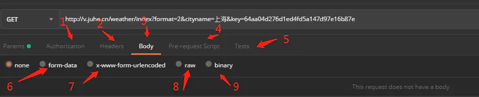

**1 **    Authorization：身份验证，主要用来填写用户名密码，以及一些验签字段,postman有一个helpers可以帮助我们简化一些重复和复杂的任务。当前的一套helpers可以帮助你解决一些authentication protocols的问题。；

**2**    **Headers：**请求的头部信息

**3**    **Body：**post请求时必须要带的参数，里面放一些key-value键值对

**4**    Pre-requerst Script：可以让你在 请求之前自定义请求数据，这个运行在请求之前，语法使用JavaScript语句。

**5**    tests：tests标签功能比较强大，通常用来写测试，它是运行在请求之后。支持JavaScript语法。postman每次执行request的时候，会执行tests。测试结果会在tests的tab上面显示一个通过的数量以及对错情况。这个后面会进行详解，它也可以用来设计用例，比如要测试返回结果是否含有某一字符串

**6**    **form-data**：,它将表单数据处理为一条消息，以标签为单元，用分隔符分开。既可以单独上传键值对，也可以直接上传文件（当上传字段是文件时，会有Content-Type来说明文件类型,但该文件不会作为历史保存，只能在每次需要发送请求的时候，重新添加文件。）；post请求里**较常用的一种**

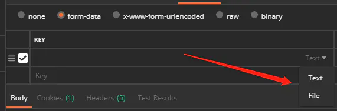

上传文件

**7**    **x-www-form-urlencoded**：对应信息头-application/x-www-from-urlencoded，会将表单内的数据转换为键值对；

**8**    **raw**：可以上传任意类型的文本，比如text、json、xml等,所有填写的text都会随着请求发送；

**9**    binary：对应信息头-Content-Type:application/octet-stream，只能上传二进制文件，且没有键值对，一次只能上传一个文件, 也不能保存历史，每次选择文件，提交；

## 三、首页-banner

1. 使用ajax调用[接口](http://kumanxuan1.f3322.net:8809/index/banners/travel)
2. 处理数据，并将通过数据改变dom
3. 点击按钮切换banner
4. 轮播效果

```js
// 1.入口函数
$(function () {
  // 2.发送ajax请求
  $.ajax({
    url: "http://kumanxuan1.f3322.net:8809/index/banners/travel",
    type: "GET",
    data: {},
    success: function (res) {
      // console.log(res.data);
      $("#_j_mfw_focus ul.show-image").empty();
      $("#_j_mfw_focus ul.show-nav").empty();
      // 3.数据处理
      $.each(res.data, function (index, item) {
        // console.log(a, b);
        // 4.dom操作
        $("#_j_mfw_focus ul.show-image").append(`
        <li data-id="0" class="show_image">
            <a href="./traveldetail.html?id=${item.refId}"
                class="show-pic">
                
            </a>
            <a href="javascript:;" class="show-title dark">
                <div class="date">
                    <span class="day">15</span>/Oct.2020
                </div>
                <h3>${item.title}</h3>
            </a>
        </li>
        `)

        $("#_j_mfw_focus ul.show-nav").append(`
        <li class="show_nav" onclick = checkBg(${index})>
            <a href="javascript:">
                
                <span></span>
            </a>
        </li>
        `)
        //模拟点击
        checkBg(0);
      })
    }
  })
})


// 5.事件绑定
function checkBg(index) {
  // console.log(index);

  // 6.2清除定时器
  clearInterval(timer);

  // 按钮排他
  $("#_j_mfw_focus ul.show-nav").children().eq(index).addClass("active").siblings().removeClass("active");
  // 切换轮播图显示
  $("#_j_mfw_focus ul.show-image").children().eq(index).show().siblings().hide();

  // 6.3再次开启
  // 6.4 index关联num
  autoPlayFn(index)
}

// 6.自动轮播
var timer = null;

function autoPlayFn(num) {
  var num = num;//累加器
  timer = setInterval(function () {
    // 6.1 边界判断
    // if (num >= ($("#_j_mfw_focus ul.show-image").children().length - 1)) {
    //   num = 0
    //   console.log(num);
    // } else {
    //   num++;
    // }


    // num在0--4之间轮转 1 2 3 4 0
    num = ++num % $("#_j_mfw_focus ul.show-image").children().length;
    // console.log(num);
    checkBg(num);
  }, 1000)
}
```

## 四、首页-游记列表

### 4.1、列表渲染

1. 使用$.ajax调[接口](http://kumanxuan1.f3322.net:8809/travels/query)
2. 处理数据
3. 使用JQ方法改变DOM渲染

### 4.2、tab切换

1. 传入不同的参数可以获取不同的数据列表
2. 点击tab切换的时候，传入不同的参数
3. 每次点击，都修改一次DOM

```js
$('#_j_tn_nav ._j_gs_tab').click(function () {
  $('#pagination [jp-role="page"]').eq(0).addClass('active')
    .siblings('[jp-role="page"]').removeClass('active')
  if (!$(this).hasClass('active')) {
    $(this).addClass('active').siblings().removeClass('active')
    if ($(this).index() == 0) {
      getTravelList(2, 1)
    } else {
      getTravelList(1, 1)
    }
  }
})
```

### 4.3、分页（拓展）

1. 通过线上的项目模板可以看出，分页是使用了jqPaginator插件的。
2. 在百度上找[jqPaginator](https://blog.csdn.net/meiwan123/article/details/94398379)的使用文档
3. 套用模板，写出分页结构
4. 搭配ajax使用

```js
function getStratList(curPage) {
  $.ajax({
    url: "http://kumanxuan1.f3322.net:8809/strategies/query",
    type: "GET",
    data: {
      currentPage: curPage || 1
    },
    success: function (data) {
      $('#box').empty()
      data.data.content.forEach(function (item) {
        $('#box').append(`<li>${item.catalogName}</li>`)
      })

      $.jqPaginator('#pagination1', {
        totalCounts: data.data.totalElements,
        totalPages: data.data.totalPages,
        pageSize:10,
        visiblePages: 5,
        currentPage: curPage || 1,
        first: '<li class="first"><a href="javascript:void(0);">首页</a></li>',
        prev: '<li class="prev"><a href="javascript:void(0);">上一页</a></li>',
        next: '<li class="next"><a href="javascript:void(0);">下一页</a></li>',
        last: '<li class="last"><a href="javascript:void(0);">尾页</a></li>',
        page: '<li class="page"><a href="javascript:void(0);">{{page}}</a></li>',
        onPageChange: function (num, type) {
          if (type == "change") {
            getStratList(num)
          }
        }
      });
    }
  })
}

getStratList()
```

## 五、游记详情页

### 5.1、页面带参数跳转

1. URL后面用`?id=002&name=jiayang` 这种方式传递参数
2. 跳转之后，获取参数，发起ajax请求

```js
// 不要求掌握，会使用这个方法获取页面参数就好
// 1.重复调用，函数封装
// 2.设计思想：需要传递一个参数key   目的是得到这个key对应的值value
function getVal(key) {
    // 3.怎么获取url   location.href
    var $href = window.location.href
    // 4. 判断一下当前url有没有参数  通过?判断
    if ($href.indexOf('?') !== -1) {
        // 5.通过"?"切割字符串，将参数从url分离
        var querys = $href.split('?')[1];
        console.log(querys);
        // 6.如果这个页面传递了多个参数，是用"&"间隔
        var trueQuerys = querys.split('&');
        // 7.遍历循环，拿到真正的我们需要的参数
        for (var i = 0; i < trueQuerys.length; i++) {
            // 8.拿到每一个参数，需要获取参数的key和val
            var pair = trueQuerys[i].split('=');
            console.log(pair);
            // 9.判断传进来的参数key和我们的pair[0]做比较
            if (pair[0] == key) {
                return pair[1]
            }
        }
    }
}
```

### 5.2、URL传参中文乱码

**两种加密方式**

encodeURI 中文加密

encodeURIComponent 字符+中文加密

**解码方式：**

decodeURI() 函数可对 encodeURI() 函数编码过的 URI 进行解码。

decodeURIComponent() 函数可对 encodeURIComponent() 函数编码的 URI 进行解码

## 六、登录注册

### 6.1、注册流程：

-

```js
// 4.2手机号可以共用
var phoneNum
// 1.验证手机号码
$('#_js_loginBtn').click(function () {
    // 1.1获取手机号码
    phoneNum = $('#inputPassword').val().trim();
    // 1.2手机号码验证
    if (phoneCheck(phoneNum)) {
        // 2.发送请求，验证手机号码是否已经被注册
        $.ajax({
            url: 'http://kumanxuan1.f3322.net:8809/users/checkPhone',
            data: {
                phone: phoneNum
            },
            type: 'GET', // 写明请求方式
            success: function (res) {
                console.log(res);
                if (res.data) {
                    // 手机号没注册
                    // 把详细的表单显示出来,把它的上一个兄弟元素隐藏
                    $('.signup-box').show().prev().hide();
                } else {
                    alert("手机号码已被注册，请直接登录")
                    location.href = './login.html'
                }
            }
        });
    }
})
// 1.2手机号码验证
function phoneCheck(phone) {
    if (phone !== "") {
        if (/^1[3|4|5|7|8][0-9]{9}$/.test(phone)) {
            return true;
        } else {
            alert("手机号码有误，请重填");
            return false;
        }
    } else {
        alert('手机号码不能为空');
        return false;
    }
}
// 3.未注册用户进行注册
// 3.1绑定事件 
$('#editForm button').on('click', function (e) {
    //3.2 button在form内部默认submit 可以阻止默认事件，也可以改type
    // e.preventDefault();
    $(this).prop('type', 'button')
    // 4.获取参数 验证表单
    // 4.1拿到输入框的值
    var nickname = $('#editForm [name=nickname]').val().trim();
    var verifyCode = $('#editForm [name=verifyCode]').val().trim();
    var pwd = $('#editForm [name=password]').val().trim();
    var rpwd = $('#editForm [name=rpassword]').val().trim();

    if (formCheck(nickname, pwd, rpwd, verifyCode)) {
        // 5.发起注册请求
        $.ajax({
            url: 'http://kumanxuan1.f3322.net:8809/users/regist',
            type: 'post',
            data: {
                phone: phoneNum,
                nickname: nickname,
                password: pwd,
                rpassword: rpwd,
                verifyCode: verifyCode
            },
            success: function (res) {
                // console.log(res);
                if (res.code === 200) {
                    alert('注册成功')
                    location.href = './login.html'
                } else {
                    alert(res.msg);
                }
            }
        })
    }
})

// 4.1验证表单
function formCheck(nickname, pwd, rpwd, verifyCode) {
    if (nickname !== "" && pwd !== "" && rpwd !== "" && verifyCode !== "") {
        if (pwd == rpwd) {
            return true;
        } else {
            alert("两次输入密码不一致");
            return false;
        }
    } else {
        alert('所有项必填');
        return false;
    }
}
```

### 6.2、登录流程：

-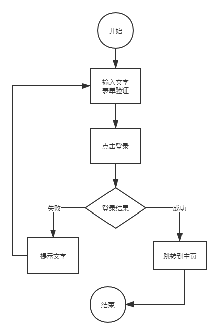

```js
// 1.绑定事件
$("#_js_loginBtn").click(function () {
    // 2.表单校验  获取输入框的值
    var user = $("#_j_login_form input[name='username']").val().trim();
    var pwd = $("#_j_login_form input[name='password']").val().trim();

    // console.log(user, pwd);
    if (user !== "" && pwd !== "") {
        // 3.发送登录请求
        $.ajax({
            url: "http://kumanxuan1.f3322.net:8809/users/login",
            type: "POST",
            data: {
                username: user,
                password: pwd
            },
            success: function (res) {
                console.log(res);
                // 4.验证结果
                if (res.code == 200) {
                    // 6.token 存储到本地
                    localStorage.setItem("token", res.data.token)
                    // 5.成功 跳转到首页
                    location.href = "./index.html"
                }
                alert(res.msg);
            }
        })
    }
})
```

### 6.3、本地存储

window 对象上有两个对象可以做浏览器数据存储

#### 6.3.1、localStorage

特点：

- 永久存在，除非主动删除；
- 同源都可以访问

语法：

- 保存数据：localStorage.setItem(key, value);
- 读取数据：localStorage.getItem(key);
- 删除单个数据：localStorage.removeItem(key);
- 删除所有数据：localStorage.clear();

#### 6.3.2、sessionStorage

特点：

- 临时会话，关闭浏览器将不再存在；
- 同源都可以访问。

语法：

- 保存数据：sessionStorage.setItem(key, value);
- 读取数据：sessionStorage.getItem(key);
- 删除单个数据：sessionStorage.removeItem(key);
- 删除所有数据：sessionStorage.clear();

## 七、作业

1. 【黄金】：
   - 首页(轮播图+列表)
   - 登录注册+登录认证+退出登陆
   - 游记列表和详情
   - 攻略列表和详情
2. 【铂金】：
   - 游记评论
   - 攻略评论
3. 【钻石】：
   - 首页搜索跳转详情页
4. 【王者】：
   - 分页插件带到项目中使用
   - 目的地页面和详情

# day06-UI框架

> 今日目标：
>
> 1. 了解前端常用框架及分类
> 2. 掌握Bootstrap框架的环境搭建
> 3. 掌握Bootstrap的栅格系统原理
> 4. 掌握Bootstrap组件插件的使用
> 5. 培养查询文档的能力，达到可以自学类似UI框架的目的
> 6. 掌握Swiper插件的使用
> 7. 掌握iframe标签插入页面
> 8. 掌握jQuery的load方法

## 一、简述前端框架

前端框架主要分为两种：

### 1.1、技术框架

JQuery、VueJs、ReactJs等，这些框架大多用于操作DOM，或者是处理数据，对于页面效果或数据处理是强项，但对UI美观能力较弱。

### 1.2、UI框架(改样式才难------覆盖)

Bootstrap、WEUI、VantUI、Ant-design、ElementUI等，这类框架是有人写好了大多数样式，你可以借助这些框架实现快速布局。

## 二、Bootstrap框架

由**Twitter**公司的两名前端工程师Mark Otto和Jacob Thornton在**2011**年发起的，并利用业余时间完成了第一个版本的开发。是最受欢迎的 HTML、CSS 和 JS 框架，用于开发响应式布局、移动设备优先的 WEB 项目。

官网：  http://getbootstrap.com/

中文网址：<https://www.bootcss.com/> 

**注意：**

使用 Bootstrap 并不代表不用写 CSS 样式，而是不用写绝大多数大家都会用到的样式

Bootstrap 本身是一个独立的英文单词，其含义为：n. 引导指令,引导程序

**总结**：

BS是用来做响应式页面的前端UI框架，它提供了栅格系统、样式布局、API供我们直接使用。

### 2.1、搭建BS使用环境（使用前准备工作）

**1、下载相关文件**

 官网打开后下载即可，或者通过包管理工具用命令下载

**2、环境搭建相关代码（引入主要文件）**

```html
<!DOCTYPE html>
<html lang="zh-CN">
  <head>
    <meta charset="utf-8">
    <!-- 告诉IE浏览器以最新的 解析器  去解析当前的页面 -->
    <meta http-equiv="X-UA-Compatible" content="IE=edge">
     <!-- 手机端适配 屏幕尺寸适配 -->
    <meta name="viewport" content="width=device-width, initial-scale=1">
    
    <!-- 上述3个meta标签*必须*放在最前面，任何其他内容都*必须*跟随其后！ -->
    <title>Bootstrap 101 Template</title>

    <!-- Bootstrap 样式文件-->
    <link href="https://cdn.jsdelivr.net/npm/bootstrap@3.3.7/dist/css/bootstrap.min.css" rel="stylesheet">

    <!-- HTML5 shim 和 Respond.js 是为了让 IE8 支持 HTML5 元素和媒体查询（media queries）功能 -->
    <!-- 警告：通过 file:// 协议（就是直接将 html 页面拖拽到浏览器中）访问页面时 Respond.js 不起作用 -->
    <!--[if lt IE 9]>
		低版本浏览器兼容h5标签
      <script src="https://cdn.jsdelivr.net/npm/html5shiv@3.7.3/dist/html5shiv.min.js"></script>
		低版本浏览器兼容媒体查询
      <script src="https://cdn.jsdelivr.net/npm/respond.js@1.4.2/dest/respond.min.js"></script>
    <![endif]-->
  </head>
  <body>
    <h1>你好，世界！</h1>

    <!-- jQuery (Bootstrap 的所有 JavaScript 插件都依赖 jQuery，所以必须放在前边) -->
    <script src="https://cdn.jsdelivr.net/npm/jquery@1.12.4/dist/jquery.min.js"></script>
    <!-- 加载 Bootstrap 的所有 JavaScript 插件。你也可以根据需要只加载单个插件。 -->
    <script src="https://cdn.jsdelivr.net/npm/bootstrap@3.3.7/dist/js/bootstrap.min.js"></script>
  </body>
</html>
```

本地简洁版：

```html
<!DOCTYPE html>
<html lang="zh-CN">
<head>
    <meta charset="utf-8">
    <meta http-equiv="X-UA-Compatible" content="IE=edge">
    <meta name="viewport" content="width=device-width, initial-scale=1">
    <title>Bootstrap</title>
    <link href="./css/bootstrap.min.css" rel="stylesheet">
    <script src="./js/html5shiv.min.js"></script>
    <script src="./js/respond.min.js"></script>
</head>
<body>
<h1>你好，世界！</h1>


<script src="./js/jquery.min.js"></script>
<script src="./js/bootstrap.min.js"></script>
</body>
</html>
```

### 2.2、BS的响应式原理（栅格系统）

文档地址：<https://v3.bootcss.com/css/#grid> 


BS的设计者把所有的终端设备按分辨率来分成4个档：

\>= 1200px     大屏幕     版心  1170

\>=992px    中等屏幕      版心  970

\>=768px    小屏幕       版心   750

<768px     超小屏幕（手机）    版心   自动撑满

在把屏幕分辨率分为4档之后，**再把版心分成12列**，让盒子占其中的多少列，因为版心宽度不同，盒子在不同档次的分辨率下实际宽度就不同了，所以利用栅格系统把盒子做成响应式。

 

**如何让盒子占多少列**？-----设置类名：

col-lg-num    盒子在**大屏幕**下占num列

col-md-num    盒子在**中等屏幕、大屏幕**下占num列

col-sm-num    盒子在**小屏幕、中等屏幕、大屏幕**下占num列

col-xs-num    盒子在**所有屏幕**下占num列

### 2.3、栅格系统实际应用

首先明确两个类名：

> .container：代表版心
>
> .container-fluid：代表通屏

实现BS中文官网上的栅格布局：

需求：

```txt
当为PC端尺寸时，版心一行排4个盒子
当为pad端尺寸时，版心一行排2个盒子
当为phone端尺寸时，版心一行只有1个盒子
```

代码1(原理)：

```html
<div class="container">
    <div class="col-md-3 col-sm-6 col-xs-12 bg-danger">盒子1</div>
    <div class="col-md-3 col-sm-6 col-xs-12 bg-primary">盒子2</div>
    <div class="col-md-3 col-sm-6 col-xs-12 bg-success">盒子3</div>
    <div class="col-md-3 col-sm-6 col-xs-12 bg-info">盒子4</div>
</div>
```

### 2.4、项目：响应式官网（重点）

项目地址：http://codesohigh.com/wolfcode/

思路：

1. 导航条——组件-[导航条](https://v3.bootcss.com/components/#navbar)
2. 轮播图——插件-[carousel](https://v3.bootcss.com/javascript/#carousel)
3. 缩略图列表——组件-缩略图-[自定义内容](https://v3.bootcss.com/components/#thumbnails)
4. 底部——全局css-辅助类-[情境背景色](https://v3.bootcss.com/css/#helper-classes)

## 三、Swiper轮播图

Bootstrap框架中的carousel，就是我们常说的轮播图，目前做轮播图应用最广的是Swiper这个插件。

插件文档：https://www.swiper.com.cn/usage/index.html

我们主要关心的是Swiper是配置项，下面看一下代码示例：

```js
var mySwiper = new Swiper('.swiper-container', {
    autoplay: true, //自动轮播
    loop: true, //无缝循环
    mousewheel: true, //鼠标滚轮控制
    keyboard: true, //键盘左右键控制
    //切换时的效果： 可设置为'slide'（普通切换、默认）,"fade"（淡入）"cube"（方块）"coverflow"（3d流）"flip"（3d翻转）。
    effect: 'cube',
    pagination: {
        el: '.swiper-pagination',
    },
    navigation: {
        nextEl: '.swiper-button-next',
        prevEl: '.swiper-button-prev',
    }
});

//鼠标覆盖停止自动切换
mySwiper.el.onmouseover = function () {
    mySwiper.autoplay.stop();
}

//鼠标离开开始自动切换
mySwiper.el.onmouseout = function () {
    mySwiper.autoplay.start();
}
```

## 四、jQuery的后台系统

### 4.1、iframe标签（重点）

功能：做页面嵌套

场景：后台系统切换子页面的时候经常用到

### 4.2、load方法（重点）

语法：

```js
$(selector).load("xxx.html");
```

功能：载入 HTML 文件代码并插入至 DOM 中。

**如果想从vscode发布到浏览器查看，需要使用 `live server` 查看，不要用 `open in default browser` 。**

## 五、作业

【黄金】：今天代码（包含课堂写的）写两遍并完成**jQuery的阶段总结**-----必须完成

【铂金】：继续完善骡窝窝项目功能

【王者】：完成下列PC后台管理系统

项目地址：http://codesohigh.com/manage/

要求：

用jQuery+Bootstrap完成这个静态项目。

思路：

1. 使用BS的导航条、胶囊式标签页和路径导航
2. 点击左侧切换页面
3. 切换的页面是不同的html页面
4. 可以使用iframe或者load方法

项目截图：


