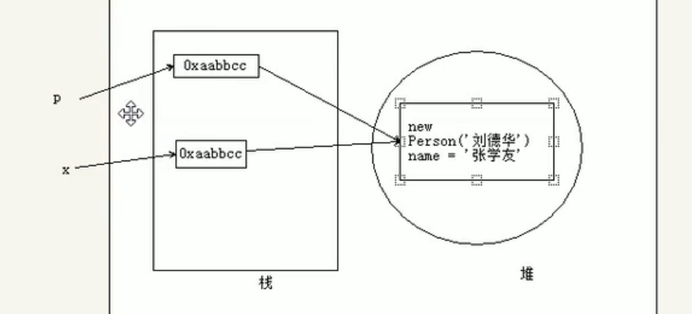
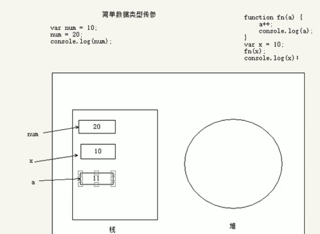
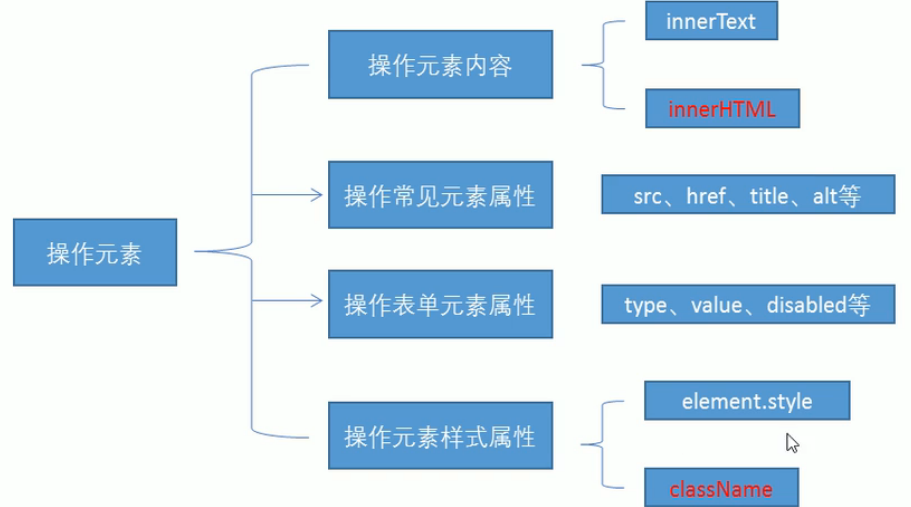

# js基础遗忘

## day01

### js组成

* ECMAScript - 简称es，用来规范JavaScript的语法的，具有多个版本。
* DOM - 文档对象模型，用来操作页面上的标签的
* BOM - 浏览器对象模型，用来操作浏览器的部分功能的

### css的注释

单行注释:ctrl+/

多行注释：ctrl+shift+a

```js
// 单行注释
/* 
多行注释
多行  */ 
```

### 变量名命名规范

1. 以数字、字母、下划线、美元符号$ 组成
2. 要区分大小写
3. 不能以数字开头
4. 不能以关键字和保留字命名（var for 等）
5. 建议使用驼峰命名 - 单词的首字母，第一个单词小写，其他的单词的首字母大写

### js中布尔值为false的六种情况

下面6种值转化为布尔值时为false，其他转化都为true

1、undefined（未定义，找不到值时出现）

2、null（代表空值）

3、false（布尔值的false，字符串"false"布尔值为true）

4、0（数字0，字符串"0"布尔值为true）

5、NaN（无法计算结果时出现，表示"非数值"；但是typeof NaN==="number"）

6、""（双引号）或''（单引号） （**空字符串，中间有空格时也是true**）

注意一个：空对象和空数组都是true

[js中布尔值为false的六种情况 - 零度从容 - 博客园 (cnblogs.com)](https://www.cnblogs.com/zjx304/p/9782942.html)

[(13条消息) JS中所有数据类型的true/false判断总结_nianbingsihan的博客-CSDN博客_js true 类型](https://blog.csdn.net/nianbingsihan/article/details/83240124)


### 数据类型转换

#### 数字型转换

方法

1. Number(数据)
2. parseInt(数据)
3. parseFloat(数据)

```js
		var str1 = '123.23';
        // 1.Number(数据) 转换为数字型 小数就小数 整数就整数 数字加字符串就是 NaN (要与parseInt()和parseFloat()区别开来) （就是说只能转数字，里面有字符都不行） 

        console.log(Number(str1));  // 123.23

        // 2.parseInt(数据) 转换为整数
        console.log(parseInt(str1)); // 123

        // 3.parseFloat(数据) 转换为浮点数
        var str2 = '123';
        console.log(parseFloat(str2));  // 123

        // NaN： not a number 虽然不是数字 但他是数字型的

		//2.数字间夹着字母情况

        // 字符在后面 前面的可以识别到赋值结束
        var str3 = '123px';
        console.log(parseFloat(str3));  // 123

        // 字符在前面 在前面就是NaN parseInt()和parseFloat()都一样
        var str4 = 'px123px';
        console.log(parseFloat(str4)); // NaN
        console.log(parseInt(str4));  // NaN

        // 字符在中间  前面的可以识别到赋值结束
        var str5 = '12px3';
        console.log(parseFloat(str5));  //12
```

#### 字符型转换

方法

1. String(数据);
2. 数据.toString();
3. 数字型数据 + ""  在数字型数据后面 + 空的字符串 得到一个字符型数据

```js
/* String(数据);
        数据.toString();
        数字型数据 + ""  在数字型数据后面 + 空的字符串 得到一个字符型数据 */
        var num = 123;
        console.log(typeof num); //number
        console.log(typeof String(num)); //string

        var num1 = 456;
        // 数据.toString();
        var num2 = num1.toString();
        console.log(typeof num2);  //string
        console.log(typeof (789 + ""));  //string
        console.log(typeof 789 + "");  //先检测类型再加
```

#### 布尔型转换

方法

1. Boolean

```js
        // <!-- Boolean() 转换成布尔型 -->
        console.log('---转化为false的---');
        console.log(Boolean(false));
        console.log(Boolean(0));
        console.log(Boolean("")); //单引号也是
        console.log(Boolean(null));
        console.log(Boolean(NaN));
        console.log(Boolean(undefined));

        console.log('---转化为true的---');
        // 除了false的都是true
        // 空数组和空对象都为true
        var arr = [];
        var obj = {};
        console.log(Boolean(arr));
        console.log(Boolean(obj));
        console.log(Boolean(1));
        console.log(Boolean(true));
		// 加个空格就是true了
        console.log(Boolean(" "));

		
```

#### 隐式转换和比较运算符

```js
// 比较运算符： != 判断是否相等  !==判断是否全等

        console.log(1 != 1);  //false
        console.log(1 !== 1);  //false
        console.log(1 != "1");  //false
        console.log(1 !== "1");  //true
```


```js
// 隐式转换
        //这里12会进行隐式转换
        console.log(123 > "12");  //true

        // 两个不是数字型 里面从左边第一个数开始比 没有隐式转换 
        console.log("133" > "12300");  //true

        // 这里看字符编码(ASCII码) 哪个大就大 a:97  s:115
        console.log("abc" > "sdfsf");  // false
```

#### +号的作用

```js
//+号作用
		//1. + 字符串拼接
        console.log('aaa' + 'ddd');  // aaaddd
        console.log(2 + 'ddd');

        // 2. 纯数字就是 数字相加
        console.log(1 + 2);  // 3

        // 3. 数字加字符串 就会变成字符串
        console.log(2 + 'ddd');  // 2ddd
        console.log(22 + '');  // "22"

        // 4. 在类数字的字符前面加上一个+ 可以换成数字型数据
        var a = +"123";
        console.log(a);  //123
        console.log(typeof a);  //number
```

#### NaN

全局属性 **`NaN`** 的值表示不是一个数字（Not-A-Number）。

`NaN`如果通过 `==` 、 `!=` 、 `===` 、以及 `!==`与其他任何值比较都将不相等 -- 包括与其他 NAN值进行比较。必须使用 [`Number.isNaN()`](https://developer.mozilla.org/zh-CN/docs/Web/JavaScript/Reference/Global_Objects/Number/isNaN) 或 [`isNaN()`](https://developer.mozilla.org/zh-CN/docs/Web/JavaScript/Reference/Global_Objects/isNaN) 函数。在执行自比较之中：NaN，也只有NaN，比较之中不等于它自己。

```js
	// 特殊字符 NaN 跟谁都不相等包括他自己
        console.log(NaN == NaN);

NaN === NaN;        // false
Number.NaN === NaN; // false
isNaN(NaN);         // true
isNaN(Number.NaN);  // true

function valueIsNaN(v) { return v !== v; }
valueIsNaN(1);          // false
valueIsNaN(NaN);        // true
valueIsNaN(Number.NaN); // true
```

### 逻辑运算符

想要把数据类型转布尔类型可以取反 ！

```js
// 逻辑运算符 ： && 与    || 或    !非 取反
        console.log(4 > 3 && 3 > 2);//true
        //&&表示多个条件同时成立，最终的结果就成立
        //条件成立为true,条件不成立fa1se
        console.log(true && true);//true
        console.log(true && false);//false
        console.log(false && true);//false
        console.log(false && false);//false
        console.log("----------");

        // ||表示多个条件只要有一个成立，最终结果就成立
        //条件成立为true
        console.log(true || true);//true
        console.log(true || false);//true
        console.log(false || true);//true
        console.log(false || false);//false
        console.log("------------");

        // !颠倒是非
        // 把真的变成假的假的变成真的
        console.log(!true); //false
        console.log(!false); //true

        console.log(!0);  //true

        // 想要把数据类型转布尔类型可以取反 ！
```


## day02

### 分支结构

#### if结构

只有一个条件判断

```js
if( 条件表达式 ){
   条件表达式的结果是true的时候要执行的代码
}
// 条件表示式里等于的记得加''

var gender = prompt('请问您的性别是男的吗');

if( gender === '男' ){
  alert('男厕所在二楼的最东边，请去吧');
}
```


两个条件判断

```js
if( 条件表达式 ){
   条件表达式的结果是true的时候要执行的代码
}else {
  条件表达式的结果是false的时候要执行的代码
}

var gender = prompt('请告诉我你的性别');
if(gender === '男'){
  alert('男厕所在二楼的最东边，请去吧');
}else {
  alert('女厕所在3楼的西边');
}
```


多条件的判断

```js
if( 条件表达式1 ){
   条件表达式1的结果是true的时候要执行的代码
}else if(条件表达式2){
  条件表达式2的结果是true的时候要执行的代码
}else if(){
         
}
// 如果还有更多的判断，继续写 else if ()

else {
  以上的条件都不为true，就会执行这里的代码
}


var gender = prompt('请告诉我您的性别');
// 男的上二楼
if(gender === '男'){
  alert('上二楼');
}else if(gender === '女'){
  // 如果是女的，上3楼
  alert('上三楼');
}else if(gender === '人妖'){
  alert('滚');
} else {
  alert('我没有听明白您的意思');
}
```


#### 三元表达式

> 语法：表达式 ? 表达式1 : 表达式2
>
> 判断第一个表达式 成立就返回表达式1 不成立就返回表达式2  跟if差不多

```js
表达式1 ? 表达式2 : 表达式3
// 如果表达式1 成立， 那么就执行表达式2
// 如果表达式1 不成立， 那么就执行表达式3
//例如： 求二个数字中谁更大
var a = 10; var b = 20;
var max = a > b ? a : b;
console.log(max);
```


#### switch结构

> 值比较固定的，就推荐用switch case结构
>
> case里的值记得是全等===
>
> 细节：
>
> 1.default不是必须的
>
> 2.break的作用是结束判断，如果不想要，也可以不写
>
> 3.变量和固定值的比较是 === 严格等于

```js
switch (变量){
  case 要比较的固定的值1:
    变量和 固定的值1  ===   的时候要执行的代码
    break;
  case 要比较的固定的值2:
    变量和 固定的值2  ===   的时候要执行的代码
    break;
  case 要比较的固定的值3:
    变量和 固定的值3  ===   的时候要执行的代码
    break;
  default:
    当以上所有的条件都不成立的时候，代码在这里执行
    break;
}
```


### 循环结构

#### for循环

> 基本语法：
>
> for(初始化表达式 ; 条件表达式 ; 递增或者递减表达式){
>   循环体（需要重复执行的代码）
> }

```js
for(var count = 0;count < 6; count++){
  console.log('javascript天下无敌！！！');
}
```

打印99乘法表

```js
var res = '';
     for (var i = 1; i <= 9; i++) {
         for (var j = 1; j <= i; j++) {
             res += j + '*' +  i + '=' + i*j + '\t';
          }
          res += '\n';
      }
console.log(res);
```

水仙花数

```js
var num = 333;
        // 个位数
        var ge = num % 10;
        // 十位数
        var shi = parseInt(num % 100 / 10);
        // 百位数
        var bai = parseInt(num / 100);
        console.log(ge);
        console.log(shi);
        console.log(bai);
        for (var i = 100; i < 1000; i++) {
            var g = i % 10;
            var s = parseInt(i % 100 / 10);
            var b = parseInt(i / 100);
            if ((g ** 3) + (s ** 3) + (b ** 3) === i) {
                console.log('水仙花数为：' + i);
            }
        }
```


#### while循环

> 基本语法：
>
> while(表达式) {
>
> ​	循环体（表达式为true时，就不断循环，直到false）
>
> }
>
> while(true)一般做死循环打到某种效果

```js
var num = 0;
      var i = 1;
      // 拿true来做死循环
      while(i<10) {   
          num += i;
          i++
      };
 console.log(num);
```


#### do while循环

> 这玩意放跟while差不多
>
> 不过do while循环一定会执行一次，因为判断条件在下面
>
> 基本语法：
>
> do {
>
> ​	循环体
>
> } while(表示式);

```js
// do while 都会执行一次
        var num = 0;
        var i = 1;
        do {
            num += i;
            i++
        } while (i < 10);
        console.log(num);
```


## day03

### 一、break和continue

break 和 continue 关键字都可以用在 for 和 while 循环结构中，表示跳出循环；break 关键字还可以用在 switch case 选择结构中，表示结束当前的选择语句。

参考：[JS break和continue语句详解 (biancheng.net)](http://c.biancheng.net/view/5528.html#:~:text=break语句 break 语句能够结束当前 for、for%2Fin、while、do%2Fwhile 或者,switch语句的执行；同时 break 也可以接受一个可选的标签名（请转到《 JS label关键字 》了解更多），来决定跳出的结构语句。)

#### 1.1、break

break 语句能够结束当前 for、for/in、while、do/while 或者 switch语句的执行。

- 示例1

下面示例设计在客户端查找 document 的 bgColor 属性。如果完全遍历 document 对象，会浪费时间，因此设计一个条件判断所有枚举的属性名是否等于“bgColor”，如果相等，则使用 break 语句跳出循环。

```js
for (i in document) {    
    if (i.toString() == "bgColor") {        
        document.write("document." +  i + "=" + document[i] + "<br />");        
        break;    
    }
}
```

在上面代码中，break 语句并非跳出当前的 if 结构体，而是跳出当前最内层的循环结构。

#### 1.2、continue

continue 语句用在循环结构内，用于跳过本次循环中剩余的代码，并在表达式的值为真时，继续执行下一次循环。

- 示例2

下面示例使用 continue 语句过滤数组中的字符串值。

```js
var a = [1,"hi",2,"good","4", ,"",3,4],  //定义并初始化数组a
    b = [], j = 0;  //定义数组b和变量j
for (var i in a) {  //遍历数组a
    if (typeof a[i] == "string")  //如果为字符串，则返回继续下一次循环
        continue;
    b[j ++] = a[i];  //把数字寄存到数组b
}
document.write(b);  //返回1,2,3,4
```


### 二、数组

#### 2.1、数组的创建和赋值

```js
//直接创建
	var arr = [];
	var arr1 = new Array(); // 里面放多个值就是赋的值
	// 如果只赋一个值 就是创建一个数组长度为该值的空数组
//赋值
    var arr = [0,1,2,3];
//或者
	var arr = [];
	arr[0] = 1;
	arr[1] = 1;
```

#### 2.2、数组的存值和取值

```js
	var arr = ['12', '33', '22'];
        // 取数组 数组名[索引];
    console.log(arr[0]);
        // 重新赋值 可以修改数组内容
        arr[0] = '11';
   // 添加数组  数字长度比最后一个索引大一 
        arr[arr.length] = '添加';     
        arr[arr.length] = '添加1';
        arr[arr.length] = '添加2';
        arr[arr.length] = '添加3';
        console.log(arr);
```

#### 2.3、遍历数组

```js
关键点 :1.数组长度为 数组名.length  2.数组索引从0开始 数组最大索引为数组长度减一
var arr = [1, 2, 3, 1, 0];
        var sum = 0;
        for (var i = 0; i < arr.length; i++) {
            // 打印数组全部值
            console.log(arr[i]);
            sum += arr[i];
        }
      	console.log(sum);
```


### 三、几个对象和方法

#### 3.1、split()方法

> 作用：用来分割字符串形成数组，把传入的分隔符去掉 把分隔符前后的内容变成数组里面的数据
>
> 用法：字符串.split('分隔符');

```js
		var str = 'sdfgs,dsfgsd,dg,d,';
        console.log(str.split(',')); // 
```

#### 3.2、Date对象

> 作用：创建时间对象可以调用他的方法去获取日期时间等
>
> 用法：var date = new Date();  要创建一个对象
>
> 
>
> 时间戳：是用来记录某一时刻的一串数字
>
> 作用：记录某个时间（朋友圈发布时间）

```js
		var date = new Date();
        // 时间戳
        var date1 = +new Date();
        // 或者
        var time = date.getTime();
        console.log(date1);
        console.log(time);
        // 年份
        var year = date.getFullYear();
        // 月的时候要加一  月份
        var month = date.getMonth() + 1;
        // 日
        var day = date.getDate();
        var hours = date.getHours();
        var minutes = date.getMinutes();
        var seconds = date.getSeconds();
        // 周
        var week = date.getDay();
        hours < 10 ? '0' + hours : hours;
        console.log(year);
        console.log(month);
        console.log(day);
        console.log(hours);
        console.log(minutes);
        console.log(seconds);
        console.log(week);
```

```js
// 创建时间对象
        var date = new Date();
        
        // 时间戳是记录某个时刻的一串数字 
        // 作用：记录某个时间（朋友圈发布时间）
        // 方法一
        console.log(date.getTime());
        // 方法二
        var date1 = +new Date();
        console.log(date1);  // 1647395305523
        
        // 得到之前时间
        var date2 = new Date(1647395305523);
        console.log(date2);

        // 时间差：获取当前时间的时间戳 - 之前的某个时间的时间戳
```


#### 3.3、Math.random()方法

> 作用：获取[0,1)的随机数
>
> 用法：Math.random(); 

```js
		var students = ['只是', '电饭锅', '带飞', '让对方', '带恩'];		
		// Math.random() 方法 获取[0-1)的随机数 不包括1
        // Math.floor 向下取整
		console.log(Math.random());
        var rad = Math.floor(Math.random() * students.length);
        console.log(rad);
        console.log(students[rad]);
```


#### 3.4、综合案列

机器人

```js
<audio src="" controls id="au"></audio>

    <script>
        // 1. 提问框(\r\n 表示换行)
        // 你好，我是您的智能助手，请输入下面的选项，决定功能：\r\n1.输入1，可以计算多个数字的和 \r\n2.输入2，可以得到当前的时间。\r\n3.输入3，可以随机点播歌曲，\r\n4.输入q可以退出聊天

        while (true) {
            var ipt = prompt('你好，我是您的智能助手，请输入下面的选项，决定功能：\n 输入1，可以计算多个数字的和 \n 输入2，可以得到当前的时间。\n 输入3，可以随机点播歌曲 \n 输入q，可以退出聊天');
            if (ipt == 'q') {
                alert('你已成功退出');
                break;
            }
            switch (ipt) {
                case '1':
                    var num = prompt('请输入相加数字，以空格隔开');
                    // 生成新数组
                    var nums = num.split(' ');
                    // 遍历
                    var sum = 0;
                    for (var i = 0; i < nums.length; i++) {
                        // 接收到的是字符串 要装换
                        sum += Number(nums[i]);
                    }
                    alert('何为：' + sum);
                    break;

                case '2':
                    // 创建时间对象
                    var date = new Date();

                    var year = date.getFullYear();
                    var month = date.getMonth();
                    var day = date.getDate();
                    var hours = date.getHours();
                    hours = hours < 10 ? '0' + hours : hours;
                    var minutes = date.getMinutes();
                    minutes = minutes < 10 ? '0' + minutes : minutes;
                    var seconds = date.getSeconds();
                    seconds = seconds < 10 ? '0' + seconds : seconds;
                    alert(`${year}年${month}月${day}日${hours}:${minutes}:${seconds}`);
                    break;

                case '3':
                    // 获取随机数
                    var music = ['稻香', '夜曲', '逆战'];
                    var ran = parseInt(Math.random() * music.length);

                    // for(var i = 0;i<music.length;i++) {

                    // }
                    var audio = [
                        'http://dl.stream.qqmusic.qq.com/RS020643ANK71H36gh.mp3?guid=7263568031&vkey=093B9F9B335D41A6AE66CB16E5853F0DB2A5BF2D0A8E37C783A01C0FA9C38E9AA369B3E98CADF629535255D9B70A9E538CBF56936B0D85BE&uin=2542648484&fromtag=66',
                        'http://dl.stream.qqmusic.qq.com/RS02062sWHfE22Za8D.mp3?guid=3475509250&vkey=D64AF8580B43CFE0AD3BC918F8BDB1D5A6BA8028D9558A74B80A70178ED083CAE01ABDAFD12B78C0A1B44C2C88FC931A7D8B57E141206A42&uin=2542648484&fromtag=66',
                        'http://dl.stream.qqmusic.qq.com/C400002okoNy2NFHOL.m4a?guid=3181061600&vkey=D339B4313141B6816666B1D869DFD01245046B3799BC863367C4228AEB2820438EBCEBCEE22EE13BF64D8F2D7EF5F73CD250B0D2AFB1FAA4&uin=2542648484&fromtag=66',
                    ];
                    alert('随机歌曲为：' + music[ran]);
                    console.log(audio[ran]);
                    // document.write(`<audio src="${audio[ran]}" controls></audio>`);
                    var au = document.getElementById('au');
                    au.src = audio[ran];
            }
        }

    </script>
```


### 四、模板字符串

> es6新增
>
> 模板字符串  字符串放在 符合里面  变量放在${}里面

```js
			// es5拼接字符串
            // document.write('');
            // es6的模板字符串  字符串放在 ` `符合里面  变量放在${}里面
            document.write(``);
```


## day04

### 一、函数

#### 1.0、构造函数

> 用来实例化对象的函数。主要功能为初始化对象。特点就是和new一起使用，new就是在创建对象，从无到有，构造函数就是在为初始化的对象添加属性和方法。**构造函数定义时首字母大写**（规范）
>
> 参考：[js构造函数详解 - 长安城下翩翩少年 - 博客园 (cnblogs.com)](https://www.cnblogs.com/honkerzh/p/10270624.html)

#### 1.1、定义

> 函数：就是执行多次重复的功能 比如求和功能、最大值等。
>
> 区别：循环是反复执行的代码
>
> 格式：
>
> ```js
> // 函数声明式
> function 函数名() {
>   函数体
> }
> 或者
> // 函数表达式
> var 函数名 = function() {
>     函数体
> }
> ```
>
> 用法：函数名();
>
> 特点：定义之后不会自己执行，必须调用才执行。

#### 1.2、参数

> 本质：函数参数的本质就是变量 也称形参
>
> 形参需要函数调用的时候赋值过来，而那个就叫实参

```js
// 函数的参数 本质是 变量 形参
        
        function tell(name1,name2) {
            console.log('我是' + name1);
            console.log('原来不是' + name2);
        }

        // 调用函数 调用的时候是给变量赋值 也就是形参
        // 而这里面放的是实参
        tell('哈哈哈','嗯嗯嗯');
```

#### 1.3、返回值

> 返回值：就是函数处理完的结果，如果不反回就得不到该结果，如果执行结果不反回就是**`undefined`**
>
> 如何返回：return 返回值;
>
> 如果返回值出现后，函数体后面的代码不会再执行。相当于终止函数的运行。

```	js
		function getSum(a,b) {
            console.log('return前的代码');
            return a+b;
            // return后面的代码不会执行
            console.log('return前的代码');
        }
        // 总结：return的作用就是返回函数的结果 并且终止函数的运行
        console.log(getSum(10,10));
```


#### 1.4、封装函数

1. 先书写一个正常的功能代码（假设一些数据），验证一下执行的正确性

2. 在书写函数的格式function() {} 把功能代码全部放到函数里

3. 观察哪个值是变化的 再修改参数 有执行结果的就return返回结果

4. 调用函数 传入参数 函数名(参数,参数...)

```js
		var date = new Date();

        var year = date.getFullYear();
        var month = date.getMonth();
        var day = date.getDate();
        var hours = date.getHours();
        // hours = hours < 10 ? '0' + hours : hours;
        var minutes = date.getMinutes();
        // minutes = minutes < 10 ? '0' + minutes : minutes;
        var seconds = date.getSeconds();
        // seconds = seconds < 10 ? '0' + seconds : seconds;
        function getZero(time) {
            return time < 10 ? '0' + time : time;
        }
        alert(`${year}年${month}月${day}日${getZero(hours)}:${getZero(minutes)}:${getZero(seconds)}`);
```

#### 1.5、匿名函数

> 顾名思义就是没有函数名的函数

```js
function (参数){ 函数体 }
```

#### 1.6、自调用函数

> 自己调用自己 (整个函数)();

```js
(function() {
    console.log('我是自调用函数');
})();
```


### 二、作用域

#### 2.0、全局变量修改(补充)

> 一般在方法里面的全局变量的修改仅限于方法体内，方法结束之后，全局变量就会恢复之前的值。另一份文档

#### 2.1、全局作用域

> 在全局声明，在哪里都可以用
>
> 在全局作用域声明的变量就是全局变量
>
> 全局包括外链js文件里面和内嵌js的script标签内部
>
> 没有var的变量是全局变量，外面的需要调用那个函数才能访问

#### 2.2、局部作用域

> 在局部声明，只有在局部被调用，就是只有在函数能被访问
>
> 在局部作用域声明的变量就是局部变量

#### 2.3、作用域链

> 作用域链就是在有嵌套的时候产生
>
> 作用域链变量的访问原则是优先使用本函数内部的变量
>
> 如果本函数内部没有这个变量就会向上一层函数查找（就近原则）
>
> 如果找到全局都没有这个变量，就会报错

#### 2.4、预解析

> 预解析是浏览器的一个功能
>
> 浏览器在解析js代码的时候回先全局扫一遍
>
> 把var声明的变量和function定义的函数提前到当前作用域的最前面(function()提到最前面)
>
> 声明提升 但是赋值没有提升

```js
		f1();// 正常执行
        function f1() {
            console.log(1);
        }
        f1(); // 正常执行

        f2();// 报错 ： f2 is not a function
        var f2 = function () {
            console.log(2);
        }
        // 预解析 
        // var f2;
        // f2();
        // f2 = function() {
        //     console.log(2);
        // }
```

## day05

### 一、arguments

> 函数内置参数对象，当实参和形参个数不一样时，可以用arguments来获取所有实参。（只能在函数内部使用）
>
> 它看起来像数组，实际是伪数组可以去遍历。

```js
		// 问题：当实参和形参个数不同时 无法得出正确结果
        // 解决：arguments 他是函数内置提供的参数对象
        // 有索引和长度 不是数组是伪数组
        function fn() {
            var sum = 0;
            for (var i = 0; i < arguments.length; i++) {
                sum += arguments[i];
            }
            return sum;
        }

        console.log(fn(10, 20));
        console.log(fn(10, 20, 30));
        console.log(fn(10));
```


### 二、短路运算

> 逻辑运算符 && || ! 
>
> 可以用于设置默认值

```js
		// && 短路 一假全假 当左边为假（返回左） 就不在验证右边了
        console.log(1 && 0);  // 0   false
        console.log(1 && 2);  // 2   true
        console.log(2 && 1);  // 1   true
        console.log(0 && 1);  // 0   false
        console.log(undefined && 1);  // undefined   false
        console.log(null && undefined);  // null false
        console.log(undefined && null);  //undefined    false

        // || 短路 一真全真 当左边为真（返回左） 就不在验证右边了
        console.log(3 || 0);  // 3   true
        console.log(4 || 2);  // 4   true
        console.log(2 || 1);  // 2   true
        console.log(0 || 1);  // 1   false
        console.log(undefined || 1);  // 1   false
        console.log(null || undefined);  // undefined   false
        console.log(undefined || null);  // null   false
```

```js
		// f是函数 调用函数就是回调函数
        function fn(f) {
            // 判断f是否有内容就是是否为true
            // if (f) {
            //     f();
            // }

            // 简化代码
            // 道理跟上面差不多 健壮性
            f && f();  // 一假全假  f为假不执行f();

            // console.log(f && f());
        }
        // 不传参数 出错 f is not a function
        fn();
        fn(function () {
            console.log('回调函数')
        })
```


### 三、回调函数

回调函数就是实参为函数。

```js
		// fn2不是回调函数 
        /* function fn1() {
            console.log('fn1');
            // 只是调用了fn2 并不是传入了fn2
            fn2();
        }
        function fn2() {
            console.log('fn2');
        } */

        // 这个fn2是回调函数
       function fn1(f) {  // 传入了fn2这个函数
            console.log('fn1');
            console.log(f);  // 输出整个函数
            fn2();
        }
        function fn2() {
            console.log('fn2');
        }
        fn1(fn2);  // fn1  fn2整个函数  fn2
```


### 四、对象

#### 4.1、定义

> 万物皆对象 一个具体的人、具体的狗都是对象，但人不是对象
>
> 对象是属性和方法的集合。也就是特征和方法

#### 4.2、创建对象

1. 字面量创建

```js
		 
        console.log(obj);
        console.log(typeof obj);
```

2. 内置对象创建

```js
 		var obj2 = new Object();
        console.log(obj2);
        console.log(typeof obj2);
```

3. 给对象添加属性值和方法

对象名.属性名 = 值

对象名.方法名 = 值

键值对：key:value

```js
		var obj3 = {};
        obj3.name = '张三';
        obj3.age = 18;
        obj3.sayHi = function () {
            console.log('你好');
            return '0';
        }
        console.log(obj3);
        // 函数 输出你好 没返回值默认undefined
        console.log(obj3.sayHi()); // 你好 undefined
```

4. 字面量初始化对象

```js
		// 字面量初始化对象
        // 键值对{key:value,key:value} 用逗号隔开
        var obj4 = {
            name: "zhangsan",
            age: 20,
            sayHi: function () {
                console.log('你好');
            }
        }
        // 对象是一个无序的键值对集合
```

#### 4.3、工厂函数创建对象

当代码需要复用的时候“封装” 函数

封装：把重复的代码放入函数体 把不确定的代码作为参数传入

```js
		// 当代码需要复用的时候“封装” 函数
        // 封装：把重复的代码放入函数体 把不确定的代码作为参数传入

        function createObject(name,age) {
            var obj = {};
            obj.name = name;
            obj.age  = age;
            obj.sayHi =function() {
                console.log('你好');
            }
            // 不反回undefined
            return obj;
        }
        console.log(createObject('张三',18));
        console.log(createObject('力士',20));
        console.log(createObject('万物',21));
```

#### 4.4、遍历对象

```js
for(var key in obj){
    console.log(key);// 键名
    console.log(obj[key]); // 每个key对应的键值
}
```

```js
function Person(name, age) {
            this.name = name;
            this.age = age;
            this.sayHi = function () {
                console.log('hi');
            }
        }

        var zhangsan = new Person('zhangsan', 20);

        // 使用属性的方式： 对象名.属性名

        // 方式二：对象名["属性/方法名"]
        // 对象名 key 属性或方法是不确定的
        var _name = "name";
        console.log(zhangsan[_name]);
        zhangsan['sayHi']();

        console.log('-------分隔符-------');

        // 遍历对象
        for (var key in zhangsan) {
            // 得到所有对象名 也就是key
            console.log('key:', key);
            console.log(zhangsan[key]);
            // console.log(zhangsan[key]());
        }
```


### 五、传参

#### 5.1、复杂数据类型（引用数据类型）传参

> 函数的形参也可以看做是一个变量，当我们把引用类型变量传给形参时，其实是把变量在栈空间里保存的**`堆地址`**复制给了形参，形参和实参其实保存的是同一个堆地址，所以操作的是同一个对像。




```js
		function Person(name) {
            this.name = name;
        }
        function f1(x) {
            console.log(x.name); //刘德华
            x.name = '张学友';
            console.log(x.name);  // 张学友
        }

        var p = new Person('刘德华') ;
        console.log(p.name);  // 刘德华
        f1(p);  // 把p传给x  相当于x等于p
        console.log(p.name); // 张学友 因为x和p指向的同一个地址 x变了 p也变了
```


#### 5.2简单数据类型传参

> 函数的形参也可以看做是一个变量，当我们把一个值类型变量作为参数传给函数的形参时，其实是把变量在栈
> 空间里的值复制了一份给形参，那么在方法内部对形参做任何修改，都不会影响到的外部变量。



```js
function fn(a)(
	a++;
	console.log(a);  // 11
}
var x 10;
fn (x);
console.log (x);  // 10
```


## day06

### 一、内置对象附子理中丸

#### 1、Array对象

```js
	<script>

        var arr = [23, 4, 5, 21, '23'];

        // 1. 在最后添加一个 push() 返回数组长度 改变原数组
        console.log(arr.push(66));
        console.log(arr);
        console.log('---------分隔符---------');

        // 2. 在最前添加一个 unshift() 返回数组长度 改变原数组
        console.log(arr.unshift(11));
        console.log(arr);
        console.log('---------分隔符---------');

        var arr1 = [24, 4, 5, 21, '23'];
        // 3. 在最后删除一个 pop() 返回删除的元素 改变原数组
        console.log(arr1.pop());
        console.log(arr1);
        console.log('---------分隔符---------');

        // 4. 在最前删除一个 shift() 返回删除的元素 改变原数组
        console.log(arr1.shift());
        console.log(arr1);
        console.log('---------分隔符---------');

        // 5. 翻转数组 reverse() 返回翻转数组 原数组不变
        console.log(arr1.reverse());
        console.log('---------分隔符---------');

        // 6. splice() 从数组添加/删除项目，并返回删除的元素是一个数组  改变原数组
        // array.splice(index(索引), howmany(数量), item1(新项), ....., itemX)
        // 删除从 index 处开始的零个或多个元素
        var arr2 = [1, 2, 3, 4, 5, 6];
        console.log(arr2.splice(1, 0, 'aa', '123'));   // 三个或以上就是替换
        console.log(arr2.splice(1, 1));  // 两个参数 就是删除
        console.log(arr2);
        // 还有个全部删除
        console.log('---------分隔符---------');
        console.log(arr2.splice(0));
        console.log(arr2);
        console.log('---------分隔符---------');
        var arr22 = [1, 2, 3, 4, 5, 6];
        console.log(arr22.splice(2));   // 删除后三个
        console.log(arr22);
        console.log('---------分隔符---------');

        // 7. 选出数组start end的数组取钱不去后 slice() 返回选出数组 不改变原数组
        var arr3 = [1, 23, 43, 4, 43, 6, 4];
        console.log(arr3.slice(1, 4));
        console.log(arr3.slice(1));  // 只给一个值 就从他开始往后全部选出
        console.log(arr3.slice(-2));  // 从后面开始选
        console.log('---------分隔符---------');

        // 8. 输入字符 返回索引 indexOf() 返回索引 不改变原数组
		// 两个参数 第二个参数表示从第几个索引开始找
        console.log(arr3.indexOf(23));
        console.log(arr3.indexOf(666));  // 找不到就返回-1
        console.log('---------分隔符---------');

        // 9. 转换成字符串 join(分隔符) 返回拼接字符串 不改变原数组
        var arr5 = ['数组2', 1, 2, 3, 4, 5];
        console.log(arr5.join('-'));
        console.log(arr5.join(''));
        console.log('---------分隔符---------');

        // 10. 连接两个数组 concat(数组1,数组2...) 返回新数组 不改变原数组
        console.log(arr3.concat(arr5));
        console.log('---------分隔符---------');

        // 11. 遍历数组 forEach(function(item,index){}) 无返回值 不改变原数组
        var arr9 = [11, 20, 3, 4, 45, 5];
        var res = arr9.forEach(function (item, index) {
            console.log(item, '索引：', index); // item 是数组里面的每个元素 index 是数组的每个索引

            return 66;
        })
        console.log(res);
        console.log('---------分隔符---------');

        // 12. 遍历数组 map(function(item,index){}) 有返回值 不改变原数组
        // 与上面这货差别就是有返回值
        var res1 = arr9.map(function (item, index) {
            console.log(item, '索引：', index);
            return 66;
        })
        console.log(res1);
        console.log('---------分隔符---------');

        // 13. 过滤数据 filter(function(item,index){}) 返回符合条件的数据 不改变原数组
        console.log(arr9.filter(function (item, index) {
            // console.log(i);
            return item > 10;
        }));


    </script>
```

> 数组遍历的坑：
>
> - 遍历里面改单个元素不生效问题：
>
> 总结：forEach方法里操作对象生效，想要操作里面的基本数据类型，就用arr[i]的形式直接操作数组。在vue组件里面可以这样去修改  this.$set(self,index,newVal)
>
> 参考链接：[深入理解关于forEach、map等循环方法无法修改当前遍历值 - 掘金 (juejin.cn)](https://juejin.cn/post/7056713961169190920)
>
> [(5条消息) forEach究竟能不能改变数组的值_ZhengKehang的博客-CSDN博客_foreach是否可以改变数组元素的值](https://blog.csdn.net/ZhengKehang/article/details/81281563)

ES6数组方法（修正：有些不是）

> 参考链接：[(5条消息) ES6数组循环、数组新增、交集、并集、补集、差集、去重_shenroom的博客-CSDN博客](https://blog.csdn.net/qq_41772754/article/details/88089555)

```js
        let arr = [1, 2, 3, 4, 5, 6];

        // 1.map 对数组遍历 返回新的数组  
        let mapArr = arr.map(e => e * 2);
        console.log(mapArr);

        // 2. filter 遍历 过滤满足条件的 以新数组返回  没有返回空数组
        const filterArr = arr.filter(e => e > 4);
        console.log(filterArr);

        // 3.find 返回满足条件的第一个元素值  没有则返回undefined
        const findArr = arr.find(e => e > 4);
        console.log(findArr);

        // 4.findIndex  返回满足条件的第一个元素的索引  没有则返回-1
        const findIndexArr = arr.findIndex(e => e > 1);
        console.log(findIndexArr);

        // 5.some 判断数组中是否或至少有一项满足判断条件  满足返回true 否则false
        const someArr = arr.some(e => e > 6);
        console.log(someArr);

        // 6.every 判断数组中每一项满足判断条件  满足返回true 否则false
        const everyArr = arr.every(e => e > 0);
        console.log(everyArr);

		// 7. 利用reduce方法遍历数组的每一个元素，reduce()调用结果最后返回一个最终值（最后一次return值）
		var arr = [
           {name: 'Vuejs入门', price: 99, count: 3},
           {name: 'Vuejs底层', price: 89, count: 1},
           {name: 'Vuejs从入门到放弃', price: 19, count: 5},
        ]
        // 8. 数组名.reduce(回调函数，pre的初始值)
        arr.reduce(function(pre, current){
            // reduce这个方法被调用时，会遍历arr这个数组的每一个元素，每遍历一个元素，就执行一次这里的代码
            // current表示当前正在遍历的这个元素
            // pre 是上一次的这个函数return的值
            // ！！！因为第一次遍历没有上一个return值，所以，交给了第二个参数，设置pre的初始值
            console.log(pre, current)
            return 10
        },0)
        //！！！并且reduce方法最终会返回最后一次的return值
		0 {name: "Vuejs入门", price: 99, count: 3}
        10 {name: "Vuejs底层", price: 89, count: 1}
        10 {name: "Vuejs从入门到放弃", price: 19, count: 5}

		9. arr.includes() 判断数组中是否有这个元素 返回的是一个布尔值

		10. 数组的扁平化（多少维数组变成一维数组）
        [1, 2, [3, 4]].flat()
		// [1, 2, 3, 4] 默认只拉一层
		拉两层
        [1, 2, [3, [4, 5]]].flat()
        // [1, 2, 3, [4, 5]]
        [1, 2, [3, [4, 5]]].flat(2)
        // [1, 2, 3, 4, 5]
		无论多少层
        [1, [2, [3]]].flat(Infinity)
		// [1, 2, 3]

		11. arr.fill() 方法用一个固定值填充一个数组中从起始索引到终止索引内的全部元素。不包括终止索引。
        arr.fill(value[, start[, end]])
value
用来填充数组元素的值。
start 可选
起始索引，默认值为 0。
end 可选
终止索引，默认值为 this.length。
返回值为新的数组
		const cards = Array(10).fill().map((_,i)=>i+1); //初始化一个 1~10 的数组
		// Array(10) 初始化长度为10 的空数组
```


#### 2、String对象

新加：

```js
// 以什么开始
str = 'hello'
let a = str.startsWith('h');  // a 为 true
// log a 为布尔值
// 还有个是以什么结束 endWith 
```


```js
 	<script>
        // 1. 字符串合并操作 +
        var num1 = 123;
        var str0 = 'def';
        console.log(num1 + str0) // 123def
        console.log('---------分隔符---------');

        // 2. 字符串以分隔符分割成数组 split()  返回新数组 
        var str = '234523';
        var str1 = '2-3-4-5-2-3';
        console.log(str1.split('-'));
        console.log(str1);
        console.log('---------分隔符---------');

        // 3. 获取对应索引的字符 charAt()  返回字符 
        console.log(str.charAt(1));
        console.log('---------分隔符---------');

        // 4. 获取对应字符的索引 indexOf()  返回索引
        console.log(str.indexOf(3));  // 1 只返回最先出现的 没有就-1
        console.log(str.indexOf(33));  // 没有就-1
        console.log('---------分隔符---------');
		// 补充-----lastIndexOf：获取最后出现字符的一个索引

        // 5. 截取对应的字符串 substr(索引,数量往后多少个)  返回截取字符串
        // str.substr(start[, length])
        var str5 = '123455667';
        console.log(str5.substr(2, 3));  // 345
        console.log(str5.substr(2));  // 一个参数选取索引后面全部  3455667
        console.log(str5.substr(-2));  // 从后面开始选  67
        console.log('---------分隔符---------');

        // 6. 截取对应的字符串 substring(开始索引start,结束索引不包括stop)  返回截取字符串
        // 取钱不去后
        console.log(str5.substring(1, 3)); // 23
        console.log(str5.substring(1)); // 一个参数选取索引后面全部  23455667
        console.log(str5.substring(-1)); // 负数选全部  123455667
        console.log('---------分隔符---------');

        // 7. replace(旧字符串，新字符串)  返回一个替换后的字符串 
        var str7 = 'sdg345sdf';
        console.log(str7.replace('dg','sb'));  // 有多个就替换第一个
        console.log('---------分隔符---------');

        // 8. 转大写 toUpperCase() 返回转后数组
        var str8 = 'sdfgwserDFGHDRTH';
        console.log(str8.toUpperCase());
        console.log('---------分隔符---------');

        // 9. 转小写 toLowerCase() 返回转后数组
        console.log(str8.toLowerCase());
    </script>
```


#### 3、Math对象

```js
	<script>
        // 1.向下取整 floor()
        console.log('11.3' + Math.floor(11.3));
        console.log('11.9' + Math.floor(11.9));
        console.log('---------分隔符---------');

        // 2. 向上取整 ceil()
        console.log('12.1' + Math.ceil(12.1));
        console.log('12.9' + Math.ceil(12.9));
        console.log('---------分隔符---------');

        // 3. 最大值 max
        console.log(Math.max(12, 99));
        console.log('---------分隔符---------');

        // 4. 最小值 min
        console.log(Math.min(10, 33));
        console.log('---------分隔符---------');

        // 6. 四舍五入 round
        console.log(Math.round(2.4));
        console.log(Math.round(2.6));
        console.log('---------分隔符---------');

        // 7. 绝对值 abs
        console.log(Math.abs(-3));
        console.log(Math.abs(3));
        console.log('---------分隔符---------');

        // 8. 随机数random
        console.log(Math.random());
        // 获取n-m的随机数
        function getRan(n, m) {
            return Math.floor(Math.random() * (m + 1 - n) + n);  // n先加 因为好理解
        }
        console.log('1-10随机数' + '\n' + getRan(1, 10));
    </script>
```


#### 4、Date对象

```js
	<script>
        // 创建时间对象
        var date = new Date(); // 当前的系统的时间和日期
        console.log(date.getFullYear());// 年份
        console.log(date.getMonth()); // 月份，从0开始
        console.log(date.getDate()); // 当前天数
        console.log(date.getHours()); // 小时，0-23
        console.log(date.getMinutes()); // 分钟 ， 0-59
        console.log(date.getSeconds()); // 秒数 ， 0-59
        console.log(date.getMilliseconds()); //毫秒 0-999        1000毫秒=1秒
        // 时间戳
        var date1 = +new Date();
        console.log(date.getTime());
        console.log(date1);

        // 1.传入不同的年月日时分秒
        var d1 = new Date(2022, 0, 1, 8, 00, 00); // 2020年1月1日 8:30:59
        console.log(d1);
 
        // 2.传入一个指定的字符串
        var d2 = new Date('2022-01-01');
        console.log(d2);

        // 3.传入一个 大的数字-- 从1970年1月1日开始到某个日期的总共的毫秒数
        var d3 = new Date(13785943209999);
        console.log(d3);

        var d4 = new Date(date.getTime());
        console.log(d4);

    </script>
```


## 操作元素



### 获取元素

#### 获取元素方式

```js
document.getElementById('id')             //通过ID获取元素，唯一一个
document.getElementsByTagName('标签名')    //通过标签名称获取元素，[]集合
document.getElementsByClassName('类名')    //通过类名获取元素，[]集合。兼容性问题
document.getElementsByName("name")        //通过name属性值获取元素(表单)

// HTML5向Web API新引入了两个方法用来更方便地从DOM选取元素
// 功能类似于jQuery的选择器。
document.querySelector('selectors')    //获取一组元素中第一个满足条件的元素，高版本浏览器支持
document.querySelectorAll('selectors') //获取所有满足条件的元素
// 这个参数selectors需要是合法的CSS选择语法，可以包含多个CSS选择器，用逗号隔开
```

待续


#### 获取元素内容

1. innerText

不识别html标签 非标准 去除空格和换行

2. innerHTML

innerHTML 识别html标签 w3c标准 保留空格和换行

```js
// innerText 不识别html标签 非标准 去除空格和换行
        var div = document.querySelector('div');
        div.innerText = '<strong>hhh</strong>';
// innerHTML 识别html标签 w3c标准 保留空格和换行
        var p = document.querySelector('p');
        p.innerHTML = '<strong>hhh</strong>';
        console.log(p.innerHTML);
```

3. 获取父级、子级、兄弟元素

原生javascript方法：


      var dom = document.getElementById("dom");
      
      dom.childNodes; //获取a的全部子节点
    
      dom.parentNode; //获取a的父节点
    
      dom.nextSibling; //获取a的下一个兄弟节点
    
      dom.previousSibling; //获取a的上一个兄弟节点
    
      dom.firstChild; //获取a的第一个子节点
    
      dom.lastChild; //获取a的最后一个子节点
————————————————
版权声明：本文为CSDN博主「JSS00」的原创文章，遵循CC 4.0 BY-SA版权协议，转载请附上原文出处链接及本声明。
原文链接：https://blog.csdn.net/YLXB2/article/details/54692860


### 修改元素

#### 修改元素属性

> src href id alt title 都可以改
>
> 事件源.属性 = '修改内容';

```js
	<button id="zjm">赵今麦1</button>
    <button id="zjm1">赵今麦2</button>
    <br>
    
    <script>
        // 获取元素
        var zjm = document.getElementById('zjm');
        var zjm1 = document.getElementById('zjm1');
        var img = document.querySelector('img');

        // 注册事件
        zjm.onclick = function () {
            img.src = './images/04.jpg';
        }
        // src href id alt title 都可以改
        zjm1.onclick = function () {
            img.src = './images/05.jpg';
            img.title = '赵今麦思密达';
        }
    </script>
```

> 修改表单的元素
>
> 修改input里面的内容不能用innerHTML 因为表单的内容是用value来修改的

```js
<button>按钮</button>
    <input type="text" value="你好啊" >
    <script>
        var btn = document.querySelector('button');
        var input = document.querySelector('input');

        btn.onclick = function () {
            // input.innerHTML = '点击了';  这个是 普通盒子 比如 div 标签里面的内容
            // 表单里面的值 文字内容是通过 value 来修改的
            input.value = '你被点击了';
            // 当前对象按钮禁用
            // this指向的是函数的调用者
            this.disabled = true;
        }
 </script>
```

#### 修改元素样式

> 1.事件源.style.属性 = '修改的样式';  p.style.backgroundColor = 'red';
>
> ​	里面的属性采用驼峰式命名法。如：backgroundColor(而不是像css用斜杠连接) fontSize  
>
> 2.事件源.className = '类名'; 
>
> ​	只写一个类名会覆盖掉原来的类名 如果想保留就要多类型先写上原来的类名，再写新加类名（在css里面写好的）
>
> ​	添加类的方法除了这种还有：在类名列表里添加类名 element.classList.add('active'),在类名列表里删除类名element.classList.remove('active')

点击叉号隐藏盒子

```js
	<div class="box">
        淘宝二维码
        
        <i class="close-btn">×</i>
    </div>
    <script>
        // 获取元素
        var box = document.querySelector('.box');
        var cha = document.querySelector('.close-btn');
        console.log(box);
        console.log(cha);
        // 点击x就隐藏整个盒子
        cha.onclick = function () {
            box.style.display = 'none';
        }

    </script>
```

通过className修改样式

```html
<style>
        div {
            width: 100px;
            height: 100px;
            background-color: pink;
        }
        
        .change {
            background-color: purple;
            color: #fff;
            font-size: 25px;
            margin-top: 100px;
        }
</style>
<div class="first">文本</div>
    <script>
        // 1. 使用 element.style 获得修改元素样式  如果样式比较少 或者 功能简单的情况下使用
        var test = document.querySelector('div');
        test.onclick = function() {
            // this.style.backgroundColor = 'purple';
            // this.style.color = '#fff';
            // this.style.fontSize = '25px';
            // this.style.marginTop = '100px';
            // 让我们当前元素的类名改为了 change

            // 2. 我们可以通过 修改元素的className更改元素的样式 适合于样式较多或者功能复杂的情况
            // 3. 如果想要保留原先的类名，我们可以这么做 多类名选择器
            // this.className = 'change';
            this.className = 'first change';
        }
    </script>
```


### 事件

> 事件三要素：
>
> 1.事件源：事件被触发的对象  如按钮button
>
> 2.事件类型: 如何触发 什么事件 如鼠标点击 onclick
>
> 3.事件处理程序：通过一个函数赋值方式
>
> 执行步骤：
>
> 1.获取事件源（元素）
>
> 2.绑定事件（注册事件）
>
> 3.添加事件处理程序

#### 事件类型

- onclick——点击

- dblclick——双击事件
- mouseover——鼠标移入事件
- mouseout——鼠标移出事件
- **change**——表单值改变事件
- **focus**——表单聚焦事件
- **blur**——表单失焦事件
- input——表单输入事件

```html
<button id="btn">唐伯虎</button>
    <h3>dsdf</h3>
    <script>
        // 执行步骤：

        // 1. 获取事件源
        var btn = document.getElementById('btn');


        // 2.绑定事件 注册事件
        // .btn.onclick

        // 3.添加事件处理程序
        btn.onclick = function () {
            alert('点秋香');
        }

        // 二
        // 修改元素样式
        var hh = document.querySelector('h3');
        hh.style.background = "red";
        hh.innerText = '标签';
        hh.innerHTML = '<p>我是段落<p>';
    </script>
```

### 案列

#### 仿京东显示隐藏密码

```html
	<style>
        .box {
            position: relative;
            width: 400px;
            border-bottom: 1px solid #ccc;
            margin: 100px auto;
        }
        
        .box input {
            width: 370px;
            height: 30px;
            border: 0;
            outline: none;
        }
        
        .box img {
            position: absolute;
            top: 2px;
            right: 2px;
            width: 24px;
        }
	</style>
<div class="box">
        <label for="">
            
        </label>
        <input type="password" name="" id="pwd">
</div>
    <script>
        // 1. 获取元素
        var eye = document.getElementById('eye');
        var pwd = document.getElementById('pwd');
        // 2. 注册事件 处理程序
        var flag = 0;
        eye.onclick = function() {
            // 点击一次之后， flag 一定要变化
            if (flag == 0) {
                pwd.type = 'text';
                eye.src = 'images/open.png';
                flag = 1; // 赋值操作
            } else {
                pwd.type = 'password';
                eye.src = 'images/close.png';
                flag = 0;
            }

        }
    </script>
```

#### 循环精灵图

```html
    <style>
        * {
            padding: 0;
            margin: 0;
            list-style: none;
        }

        .sprite {
            display: flex;
            flex-wrap: wrap;
            align-content: space-around;
            height: 300px;
            width: 420px;
            background-color: red;
            margin: 100px;
        }

        li {
            width: 20%;
            height: 84px;
            background-color: aqua;
            background: url(./images/sprite.png) no-repeat;
        }
    </style>

    <ul class="sprite">
        <li></li>
        <li></li>
        <li></li>
        <li></li>
        <li></li>
        <li></li>
        <li></li>
        <li></li>
        <li></li>
        <li></li>
        <li></li>
        <li></li>
        <li></li>
        <li></li>
        <li></li>
    </ul>

    <script>
        // 前提精灵图是有规律的
        // 获取元素 是所有的小li All
        var lii = document.querySelectorAll('li');
        // console.log(lii);
        console.log(lii.length);

        for (var i = 0; i < lii.length; i++) {
            // console.log(lii[i]);
            var index = i * 84;
            // 先把每个位置规律存起来
            console.log(index);
            // 因为图片往上走 所以是负的
            lii[i].style.backgroundPosition = '0 -' + index + 'px';
        }
    </script>
```

#### 仿新浪注册

```html
<style>
        div {
            width: 600px;
            margin: 100px auto;
        }

        .message {
            display: inline-block;
            font-size: 12px;
            color: #999;
            background: url(images/mess.png) no-repeat left center;
            padding-left: 20px;
        }

        .wrong {
            color: red;
            background-image: url(images/wrong.png);
        }

        .right {
            color: green;
            background-image: url(images/right.png);
        }
    </style>

	<div class="register">
        <input type="password" class="ipt">
        <p class="message">请输入6~16位密码</p>
    </div>

    <script>
        // 首先判断的事件是表单失去焦点 onblur
        // 如果输入正确则提示正确的信息颜色为绿色小图标变化
        // 如果输入不是6到16位，则提示错误信息颜色为红色 小图标变化
        // 因为里面变化样式较多，我们采取className修改样式
        var ipt = document.querySelector('.ipt');
        var message = document.querySelector('.message');
        // 输入框文字长度 是他的值的长度ipt.value.length; 不是ipt.length;
        // onblur失去焦点
        ipt.onblur = function () {

            if (ipt.value.length < 6 || this.value.length > 16) {
                message.className = 'message wrong';
                message.innerHTML = '密码不符合规范';
            } else {
                message.className = 'message right';
                message.innerHTML = '输入规范';
            }
        }

    </script>
```

#### 点击图片换背景

```html
		body {
            background: url(./images/03.jpg) no-repeat top;
            background-size: cover
        }

        * {
            padding: 0;
            margin: 0;
            list-style: none;
        }

        .baidu {
            margin: 100px auto;
            width: 816px;
            height: 125px;
        }

        li {
            float: left;
            padding: 0 2px;
        }

        img {
            width: 200px;
            vertical-align: middle;
        }

		<ul class="baidu">
        <li></li>
        <li></li>
        <li></li>
        <li></li>
    </ul>

    <script>
        var bd = document.querySelector('body');
        // ul里面的img
        var imgs = document.querySelector('.baidu').querySelectorAll('img');
        console.log(imgs);

        for (var i = 0; i < imgs.length; i++) {
            imgs[i].onclick = function () {
                // this.src 表示 ./images/03.jpg
                console.log(this.src);
                // bd.style.backgroundImage = 'url(' + this.src + ')';
                // body也可以这样获取
                document.body.style.backgroundImage = 'url(' + this.src + ')';
            }
        }

    </script>
```


## 排他思想

> 1.所有元素全部清除样式（干掉其他人）
> 2.给当前元素设置样式（留下我自己）
> 3.注意顺序不能颠倒，首先干掉其他人，再设置自己

```html
	<button>按钮0</button>
    <button>按钮1</button>
    <button>按钮2</button>
    <button>按钮3</button>
    <button>按钮4</button>
    <button>按钮5</button>

    <script>
        var btns = document.getElementsByTagName('button');
        // 获得的btns是伪数组 可以遍历

        for (var i = 0; i < btns.length; i++) {
            btns[i].onclick = function () {
                // 把所以颜色清除 干掉所有人
                for (var i = 0; i < btns.length; i++) {
                    btns[i].style.backgroundColor = '';
                }
                // 当前按钮变颜色 留下自己
                this.style.backgroundColor = 'pink';
            }
        }

    </script>
```

### 案列

**tab栏**（标签给索引）(重要)

> 上面排他思想
>
> 后面定义index
>
> [JavaScript实现Tab栏切换 - 千古壹号 - 博客园 (cnblogs.com)](https://www.cnblogs.com/qianguyihao/p/8371782.html)

```html
<!DOCTYPE html>
<html lang="en">

<head>
    <meta charset="UTF-8" />
    <meta name="viewport" content="width=device-width, initial-scale=1.0" />
    <title>Tab栏</title>
    <style type="text/css">
        div,
        span,
        ul,
        li,
        h2,
        body {
            padding: 0;
            margin: 0;
            list-style: none;
        }

        .all {
            width: 440px;
            border: 1px solid #000;
            padding: 10px;
            margin: 80px auto;
        }

        .all h2 {
            height: 30px;
            text-align: center;
            display: flex;
            justify-content: space-between;
        }

        .all h2 span {
            width: 100px;
            height: 30px;
            background: #CCC;
            text-align: center;
            cursor: pointer;
        }

        .all h2 span.current {
            background: pink;
        }

        .all ul li {
            display: none;
            background: pink;
            height: 200px;
        }

        .all ul li.current {
            display: block
        }
    </style>
</head>

<body>
    <div class="all">
        <h2>
            <span class="current">新闻</span>
            <span>娱乐</span>
            <span>游戏</span>
            <span>财经</span>
        </h2>
        <ul>
            <li class="current">新闻</li>
            <li>娱乐</li>
            <li>游戏</li>
            <li>财经</li>
        </ul>
    </div>
    <script>
        // 点击栏就变成其他颜色

        var dot = document.querySelector('h2').querySelectorAll('span');
        var con = document.querySelector('ul').querySelectorAll('li');
        // console.log(con[index]);

        for (var i = 0; i < dot.length; i++) {
            // console.log(i);
            console.log(con[i]);
            // 标签默认没有索引
            // 这里要给他的标签定义一个索引
            dot[i].index = i;
            // console.log(con[i].index);
            dot[i].onmouseover = function () {
                // 排他
                for (var i = 0; i < dot.length; i++) {
                    // 这里不能用this 不确定哪个
                    dot[i].className = '';
                    con[i].className = '';
                }
                // 这个只能用this
                this.className = 'current';
                // 查看鼠标经过时索引
                console.log(this.index);
                con[this.index].className = 'current';

            }
        }

        // 答案
        // var btns = document.getElementsByTagName("span");
        // var pages = document.getElementsByTagName("li");
        // for (var i = 0; i < btns.length; i++) {
        //     btns[i].index = i;
        //     console.log();
        //     btns[i].onmouseenter = function () {
        //         for (var j = 0; j < btns.length; j++) {
        //             btns[j].className = "";
        //             pages[j].className = "";
        //         }
        //         this.className = "current";
        //         pages[this.index].className = "current";
        //     };
        // }

    </script>
</body>

</html>
```

 	
