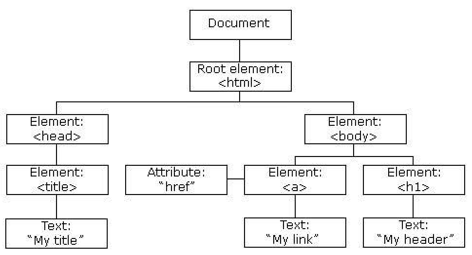
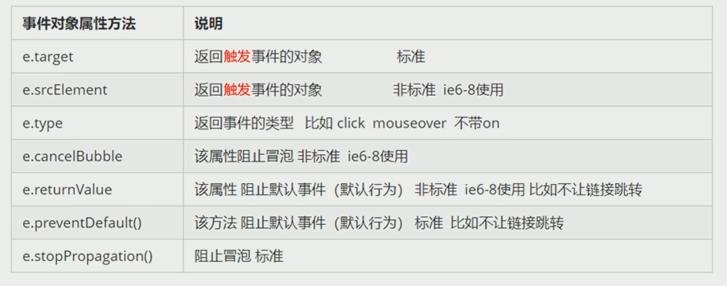
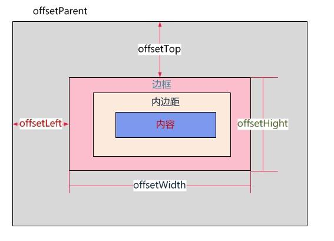
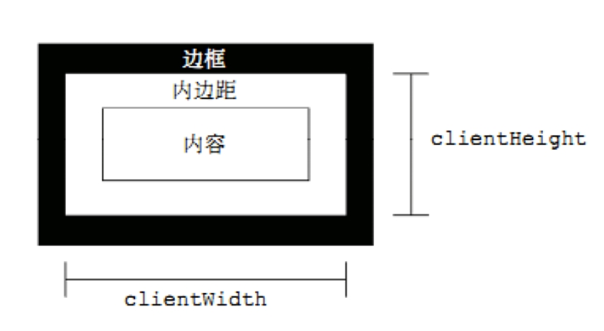

# js进阶

## day01

### 一、获取元素方式

```js
document.getElementById('id')             //通过ID获取元素，唯一一个
document.getElementsByTagName('标签名')    //通过标签名称获取元素，[]集合
document.getElementsByClassName('类名')    //通过类名获取元素，[]集合。兼容性问题
document.getElementsByName("name")        //通过name属性值获取元素(表单)

// HTML5向Web API新引入了两个方法用来更方便地从DOM选取元素
// 功能类似于jQuery的选择器。
// 推荐
document.querySelector('selectors')    //获取一组元素中第一个满足条件的元素，高版本浏览器支持
document.querySelectorAll('selectors') //获取所有满足条件的元素
// 这个参数selectors需要是合法的CSS选择语法，可以包含多个CSS选择器，用逗号隔开
```


### 二、绑定事件

#### 1.1、事件

> 事件三要素：
>
> 1.事件源：事件被触发的对象  如按钮button
>
> 2.事件类型: 如何触发 什么事件 如鼠标点击 onclick
>
> 3.事件处理程序：通过一个函数赋值方式
>
> 执行步骤：
>
> 1.获取事件源（元素）
>
> 2.绑定事件（注册事件）
>
> 3.添加事件处理程序

#### 1.2、事件类型

- click——点击

- dblclick——双击事件
- mouseover——鼠标移入事件
- mouseout——鼠标移出事件
- **change**——表单值改变事件
- **focus**——表单聚焦事件
- **blur**——表单失焦事件
- input——表单输入事件

#### 1.3、事件绑定

> 事件源.事件类型 = function() {事件处理程序};

```html
	<button id="btn">按钮</button>
    <script>
        // 需求：给button绑定一个点击事件输出123
        // 语法：事件源.点击事件 = function() {事件处理程序}  重点
        // 时间类型click
        // 处理程序输出 123
        var _btn = document.getElementById('btn');
        _btn.onclick = function () {
            console.log('1234');
        }
        
    </script>
```

> 多个元素绑定事件 （this）

```html
<h1>给多个元素绑定</h1>
    <ul>
        <li>我是第1个li</li>
        <li>我是第2个li</li>
        <li>我是第3个li</li>
        <li>我是第4个li</li>
        <li>我是第5个li</li>
    </ul>

    <script>
        // 给多个元素绑定
        // 需求： 给所有li添加点击事件 点击li时显示对应的文本
        // 1.获取元素
        var lis = document.querySelectorAll('li');

        // 2.绑定事件
        for (var i = 0; i < lis.length; i++) {
            lis[i].onclick = function () {  // 同步 已经绑定了
                // 没有点击触发 压根就没有进去  异步
                // 所以 点击之后 i变成了5
                console.log(i);
                // console.log(lis[i].innerHTML);
                console.log(this.innerHTML);
                // this就是事件源对象
            }
        }
        // 同步代码 for循环执行完之后i变成5了

    </script>s
```


#### 1.4、同步和异步

> 异步程序：不会随着浏览器代码的加载而执行的代码。而事件的执行就是异步的。
>
> 同步：浏览器代码自上而下执行，前面需要获取的元素在后面写就无法获取到(就是js写在body前面)。

```html
<h1>同步和异步</h1>
    <button id="btn">按钮</button>

    <script>
        // 写在元素上方 出错原因 代码是自上而下执行的 当执行获取元素时 HTML文档没有完全创建成功
        var _btn = document.getElementById('btn');
        _btn.onclick = function () { // 绑定事件的代码是同步的
            alert('fff');  // 异步程序 不会随着浏览器代码的加载而执行的代码
            // 事件执行程序是异步的
            console.log('1');  // 不点击 这里不会输出
        }

        console.log('2');

    </script>
```


#### 1.5、元素的内容的修改

> 1. innerText
>
> 不识别html标签 非标准 去除空格和换行
>
> 2. innerHTML
>
> innerHTML 识别html标签 w3c标准 保留空格和换行

```html
	<h1>
        修改元素内容
    </h1>
    <div id="box">
        222
        <p>p标签</p>
    </div>
    <button>
        按钮
    </button>
    <script>
        // 需求：点击按钮 对盒子进行内容操作（获取、修改、清空）
        // 语法： ele.innerHTML  --html的代码段
        // ele.innerText   纯文本

        var btn = document.querySelector('button');
        var box = document.getElementById('box');

        btn.onclick = function () {
            // 元素本质就是对象 所以 对象.属性
            console.dir(box);
            // 获取
            console.log(box.innerHTML);
            console.log(box.innerText);
            // 修改
            // box.innerHTML = '<span>这是span标签</span>';  // 一整个修改包括标签
            box.innerText = '<span>这是span标签</span>';
            // 清空
            // box.innerHTML = '';
            box.innerText = '';
            console.log(box.innerHTML);
        }
    </script>
```

#### 1.6、css样式的修改

> 1. ele.style.属性（驼峰命名） = '属性值';

```html
<h1>css样式修改</h1>
    <div id="box"></div>
    <button id="btn">按钮</button>

    <script>
        // 需求：点击按钮box变绿色
        var box = document.querySelector('#box');
        var btn = document.querySelector('#btn');
        // var btn = document.querySelector('button');
        // var box = document.getElementById('box');

        btn.onclick = function () {
            // console.dir(box);
            
            // box.style.backgroundColor = 'green';
            // box.style.width = '200px';

            // 1.打点 固定属性  2.[]不固定属性

            // 解决复用 封装
            setStyle(box, {
                backgroundColor: 'green',
                width: '200px',
                height: '200px'
            });
        }

        function setStyle(ele, cssObj) {
            for (var k in cssObj) {
                ele.style[k] = cssObj[k];
            }
        }
    </script>
```


#### 1.7、标签属性的修改

> ele.属性 = '属性值';

```html
<h1>标签属性的修改</h1>
    <a href="https://www.baidu.com" target="_blank">百度一下</a>
    <button>按钮</button>
    <script>
        // 需求 点击按钮将 a链接变成天bing 同一个页面打开

        // 获取dom元素
        var btn = document.querySelector('button');
        var _a = document.querySelector('a');

        // 绑定事件
        btn.onclick = function () {
            console.dir(_a);
            // 可以使用dom对象的属性 来 修改标签的属性
            // 但是对象属性 和 标签属性 不是一回事
            _a.href = 'https://bing.com';
            _a.target = '_self';
            _a.innerText = 'bing搜索';
        }

    </script>
```


### 三、Web API

**API**（Application Programming Interface,应用程序编程接口）是一些**预先定义的函数或方法**，目的是提供应用程序与开发人员基于某软件或硬件得以访问一组例程的能力，而又无需访问源码，或理解内部工作机制的细节。

**Web  API**：浏览器提供的一套操作浏览器功能和页面元素的API(BOM和DOM)，**此处的Web API特指浏览器提供的一组方法**，Web API在后面的课程中有其它含义。如下是MDN中的列举的Web API：[MDN文档](https://developer.mozilla.org/zh-CN/docs/Web/API)

### 四、JavaScript组成

#### 4.1、组成

JavaScript由ECMAScript、BOM、DOM组成，其中BOM和DOM属于Web APIs。


- ECMAScript：定义了JavaScript 的语法规范，是JavaScript的核心。它描述了语言的基本语法和数据类型，ECMAScript是一套标准，定义了一种语言的标准，它与具体实现无关。
- BOM（Browser Object Model）：其实是一套操作浏览器功能的API，通过BOM可以操作浏览器窗口，比如：弹出框、控制浏览器跳转、获取分辨率等。
- DOM（Document Object Model）：其实是一套操作页面元素的API，JavaScript中的DOM把HTML看做是文档树，通过DOM提供的API可以对树上的节点进行操作。

#### 4.2、DOM概念

文档对象模型（Document Object Model，简称DOM），是 W3C 组织推荐的处理 可扩展标记语言（html或xml文档） 的标准 编程接口。它是一种与平台和语言无关的 API，它**可以动态操作HTML文档，如 对html标签作增删改查操作**。DOM 是一种基于树的 API 文档，在处理html文档的过程中，DOM以对象的形式存储在内存中。

因为DOM是基于树结构存储在内存中的，所以DOM又称为文档树模型，DOM的树结构如下图



DOM中的几个常用概念

​	1、文档：一个网页可以称为文档
​	2、节点：网页中的所有内容都是节点（标签、属性、文本、注释等）
​	3、元素：网页中的标签
​	4、属性：标签的属性

DOM经常进行的操作

​	1、获取元素
​	2、对元素进行操作(设置其属性或调用其方法)
​	3、动态创建元素
​	4、事件(什么时机做相应的操作)


## day02

### 一、表单元素属性

> 常见表单元素：input、select、textarea、button
>
> 常见属性：
>
> - value 用于获取和设置表单元素的内容
> - type 用于获取和设置input标签的类型
> - checked 复选框选中属性（true表示选中, false表示不选中）默认false
> - disabled 用于禁用表单输入或选择操作 默认false

```html
	<!-- 修改表单属性 value id type -->
    <input type="text" id="ipt" value="我要修改">
    <button id="btn1">按钮1</button>
    <br>
    <br>
    <br>
    <!-- 修改表单属性 checked选中  disabled禁用-->
    性别：
    <input type="radio" name="gender" id="nan">男
    <input type="radio" name="gender" id="nv">女
    <input type="checkbox" name="like" id=""> 吃饭
    <input type="checkbox" name="like" id="ck2"> 睡觉
    <input type="checkbox" name="like" id="ck1"> 打游戏
    <textarea name="" id="text" cols="30" rows="10">我被金庸了</textarea>
    <button id="btn2">按钮2</button>
    <script>
        // 修改表单属性 value id type
        var ipt = getId('ipt');
        var btn1 = document.getElementById('btn1');
        btn1.onclick = function () {
            console.dir(ipt);
            ipt.value = '我被改变了';
            // ipt.type = 'password';
        }

        // 修改表单属性 checked选中  disabled禁用
        var nan = getId('nan');
        var nv = getId('nv');
        var ck1 = getId('ck1');
        var ck2 = getId('ck2');
        var btn2 = getId('btn2');
        var text = getId('text');
        btn2.onclick = function () {
            ck2.checked = true;
            ck1.checked = true;
            nv.checked = true;
            text.disabled = true;
        }
    </script>
```


### 二、事件类型

- onclick——点击
- dblclick——双击事件
- mouseover——鼠标移入事件
- mouseout——鼠标移出事件
- **change**——表单值改变事件
- **focus**——表单聚焦事件
- **blur**——表单失焦事件
- input——表单输入事件
- beforeunload——浏览器窗口关闭或者刷新时，会触发beforeunload事件

```js
window.addEventListener('beforeunload', (event) => {
  // Cancel the event as stated by the standard.
  event.preventDefault();
  // Chrome requires returnValue to be set.
  event.returnValue = '';
});
```


```html
	<div class="box"></div>
    <input type="text" name="uname">
    <script>
        var box = document.querySelector('div');
        // 鼠标移入
        box.onmouseover = function () {
            console.log('抑郁了');
        }
        // 鼠标移出
        box.onmouseout = function () {
            console.log('么抑郁了');
        }
        // 表单聚焦
        var uname = document.querySelector('input');
        uname.onfocus = function () {
            console.log('得到焦点');
        }

        // 表单失去焦点
        uname.onblur = function () {
            console.log('失去焦点');
        }

        // 表单输入事件
        uname.oninput = function () {
            console.log(uname.value);

        }
    </script>
```


### 三、动态设置class

> 修改
>
> 1. ele.className = '类名 类名2 ...';  会把原有的覆盖掉
>
> 2. ele.classList.add('类名','类名',...); 
>
> 删除
>
> 1. ele.className = '';
> 2. ele.classList.remove('类名','类名1',...);  

```html
	<div id="box" class="classA">
        文字
    </div>

    <script>
        var box = document.getElementById('box');
        box.onclick = function () {
            // 添加类
            // box.className = 'classB'; // 会把原有的覆盖掉
            box.classList.add('classB', 'classC'); // 多个用逗号隔开

            // 删除
            box.classList.remove('classB');
            // 或者
            // box.className = '';
        }
    </script>
```


### 五、案例

#### 5.1、随机颜色

```html
<button>按钮</button>
    <script>
        // 点击按钮切换窗口 背景色 rgb
        // 获取rgb
        function getRGBColor() {
            var r = Math.floor(Math.random() * 256);
            var g = Math.floor(Math.random() * 256);
            var b = Math.floor(Math.random() * 256);
            return `rgb(${r},${g},${b})`;
        }

        var btn = document.querySelector('button');

        btn.onclick = function () {
            document.body.style.backgroundColor = getRGBColor();
        }
    </script>
```

#### 5.2、开关思想

>开关思想：定义一个变量, 这个变量决定了一个状态，事件触发的时候，根据这个变量的值，执行对应的操作，操作完还需要修改这个变量的值。flag

```html
	<h1>开关思想</h1>
    <button>按钮</button>
    <script>
        var btn = document.querySelector('button');
        var h1 = document.querySelector('h1');
        var flag = true;
        btn.onclick = function () {
            if (flag) {
                document.body.style.backgroundColor = '#000';
                h1.style.color = '#fff';
                // flag = false;
            } else {
                document.body.style.backgroundColor = '#fff';
                h1.style.color = '#000';
                // flag = true;
            }
            flag = !flag;
        }
```


#### 5.3、排他思想

> 1.所有元素全部清除样式（干掉其他人）
> 2.给当前元素设置样式（留下我自己）
> 3.注意顺序不能颠倒，首先干掉其他人，再设置自己

```html
	<button>按钮0</button>
    <button>按钮1</button>
    <button>按钮2</button>
    <button>按钮3</button>
    <button>按钮4</button>
    <button>按钮5</button>

    <script>
        var btns = document.getElementsByTagName('button');
        // 获得的btns是伪数组 可以遍历

        for (var i = 0; i < btns.length; i++) {
            btns[i].onclick = function () {
                // 把所以颜色清除 干掉所有人
                for (var i = 0; i < btns.length; i++) {
                    btns[i].style.backgroundColor = '';
                }
                // 当前按钮变颜色 留下自己
                this.style.backgroundColor = 'pink';
            }
        }

    </script>
```

#### 5.4、**tab栏**（标签给索引）(重要)

> 上面排他思想
>
> 后面定义index
>
> [JavaScript实现Tab栏切换 - 千古壹号 - 博客园 (cnblogs.com)](https://www.cnblogs.com/qianguyihao/p/8371782.html)

```html
<!DOCTYPE html>
<html lang="en">

<head>
    <meta charset="UTF-8" />
    <meta name="viewport" content="width=device-width, initial-scale=1.0" />
    <title>Tab栏</title>
    <style type="text/css">
        div,
        span,
        ul,
        li,
        h2,
        body {
            padding: 0;
            margin: 0;
            list-style: none;
        }

        .all {
            width: 440px;
            border: 1px solid #000;
            padding: 10px;
            margin: 80px auto;
        }

        .all h2 {
            height: 30px;
            text-align: center;
            display: flex;
            justify-content: space-between;
        }

        .all h2 span {
            width: 100px;
            height: 30px;
            background: #CCC;
            text-align: center;
            cursor: pointer;
        }

        .all h2 span.current {
            background: pink;
        }

        .all ul li {
            display: none;
            background: pink;
            height: 200px;
        }

        .all ul li.current {
            display: block
        }
    </style>
</head>

<body>
    <div class="all">
        <h2>
            <span class="current">新闻</span>
            <span>娱乐</span>
            <span>游戏</span>
            <span>财经</span>
        </h2>
        <ul>
            <li class="current">新闻</li>
            <li>娱乐</li>
            <li>游戏</li>
            <li>财经</li>
        </ul>
    </div>
    <script>
        // 点击栏就变成其他颜色

        var dot = document.querySelector('h2').querySelectorAll('span');
        var con = document.querySelector('ul').querySelectorAll('li');
        // console.log(con[index]);

        for (var i = 0; i < dot.length; i++) {
            // console.log(i);
            console.log(con[i]);
            // 标签默认没有索引
            // 这里要给他的标签定义一个索引
            dot[i].index = i;
            // console.log(con[i].index);
            dot[i].onmouseover = function () {
                // 排他
                for (var i = 0; i < dot.length; i++) {
                    // 这里不能用this 不确定哪个
                    dot[i].className = '';
                    con[i].className = '';
                }
                // 这个只能用this
                this.className = 'current';
                // 查看鼠标经过时索引
                console.log(this.index);
                con[this.index].className = 'current';

            }
        }

        // 答案
        // var btns = document.getElementsByTagName("span");
        // var pages = document.getElementsByTagName("li");
        // for (var i = 0; i < btns.length; i++) {
        //     btns[i].index = i;
        //     console.log();
        //     btns[i].onmouseenter = function () {
        //         for (var j = 0; j < btns.length; j++) {
        //             btns[j].className = "";
        //             pages[j].className = "";
        //         }
        //         this.className = "current";
        //         pages[this.index].className = "current";
        //     };
        // }

    </script>
</body>

</html>
```

#### 5.5、全选反选

html代码

```html
<!DOCTYPE html>
<html lang="en">

<head>
    <meta charset="UTF-8">
    <meta http-equiv="X-UA-Compatible" content="IE=edge">
    <meta name="viewport" content="width=device-width, initial-scale=1.0">
    <title>全选反选功能</title>
    <style>
        * {
            padding: 0;
            margin: 0;
        }

        .wrap {
            width: 300px;
            margin: 100px auto 0;
        }

        table {
            border-collapse: collapse;
            border-spacing: 0;
            border: 1px solid #c0c0c0;
            width: 300px;
        }

        th,
        td {
            border: 1px solid #d0d0d0;
            color: #404060;
            padding: 10px;
        }

        th {
            background-color: #09c;
            font: bold 16px "微软雅黑";
            color: #fff;
        }

        td {
            font: 14px "微软雅黑";
        }

        td:nth-of-type(1) {
            text-align: center;
        }

        tbody tr,
        tfoot tr {
            background-color: #f0f0f0;
        }

        tbody tr:hover {
            cursor: pointer;
            background-color: #fafafa;
        }

        button {
            width: 50px;
        }
    </style>
</head>

<body>

    <div class="wrap">
        <table>
            <thead>
                <tr>
                    <th>
                        <input type="checkbox" id="j_cbAll" />
                        <span id="txt">全选</span>
                    </th>
                    <th>菜名</th>
                    <th>饭店</th>
                </tr>
            </thead>
            <tbody id="j_tb">
                <tr>
                    <td>
                        <input type="checkbox" />
                    </td>
                    <td>红烧肉</td>
                    <td>好再来</td>
                </tr>
                <tr>
                    <td>
                        <input type="checkbox" />
                    </td>
                    <td>西红柿鸡蛋</td>
                    <td>好再来</td>
                </tr>
                <tr>
                    <td>
                        <input type="checkbox" />
                    </td>
                    <td>油炸榴莲</td>
                    <td>好再来</td>
                </tr>
                <tr>
                    <td>
                        <input type="checkbox" />
                    </td>
                    <td>清蒸助教</td>
                    <td>好再来</td>
                </tr>

            </tbody>
            <tfoot>
                <tr>
                    <td colspan="5"><button id="rev">反选</button></td>
                </tr>
            </tfoot>
        </table>
    </div>
</body>

</html>
```

js代码

```js
<script>
        /*
                实现步骤
                1.全选框  点击全选勾选上 列表框全部选中 未选中 全部不选
        
                2.列表选框 全部勾选 全选框勾选
                
        */
        // 1.全选框 
        var cks = getEles('j_tb', 'input');
        getId('j_cbAll').onclick = function () {
            // if (this.checked) {
            //     for (var i = 0; i < cks.length; i++) {
            //         cks[i].checked = true;
            //     }
            // } else {
            //     for (var i = 0; i < cks.length; i++) {
            //         cks[i].checked = false;
            //     }
            // }
            for (var i = 0; i < cks.length; i++) {
                // console.log(cks[i]); 
                // 全选框为true 列表为true   全选框为false 列表为false
                cks[i].checked = this.checked;
            }
            // 改变文本 勾选上时 全不选  
            getId('txt').innerText = this.checked ? '全不选' : '全选';
        }
        console.log(cks);

        // 列表选框
        for (var i = 0; i < cks.length; i++) {
            cks[i].onclick = function () {
                // 假设全部为 选中
                flag = true;
                // 查看每个是否都选中 只有有一个false 就说明没有全选
                for (var j = 0; j < cks.length; j++) {
                    // 判断是否有没有选中的
                    if (cks[j].checked == false) {
                        flag = false;
                        // console.log(flag);
                        break;

                    }
                }
                getId('j_cbAll').checked = flag;
            }

        }
    </script>
```


## day03

### 一、节点属性

#### 1.1、什么是节点

> 节点：页面中所有的内容 标签 属性 注释 文本 换行 空格    Node 对象
>
> 元素：就是标签 div a 等  element 对象

| 节点node         | nodeType | nodeName           | nodeValue                         |
| ---------------- | -------- | ------------------ | --------------------------------- |
| **元素节点**     | 1        | 标签名（大写）     | null                              |
| **属性节点**     | 2        | 属性名             | 属性值                            |
| **文本节点**     | 3        | #text              | 文本内容                          |
| CDATA节点        | 4        | #cdata-section     | CDATA区域内容                     |
| 实体引用名称节点 | 5        | 引用名称           | null                              |
| 实体名称节点     | 6        | 实体名称           | null                              |
| 处理指令节点     | 7        | target             | entire content cluding the target |
| **注释节点**     | 8        | #comment           | 注释内容                          |
| **文档节点**     | 9        | #document          | null                              |
| 文档类型节点     | 10       | doctype的名称      | null                              |
| 文档片段节点     | 11       | #document-fragment | null                              |
| DTD声明节点      | 12       | 符号名称           | null                              |

```js
// nodeType:节点的类型
// nodeName:节点的名字
// nodeValue:节点的值
<h1>节点属性</h1>
    <div id="box">box</div>

    <script>
        console.log(document.nodeName);
        console.log(document.nodeType);
        console.log(document.nodeValue);
		// 节点 对象 可以用打点属性名 来查看
        var box = document.getElementById('box');
        console.log(box.nodeName);
        console.log(box.nodeType);
        console.log(box.nodeValue);
    </script>
```


#### 1.2、节点获取

> 父节点：partentNode  一个
>
> 父元素：partentElement
>
> 子节点：childNodes  多个
>
> 子元素：children
>
> 用法：ele.partentNode; 其他一样 
>
> 
>
> 获取某节点的前一个兄弟节点：node.previousSibling;
>
>   推荐
>
> 获取某节点的前一个兄弟元素：node.previousElementSibling;
>
> 获取某节点的后一个兄弟节点：node.nextSibling;
>
>   推荐
>
> 获取某节点的后一个兄弟元素：node.nextElementSibling;


#### 1.3、属性节点（了解）

```js
<h1>属性节点获取</h1>
    <input type="text" name="掌上">
    <script>
        var ipt = document.querySelector('input');
        // 获取属性值  属性 name 值 掌上
        console.log(ipt.name);

        // attribute 属性 
        // 获取属性节点 get Attribute Node 
        console.dir(ipt.getAttributeNode('name'));
        console.log(ipt.getAttributeNode('name'));
    </script>
```

#### 1.4、自定义属性

> 都是一些方法
>
> 获得属性值：getAttribute('key');
>
> **设置属性值**：setAttribute('key','value');
>
> 删除属性值：removeAttribute('key');


### 二、创建元素方式

#### 2.1、document.write（了解）

> document.write("<p>这是一个p</p>");//会重写
>
> 会重绘整个页面 不推荐

#### 2.2、innerHTML 创建（掌握）

> element.innerHTML=HTML

```js
<input type="text">
    <button>啊添加</button>
    <ul>

    </ul>
    <script>
        var txt = document.querySelector('input');
        var btn = document.querySelector('button');
        var ul = document.querySelector('ul');

        btn.onclick = function () {
            // 获取用户输入内容
            var text = txt.value;
            // console.log(text);
            // 非空校验
            if (text) {
                ul.innerHTML += `<li>${text}</li>`;
            }
            else {
                alert('不能输入空的');
            }

            // 添加完后 清空输入框
            txt.value = '';

        }
    </script>
```


#### 2.3、createElement （掌握）

创建对象方式创建元素

>1.创建元素节点 
>
>childNode = document.createElement('标签');
>
>2.把元素追加到父级元素中
>
>parentNode = appendChild(childNode);


### 三、元素节点操作

语法：

```js
 //添加到容器(父级节点)的结尾，并返回新增节点
 parentNode.appendChild(新节点);
 //参照节点之前插入节点，并返回新节点
 parentNode.insertBefore(新节点,参照节点)
 //用新节点替换当前节点，并返回被替换节点（当前节点）
 parentNode.replaceChild (新节点,当前节点 )
 //移除节点，并返回移除的节点
 //不能直接删除自己，是需要先到父级元素，再来删除自己
 parentNode.removeChild(当前元素)
```

html和css代码

```html
 <button id="btn">最前插入新节点</button>
 <ul id="uu">
     <li>桃园豪杰三结义 <button class="rep">替换</button> <button class="del">删除</button></li>
     <li>孙坚跨江击刘表 <button class="rep">替换</button> <button class="del">删除</button></li>
     <li>吕奉先射戟辕门 <button class="rep">替换</button> <button class="del">删除</button></li>
     <li>关公赚城斩车胄 <button class="rep">替换</button> <button class="del">删除</button></li>
     <li>玄德荆州依刘表 <button class="rep">替换</button> <button class="del">删除</button></li>
     <li>赵子龙单骑救主 <button class="rep">替换</button> <button class="del">删除</button></li>
     <li>诸葛亮痛哭庞统 <button class="rep">替换</button> <button class="del">删除</button></li>
     <li>关云长败走麦城 <button class="rep">替换</button> <button class="del">删除</button></li>
     <li>武侯弹琴退仲达 <button class="rep">替换</button> <button class="del">删除</button></li>
     <li>魏主政归司马氏 <button class="rep">替换</button> <button class="del">删除</button></li>
 </ul>
```

JavaScript代码

```js
 // 最前插入新节点
 btn.onclick = function () {
     var newli = document.createElement("li");
     newli.innerText = "皇叔败走投袁绍";
     uu.insertBefore(newli, uu.children[0])
 }
 
 var orep = document.querySelectorAll(".rep");
 var odel = document.querySelectorAll(".del");
 
 // console.log(orep);
 // console.log(odel);
 
 // 给每一条数据的替换和删除按钮绑定事件
 for (var i = 0; i < orep.length; i++) {
     orep[i].onclick = function () {
         var newli = document.createElement("li");
         newli.innerText = "定三分隆中决策";
         uu.replaceChild(newli, this.parentElement)
     }
     odel[i].onclick = function () {
         uu.removeChild(this.parentElement)
     }
 }
```


### 四、案例

#### 节点练习

```html
<!DOCTYPE html>
<html lang="en">

<head>
    <meta charset="UTF-8">
    <meta http-equiv="X-UA-Compatible" content="IE=edge">
    <meta name="viewport" content="width=device-width, initial-scale=1.0">
    <title>Document</title>
    <style>
        div {
            width: 300px;
            height: 450px;
            border: 1px solid red;
        }
    </style>
</head>

<body>
    <input type="button" value="变色" id="btn" />
    <div id="dv">
        <span>这是span</span>
        <p>这是p</p>
        <span>这是span</span>
        <p>这是p</p>
        <span>这是span</span>
        <p>这是p</p>
        <span>这是span</span>
        <a href="http://www.baidu.com">百度</a>
    </div>

    <script>
        var dv = document.getElementById('dv');
        var btn = document.querySelector('input ');

        btn.onclick = function () {
            console.log(1);
            // 获取所有子节点
            var nodes = dv.childNodes;
            // 遍历
            for (var i = 0; i < nodes.length; i++) {
                // 判断节点类型必须是1 和 节点名字是 P 标签
                if (nodes[i].nodeType == 1 && nodes[i].nodeName == 'P') {
                    nodes[i].style.background = 'pink';
                }
            }
        }
    </script>
</body>

</html>
```

#### 动态创建列表

```html
<button id="btn">创建列表</button>
    <div id="dv"></div>

    <script>
        var names = ["杨过", "郭靖", "张无忌", "张三丰", "乔峰", "段飞", "丁棚"];
        var btn = document.querySelector('button');
        var dv = document.getElementById('dv');

        btn.onclick = function () {
			// 只创建一次
            if (dv.children.length == 0) {
                // 创建ul对象 页面上没有
                var ul = document.createElement('ul');
                // 将ul对象添加到元素内
                dv.appendChild(ul);

                console.log(dv.appendChild(ul));
                // for (var i = 0; i < names.length; i++) {
                //     var li = document.createElement('li');
                //     li.innerHTML = names[i];
                //     ul.appendChild(li);
                // }
                
                console.log(ul);
                console.log(dv.children.length);
				// 遍历 创建li对象
                names.forEach(function (item, index) {
                    // 创建li对象
                    var li = document.createElement('li');
                    li.innerText = item;
                    // 把li对象追加到ul
                    ul.appendChild(li);
                });
            }
            // btn.disabled = true;
        }
    </script>
```

语法：

```js
//添加到容器(父级节点)的结尾，并返回新增节点
parentNode.appendChild(新节点);
//参照节点之前插入节点，并返回新节点
parentNode.insertBefore(新节点,参照节点)
//用新节点替换当前节点，并返回被替换节点（当前节点）
parentNode.replaceChild (新节点,当前节点 )
//移除节点，并返回移除的节点
//不能直接删除自己，是需要先到父级元素，再来删除自己
parentNode.removeChild(当前元素)
```

html和css代码

```html
<button id="btn">最前插入新节点</button>
<ul id="uu">
    <li>桃园豪杰三结义 <button class="rep">替换</button> <button class="del">删除</button></li>
    <li>孙坚跨江击刘表 <button class="rep">替换</button> <button class="del">删除</button></li>
    <li>吕奉先射戟辕门 <button class="rep">替换</button> <button class="del">删除</button></li>
    <li>关公赚城斩车胄 <button class="rep">替换</button> <button class="del">删除</button></li>
    <li>玄德荆州依刘表 <button class="rep">替换</button> <button class="del">删除</button></li>
    <li>赵子龙单骑救主 <button class="rep">替换</button> <button class="del">删除</button></li>
    <li>诸葛亮痛哭庞统 <button class="rep">替换</button> <button class="del">删除</button></li>
    <li>关云长败走麦城 <button class="rep">替换</button> <button class="del">删除</button></li>
    <li>武侯弹琴退仲达 <button class="rep">替换</button> <button class="del">删除</button></li>
    <li>魏主政归司马氏 <button class="rep">替换</button> <button class="del">删除</button></li>
</ul>
```

JavaScript代码

```javascript
// 最前插入新节点
btn.onclick = function () {
    var newli = document.createElement("li");
    newli.innerText = "皇叔败走投袁绍";
    uu.insertBefore(newli, uu.children[0])
}

var orep = document.querySelectorAll(".rep");
var odel = document.querySelectorAll(".del");

// console.log(orep);
// console.log(odel);

// 给每一条数据的替换和删除按钮绑定事件
for (var i = 0; i < orep.length; i++) {
    orep[i].onclick = function () {
        var newli = document.createElement("li");
        newli.innerText = "定三分隆中决策";
        uu.replaceChild(newli, this.parentElement)
    }
    odel[i].onclick = function () {
        uu.removeChild(this.parentElement)
    }
}
```

## day04

### 一、事件三个阶段

> 捕获阶段：由内向外
>
> 目标阶段：执行点击的元素代码
>
> 冒泡阶段：儿子传给父亲，由内向外，父子绑定同一个类型的事件，儿子触发时，父亲也会触发 从内向外

#### 1.1、阻止冒泡

> e.stopPropagation();  w3c标准
>
> e.cancelBubble = true;  ie特有

```html
<!DOCTYPE html>
<html lang="en">

<head>
    <meta charset="UTF-8">
    <meta http-equiv="X-UA-Compatible" content="IE=edge">
    <meta name="viewport" content="width=device-width, initial-scale=1.0">
    <title>Document</title>
    <style>
        #outer {
            width: 300px;
            height: 300px;
            background: pink;
        }

        #inner {
            width: 200px;
            height: 200px;
            background: red;
        }
    </style>
</head>

<body>
    <div id="outer">
        <div id="inner">里面</div>
    </div>

    <script>
        // 事件冒泡：父元素跟子元素绑定同一类型事件 子元素触发 父元素也触发
        // 事件执行的三个阶段 捕获阶段 目标阶段 冒泡阶段
        var _outer = document.getElementById('outer');
        var _inner = document.getElementById('inner');
        _outer.onclick = function () {
            console.log('我是外面的');
        }
        _inner.onclick = function (e) {
            console.log('我是里面的');
            // 事件对象 兼容处理
            e = e || window.event;
            // 阻止冒泡
            // e.cancelBullue = ture 兼容处理
            e.stopPropagation ? e.stopPropagation() : e.cancelBubble = true;
        }
    </script>
</body>

</html>
```

#### 1.2、阻止事件默认行为

> e.preventDefault();  w3c
>
> e.returnValue = false;  ie8

```html
<a href="https://www.baidu.com">跳转百度</a>

    <script>
        var a = document.querySelector('a');
        a.onclick = function (e) {
            e = e || window.event;
            console.log('dasf');
            // 兼容性处理
            // e.returnValue = returnValue = false
            e.preventDefault ? e.preventDefault() : e.returnValue = false;
            // e.preventDefault();
        }
    </script>
```


### 二、事件委托

> 事件委托：基于事件冒泡原理 使用一个函数解决一类事件 子元素委托给父级处理 事件不绑定自己身上 绑在父级
>
> 好处：节约内存，提高代码效率，为动态添加的元素进行事件绑定

#### 2.0、原理

> 不是每个子节点单独设置事件监听器，而是事件监听器设置在其父节点上，然后利用冒泡原理影响设置每个子节点。

#### 2.1、e.target和this区别

> e.target:在编写**事件函数**时可以传入一个event参数，even参数可以使用一个target属性如even.target用以调用，其作用是指向返回事件的目标节点（触发该事件的节点）。
>
> this:是注册点击事件的元素，也就是事件源

```html
<button>按钮</button>
    <div id="box">
        <ul id="uu">
            <li>这是第1个li</li>
            <li>这是第2个li</li>
            <li>这是第3个li</li>
            <li>这是第4个li</li>
            <li>这是第5个li</li>

        </ul>
    </div>

    <script>

        // 为什么要委托事件  1.节约内存 2.提高代码效率  3.动态添加元素绑定事件
        var uu = document.getElementById('uu');
        var btn = document.querySelector('button');
        btn.onclick = function () {
            // console.log(1);
            // 动态添加li到ul里面
            var li = document.createElement('li');
            li.innerHTML = '这是新增的li';
            uu.appendChild(li);
        }

        // 需求：li需要绑定点击事件 同时新增的li也有点击事件s
        uu.onclick = function (e) {
            e = e || window.event;
            // var target = e.target || e.src
            if (e.target.nodeName == 'LI') {
                console.log('点击了', e.target);
            }
        }
    </script>
```

### 三、事件监听

> 事件监听：给同一个元素绑定多个事件
>
> 事件监听做什么的：多次绑定同个事件 正常绑定后面的覆盖前面，所以需要事件监听，监听不会覆盖。
>
> 语法：事件源.addEventListener('type',function(),boolean);

```html
<div id="outer">
        <div id="inner">
            <button>按钮</button>
        </div>
    </div>

    <script>
        // 使用事件监听函数 为三个绑元素定事件
        /*
            ele.addEventListener('type',function,boolean)
            type:事件类型 click
            function:事件处理程序
            boolean:布尔类型 默认false(冒泡)  true(捕获)
        */
        var btn = document.querySelector('button');
        var inner = document.getElementById('inner');
        var outer = document.getElementById('outer');

        btn.addEventListener('click', function () {
            console.log('btn');
        }, false)
        inner.addEventListener('click', function () {
            console.log('inner');
        }, false)
        // 第三个值true 变成捕获事件先打印
        outer.addEventListener('click', function () {
            console.log('outer');
        }, true)
    </script>
```


#### 3.1、事件解绑

```html
<button id="btn1">按钮1</button>
    <button id="btn2">解绑按钮</button>

    <script>
        var btn1 = document.getElementById('btn1');
        var btn2 = document.getElementById('btn2');

        // 0级事件解绑
        /*  btn1.onclick = function () {
             console.log('按钮1');
         }
         btn2.onclick = function () {
             console.log('解绑按钮');
             btn1.onclick = null;
         } */

        // 2级事件解绑
        // 解绑语法： ele.removeEventListener('type',处理程序);

        // 先把地址存起来
        var fn = function () {
            console.log('按钮1');
        }
        btn1.addEventListener('click', fn)
        btn2.addEventListener('click', function () {
            console.log('解绑按钮');
            // 不能直接赋值解绑 引用数据类型问题 里面内容相同 但是是不同地址
            // btn1.removeEventListener('click', function () {
            //     console.log('按钮1');
            // });
            btn1.removeEventListener('click', fn);
        })
    </script>
```

### 四、入口函数

> **window.onload** 方法用于在网页加载完毕后立刻执行的操作。
>
> 有了这个操作，js想放哪里放哪里

```js
<script>

        // 报错 了；浏览器自上而下执行
        // 入口函数就是等页面加载完再执行
        window.onload = function () {
            var btn = document.getElementById('sdf');
            btn.onclick = function () {
                console.log('---------分隔符---------');
            }
        }
        // 什么时候需要入口函数
        // 所写的代码需要依赖dom加载的时候

    </script>
```

### 五、BOM

#### 5.0、window对象

**window对象**：是浏览器的顶级对象，全局对象。

1. alert 等一系列弹框方法
2. open方法：打开新窗口
3. close方法：关闭当前窗口
4. document对象：HTML 文档
5. location对象：包含当前网页文档的URL信息
6. history对象：包含浏览器窗口访问过的URL信息
7. navigator对象：包含有关浏览器的信息，如名称，版本和系统等。
8. 定时器

#### 5.1、location对象

> Location 对象是 Window 对象的一个部分，包含当前网页文档的URL信息，可通过 window.location 属性来访问。默认全局对象就是window，所有window可以不写。
>
> location.href——获取完整URL
>
> 重写location.href可以跳转页面

#### 5.2、history对象

> History 对象是 window 对象的一部分，包含浏览器窗口访问过的URL信息（历史记录），可通过 window.history 属性对其进行访问。这个对象包含几个常用属性（方法）：

- length属性——历史记录的长度（个数）。
- back() 方法——向后跳转，加载 history 列表中的前一个 URL。
- forward()方法——向前跳转，加载 history 列表中的下一个 URL。
- go()方法——加载 history 列表中的某个具体页面，参数 1 表示向前跳转，-1表示向后跳转。


### 六、事件对象

> Event 对象代表事件的状态，比如事件在其中发生的元素、键盘按键的状态、鼠标的位置、鼠标按钮的状态
>
> 兼容处理：var e=e || window.event

#### 6.1、target和this区别

> e.target点击了那个元素，就返回那个元素this那个元素绑定了这个点击事件，那么就返回谁

#### 6.2、属性和方法



#### 6.3、鼠标事件对象

```js
// 鼠标事件对象 MouseEvent
	document.addEventListener('click', function (e) {
    // 鼠标在可视区的xy坐标
    console.log(e.clientX);
    console.log(e.clientY);
    // 鼠标在文档页面的x和y坐标
    console.log(e.pageX);
    console.log(e.pageY);
})
```

案例

```html
<!DOCTYPE html>
<html lang="en">

<head>
    <meta charset="UTF-8">
    <meta http-equiv="X-UA-Compatible" content="IE=edge">
    <meta name="viewport" content="width=device-width, initial-scale=1.0">
    <title>Document</title>
    <style>
        img {
            position: absolute;
            transform: translateX(-50%) translateY(-50%);
            /* transform: translateY(-50%); */
        }
    </style>
</head>

<body>
    
    <script>
        var img = document.querySelector('img');
        // 鼠标移动事件
        document.addEventListener('mousemove', function (e) {
            var x = e.pageX;
            var y = e.pageY;
            img.style.top = y + 'px';
            img.style.left = x + 'px';
            img.style.transform
        })
    </script>
</body>

</html>
```

#### 6.4、键盘事件对象

```js
// 1.keyup 按键谈起的时候触发
document.addEventListener('keyup', function () {
    console.log('谈起了');
})
// 2.keydown 按键按下的时候触发(比press先执行)
document.addEventListener('keydown', function () {
    console.log('按下了');
})
// 3.keypress 按键按下的时候触发（不识别功能键ctrl shift）
document.addEventListener('keypress', function () {
    console.log('按下了press');
})
```

keyCode

```js
// keyCode属性可以得到相应键的ASCII码值
        // 1.keyup 按键谈起的时候触发
        // 这个不区分大小写 a 和 A 都是65
        document.addEventListener('keyup', function (e) {
            console.log('up',e.keyCode);
        })
        
        // 3.keypress 按键按下的时候触发（不识别功能键ctrl shift）
        document.addEventListener('keypress', function (e) {
            console.log('press',e.keyCode);
        })
```

#### 6.5、案例

模拟京东按键盘某个键聚焦输入

```html
<!DOCTYPE html>
<html lang="en">

<head>
    <meta charset="UTF-8">
    <meta http-equiv="X-UA-Compatible" content="IE=edge">
    <meta name="viewport" content="width=device-width, initial-scale=1.0">
    <title>Document</title>
</head>

<body>
    <input type="text" name="" id="">
    <script>
        // 需求按s键聚焦到搜索框
        var search = document.querySelector('input');
        document.addEventListener('keyup', function (e) {
            console.log(e.keyCode); // s键83
            // 按空格聚焦
            if (e.keyCode === 32) {
                // js 提供的聚焦方法focus()
                search.focus();
            }
        })
    </script>
</body>

</html>
```


## day05

### 一、同步和异步

> JavaScript是一门**单线程**的语言，因此，JavaScript在同一个时间只能做一件事，单线程意味着，如果在同个时间有多个任务的话，这些任务就需要进行排队，前一个任务执行完，才会执行下一个任务。

js运行机制：先同步代码 后异步代码

参考：[js中的同步和异步 - Yellow_ice - 博客园 (cnblogs.com)](https://www.cnblogs.com/Yellow-ice/p/10433423.html)

[(16条消息) JavaScript 系列八：同步与异步_XHSRookies的博客-CSDN博客](https://blog.csdn.net/XHSRookies/article/details/118789437)

```js
// 综合
    function fn() {
        console.log('我是fn');
    }
    // 此处直接调用就是同步代码
    fn();
    // 此处 放到点击函数里面 或者定时器的函数里面是异步
    document.querySelector('button').onclick = fn;
    setTimeout(fn, 0);
```


#### 1.1、同步

> 同步任务是指在主线程上排队执行的任务，只有前一个任务执行完毕，才能继续执行下一个任务，当我们打开网站时，网站的渲染过程，比如元素的渲染，其实就是一个同步任务

```js
 // 同步代码
function fn1() {
    console.log(1);
}
function fn2() {
    console.log(2);
}
fn1();
fn2();
// 输出 1 2
```

#### 1.2、异步

> 异步任务是指不进入主线程，而进入任务队列的任务，只有任务队列通知主线程，某个异步任务可以执行了，该任务才会进入主线程，当我们打开网站时，像图片的加载，音乐的加载，其实就是一个异步任务

```js
// 定时器里面的内容异步 还有事件里面的异步
// 例一
    console.log(1);
    setTimeout(function () {
        console.log(2);
    }, 0)
    console.log(3);
    setTimeout(function () {
        console.log(4);
    }, 0)
    // 输出 1 3 2 4

// 例二
    for (var i = 0; i < 3; i++) {
        console.log(i);
        // 异步 最后执行
        setTimeout(function () {
            console.log(i);
        }, 0)
    }
    // 输出 0 1 2 3 3 3
```


### 二、三大家族

#### 1.1、offset偏移量

offset是偏移、位移、补偿的意思（取整数值四舍五入），表示元素的偏移量。



- **offsetHeight和offsetWidth**
  - 元素盒子模型的宽高（width/height + padding+border）
- **offsetLeft和offsetTop**
  - 1、表示当前元素距离它最近的相对父级（定位元素）的水平或者垂直距离。
  - 2、如果它一直没有相对父级元素，默认指向body
- **offsetParent**和parentNode
  - offsetParent 指的是最近的一个相对父级元素（默认指向body）
  - parentNode 就是直接父级（标签结构中的父子关系 ）

```js
<script>
    var box = document.querySelector('.box');
    // 盒子模型 内容+padding border
    console.log(box.offsetWidth);
    // 盒子模型 内容+padding border
    console.log(box.offsetHeight);
    console.log('---------分隔符---------');
    // 盒子到父级的上 右距离
    console.log(box.offsetTop);
    console.log(box.offsetLeft);
    // 指定最近的一个相对父级元素
    console.log(box.offsetParent);
</script>
```


#### 1.2、scroll滚动

scroll是长卷纸，卷轴的意思，表示浏览器滚动时元素的卷曲值。


- **scrollHeight和scrollWidth**
  - 代表获容器内部可滚动的宽度和高度（width/height + padding）
  - 包括由于溢出而无法展示在网页的不可见部分
- **scrollTop和scrollLeft**
  - 相对父盒子，元素 向上/向左 卷曲出去（滚出去）的距离

```js
var oBox = document.getElementById('box');
var oContent = document.getElementById('content');
var oBtn = document.getElementById("btn")
console.log(oContent.scrollWidth); // 内容盒子的可滚动宽度
console.log(oContent.scrollHeight); // 内容盒子的可滚动高度

console.log(oBox.scrollWidth); // 限定了宽高的父盒子中，其内容盒子可滚动的宽度
console.log(oBox.scrollHeight); // 限定了宽高的父盒子中，其内容盒子可滚动的高度

oBtn.onclick = function () {
    console.log("-------------------------");
    console.log(oBox.scrollTop); // 获取内容盒子相对于父盒子已经滚动了多少高度
    console.log(oBox.scrollLeft); // 获取内容盒子相对于父盒子已经滚动了多少宽度
}
```


#### 1.3、client客户区

client获取的是元素的可视区域



- clientWidth和clientHeight
  - 不包含border在内的实际宽度（width/height + padding）
- clientLeft和clientTop
  - 打印出盒子 左侧边框/顶部边框 的厚度
  - 几乎不用

### 三、定时器

#### 3.1、单次定时器

> 代码经过设定的多少毫秒后开始运行（异步），只运行一次
>
> 语法：
>
> 开启定时器：var timer = setTimeout(fn,time);
>
> 关闭定时器：clearTimeout(timer);

```html
<h1>单次定时器</h1>
    <button>启动</button>
    <button id="stop">停止</button>
    <!-- 
        定时器：让代码过一段时间再执行
        有单次定时器 和 循环定时器
        设置定时器：var timer = setTimeout(fn,time)
        场景：（广告、签单提醒）

        清楚定时器： clearTimeout(timer);
    -->
    <script>
        var star = document.querySelector('button');
        var timer = null;
        star.addEventListener('click', function () {
            // 对象 比较的是地址 
            // console.log(window.setTimeout = setTimeout); // true
            timer = setTimeout(function () {
                alert('2s弹出');
            }, 2000);
        })

        var stop = document.getElementById('stop');
        stop.onclick = function () {
            clearTimeout(timer);
        }
    </script>
```


#### 3.2、循环定时器

> 代码经过设定的多少毫秒后开始运行（异步），重复运行，除非关闭定时器
>
> 语法：
>
> 开启定时器：var timer = setInterval(fn,time);
>
> 关闭定时器：clearInverval(timer);

```html
<h1>循环定时器</h1>
    <button>启动</button>
    <button id="stop">停止</button>
    <!-- 
        定时器：让代码过一段时间再执行
        有单词定时器 和 循环定时器
        设置定时器：var timer = setInterval(fn,time)
        场景：（轮播图，验证码 显示当前时间）

        清楚定时器： clearInterval(timer);
    -->
    <script>
        var star = document.querySelector('button');
        var timer = null;
        star.addEventListener('click', function () {
            // 对象 比较的是地址 
            // console.log(window.setTimeout = setTimeout); // true
            /*
                问题：连续点击时 会设置出多个定时器 timer只存储了最后一个，在清除的时候就只清除了最后一个
                解决：在每次设置之前先清除
            */
            clearInterval(timer);
            console.log('开启定时器');
            timer = setInterval(function () {
                console.log('2s弹出');
            }, 2000);
        })

        var stop = document.getElementById('stop');
        stop.onclick = function () {
            clearInterval(timer);
            console.log('停止定时器');
        }
    </script>
```


### 案列

#### 吸顶导航

```html
<!DOCTYPE html>
<html lang="en">

<head>
    <meta charset="UTF-8">
    <meta http-equiv="X-UA-Compatible" content="IE=edge">
    <meta name="viewport" content="width=device-width, initial-scale=1.0">
    <title>Document</title>
    <style>
        body {
            margin: 0;
        }

        .box {
            width: 100%;
            height: 80px;
            background-color: pink;
            text-align: center;
        }
    </style>
    <script>
        window.onload = function () {
            var box = document.querySelector('.box');
            // 获取盒子到（整个）文档顶部的距离 包括滚动过的距离
            // 要定义到全局那里 这样 offsetTop值才不会变0
            var boxTop = box.offsetTop;
            // 滚动事件 onscroll
            window.onscroll = function () {
                // 获取滚动距离  滚动条 document.documentElement
                var winTop = document.documentElement.scrollTop;
                // 滚动距离大过盒子offset的值 让box吸顶
                if (winTop >= boxTop) {
                    box.style.position = 'fixed';
                    box.style.top = '0';
                } else {
                    box.style.position = 'static';
                }
            }
        }
    </script>
</head>

<body>
    <p>哇塞的发生的风格啊1</p>
    <p>哇塞的发生的风格啊2</p>
    <p>哇塞的发生的风格啊3</p>
    <p>哇塞的发生的风格啊4</p>
    <p>哇塞的发生的风格啊5</p>
    <p>哇塞的发生的风格啊6</p>
    <p>哇塞的发生的风格啊7</p>
    <div class="box"></div>
    <p>哇塞的发生的风格啊13</p>
    <!-- 下面胜率无限个<p> -->
</body>

</html>
```


#### 定时器改变宽度

```html
<!DOCTYPE html>
<html lang="en">

<head>
    <meta charset="UTF-8">
    <meta http-equiv="X-UA-Compatible" content="IE=edge">
    <meta name="viewport" content="width=device-width, initial-scale=1.0">
    <title>Document</title>
    <style>
        * {
            padding: 0;
            margin: 0;
        }

        button {
            margin: 20px;
        }

        .box {
            margin: 20px;
            width: 200px;
            height: 200px;
            background-color: pink;
            border-radius: 100px;
        }
    </style>
</head>

<body>
    <button>按钮</button>
    <div class="box"></div>
    <script>
        var btn = document.querySelector('button');
        var box = document.querySelector('.box');
        // 用来存定时器
        var timer = null;
        btn.onclick = function () {
            var w = 200;
            var h = 200;
            var bd = 100;
            // 执行前关闭定时器
            clearInterval(timer)
            // 定时器开启
            timer = setInterval(function () {
                // 让属性值自增
                w += 10;
                h += 10;
                bd += 10;
                // 判断
                if (w < 600) {
                    box.style.width = w + 'px';
                    box.style.height = h + 'px';
                    box.style.borderRadius = bd + 'px';
                }
                else {
                    // 关闭定时器
                    clearInterval(timer);
                }

            }, 100)
        }
    </script>
</body>

</html>
```


#### 随机点名

```html
<!DOCTYPE html>
<html lang="en">

<head>
    <meta charset="UTF-8">
    <meta http-equiv="X-UA-Compatible" content="IE=edge">
    <meta name="viewport" content="width=device-width, initial-scale=1.0">
    <title>Document</title>
    <style>
        * {
            padding: 0;
            margin: 0;
        }

        body {
            text-align: center;
        }

        #box {
            width: 1000px;
            background: pink;
            overflow: hidden;
            margin: 0 auto 20px;

        }

        .name {
            margin: 10px;
            width: 77px;
            height: 30px;
            line-height: 30px;
            border: 1px solid #000;
            float: left;
        }

        button {
            width: 80px;
            height: 30px;
            background: green;
            border-radius: 20px;
        }
    </style>
</head>

<body>
    <h1>随机点名</h1>
    <div id="box"></div>
    <button>开始</button>
    <script>
        // 1.动态创建盒子到div中 并设置样式
        var arrs = ["宋江", "卢俊义", "吴用", "公孙胜", "林冲", "花荣", "鲁智深", "武松", "李逵", "晁盖", "燕青", "潘金莲", "阎婆惜", "关胜", "秦明", "呼延灼", "陈达", "张青", "刘唐", "李俊", "张顺", "高俅", "孙二娘", "戴宗", "朱仝", "方腊", "阮小二", "李瓶儿", "庞春梅", "白胜", "吕方", "董平", "穆春", "宋清", "柴进", "施恩", "李忠", "周通", "杜兴", "时迁", "曹正", "宋万", "杨志", "镇关西", "西门庆"];
        var box = document.getElementById('box');
        arrs.forEach(function (item) {
            var nameNode = document.createElement('div');
            nameNode.innerText = item;
            // 加类名
            nameNode.className = 'name';
            box.appendChild(nameNode);
        })

        // 2.点击按钮 随机获取数组中的名字 并把对应盒子背景色改了
        var btn = document.querySelector('button');
        var timer = null;
        btn.onclick = function () {
            // 6.利用按钮文字判断开始和停止
            // 这里也可以用开关思想
            if (this.innerText === '开始') {
                // 5.加入定时器让其自己随机
                timer = setInterval(function () {
                    for (var i = 0; i < arrs.length; i++) {
                        // 4.先把之前的背景色去掉
                        box.children[i].style.background = '';
                    }
                    // 3.随机获取里面的名字 random 这样之前的背景色也改了 先把之前的背景色去掉
                    var ran = Math.floor(Math.random() * arrs.length);
                    // box的子元素
                    box.children[ran].style.background = 'hotpink';
                }, 20)
                // 7.此时将按钮改成停止
                this.innerText = '停止';
                console.log(btn.innerText);
            } else {
                // 8.关闭定时器
                console.log(11);
                clearInterval(timer);
                this.innerText = '开始';
            }
        }
    </script>
</body>
<!--  -->

</html>
```

#### 显示当前时间

```html
<!DOCTYPE html>
<html lang="en">

<head>
    <meta charset="UTF-8">
    <meta http-equiv="X-UA-Compatible" content="IE=edge">
    <meta name="viewport" content="width=device-width, initial-scale=1.0">
    <title>Document</title>
</head>

<body>
    <button>显示时间</button>
    <div class="time"></div>
    <script>
        var time = document.querySelector('.time');
        function getTime() {
            var date = new Date();
            var year = date.getFullYear();
            var month = getZero(date.getMonth() + 1);
            var day = date.getDate();
            var week = date.getDay();
            // 调用补0
            var hours = getZero(date.getHours());
            var minutes = getZero(date.getMinutes());
            var seconds = getZero(date.getSeconds());
            // 星期处理
            var weeks = ['星期日', '星期一', '星期二', '星期三', '星期四', '星期五', '星期六'];
            // 内容插入div
            time.innerHTML = `${year}年${month}月${day}日 ${weeks[week]} ${hours}:${minutes}:${seconds}`;
        }

        // 封装补0
        function getZero(time) {
            return time > 10 ? time : '0' + time;
        }
        var btn = document.querySelector('button');
        btn.onclick = function () {
            getTime();
            setInterval(getTime, 1000);
        }
    </script>
</body>

</html>
```

