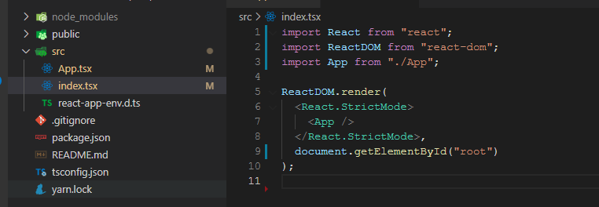
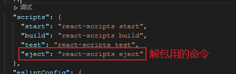

[
《IT-猿题库》项目笔记](http://110.40.134.6:9690/react/04.html#it-猿题库项目笔记)

- [一、项目介绍](http://110.40.134.6:9690/react/04.html#一项目介绍)
- [二、项目准备](http://110.40.134.6:9690/react/04.html#二项目准备)
- [三、配置路由](http://110.40.134.6:9690/react/04.html#三配置路由)
- [五、配置Store](http://110.40.134.6:9690/react/04.html#五配置store)
- [六、请求配置](http://110.40.134.6:9690/react/04.html#六请求配置)
- [七、业务代码编写](http://110.40.134.6:9690/react/04.html#七业务代码编写)

# 《IT-猿题库》项目笔记

## 一、项目介绍

【参考地址】

《IT-猿题库》是一个使用 React + TS 实现的移动端为主的刷题网站。结合了React、TypeScript、React-Router-Dom、React-Redux、Hooks、Axios、Less、MUI等常用的react技术栈的综合应用项目。

主要功能包含：登录、注册、学科分类、快速刷题、个人中心、数据统计等功能。

项目演示地址：

https://52coding.cc/yuantiku/login

接口文档地址：

http://www.xiaoyaoji.cn/project/1mtOteI5bqT/1mtOthTw1VQ

资源包：

链接：https://pan.baidu.com/s/196fQ1f9VkQ3qC95HO-eMdg  提取码：yyce 

然后我们把这些设计图上传到蓝湖，方便我们直接得到大小进行使用。

 

## 二、项目准备

### 1.创建项目

此处我们使用脚手架创建项目。

```
npx create-react-app it-qsl --template typescript  
# 或者
yarn create react-app it-qsl --template typescript
```

然后我们把项目进行一定的精简，删除不必要的文件，修改index.tsx为下图的样子。



### 2.进行项目解包

因为我们使用less进行样式预处理，所以我们必须在webpack.config.js里面进行配置，但是我们发现在项目里面并没有看到这样的一个文件。原因是我们使用脚手架创建的项目，已经帮我们进行了一些重要的设置，如非必要，脚手架不希望我们修改配置了。

所以我们需要进行项目的解包。解包的命令可以在 `package.json > scripts` 中找到



但是此时如果我们直接解包，会无法成功。因为解包是一个不可逆的过程，我们最好进行一次版本管理。所以我们先使用git先把之前的修改进行保存。

```
git add .
git commit -m '解包前的备份'
```

然后我们就可以进行解包了。

```
npm run eject
或者
yarn eject
```

解包完成后我们会在根目录看到一个config文件夹，这个config文件夹就是我们要进行配置的地方。

### 3.下载项目所需的依赖

项目中我们需要使用到的依赖比较多，所以我们先一次性下载好所有的依赖。

less和less-loader

```
npm i less less-loader --save--dev
# 或者
yarn add less less-loader --save--dev
```

react-router-dom

```
npm i react-router-dom@6 --save
# 或者
yarn add react-router-dom@6 --save
```

redux和react-redux

```
npm i redux react-redux --save
# 或者
yarn add redux react-redux --save
```

axios

```
npm i axios --save
# 或者
yarn add axios --save
```

mui , mui的[官网](https://mui.com/)

```
npm install @mui/material @emotion/react @emotion/styled
# 或者
yarn add @mui/material @emotion/react @emotion/styled
```

postcss-px-to-viewport

```
npm i postcss-px-to-viewport --save-dev
# 或者
yarn add postcss-px-to-viewport --save-dev
```

### 4.配置移动端屏幕适配

在前端的发展过程中，最认可的屏幕适配方案主要有两个。比较老的是 `media + rem` , 比较新的是 `viewport` ，我们这个项目采用 `viewport` 。

也就是说我们使用 `vw` + `vh` 来进行屏幕适配。但是其实我们这个项目中只需要使用 `vw` 就够了。

我们在 `config/webpack.config.js` 里面进行配置。找到 `postcss-loader` 节点，在这个节点的 `plugins` 节点的里面添加下面的配置.

```
require('postcss-px-to-viewport')({
    viewportWidth: 1125, // 视口宽度，根据设计图的大小
    viewportHeight: 1000, // 视口高度，根据设计图的大小
    unitPrecision: 6,// 保留小数点
    viewportUnit: 'vw', // 单位
    selectorBlackList: [], // 排除的类
    minPixelValue: 1, // px的最小单位
    mediaQuery: false, // 排除媒体查询
    landscapeUnit: 'vw', // 横屏单位
    fontViewportUnit: 'vw' // 字体属性单位
})
```

值得注意的是 `plugins` 节点有一个三元判断，需要在两个分支上都添加这段代码。

### 5.配置less-loader

我们下载好了less-loader后，需要在 `config/webpack.config.js` 里面进行配置。找到 `module/rules` 节点，在最后一个 `sass-loader` 后添加less-loader的配置

```
{
    test: /\.less$/,
    use: getStyleLoaders({}, 'less-loader')
}
```

然后我们在 `src/assets/style` 目录下新建一个 `common.less` 文件，加入下面的代码，然后在`index.tsx`中引入就可以看到在页面上能正常使用less了。

```
#root {
    font-size: 38px;
    font-family: NotoSansHans;
    color: #333333;
}
```

### 6.配置 @ 指向

首先还是找到 `config/webpack.config.js` 里面，找到 `resolve/alias` 节点，在最后添加下面代码：

```
"@": path.join(__dirname, "../src")
```

这一步的作用是为了让webpack在编译代码的时候把 `@` 编译成对应的目录。

然后找到 `tsconfig.json` , 在 `compilerOptions` 节点的最后添加

```
"baseUrl": "./",
"paths": {
    "@/*": ["src/*"]
}
```

这一步的作用是为了ts在静态检查的时候能正确找到  `src`  目录

> 注意：以上修改 webpack.config.js 的所有步骤，都需要重启脚手架方能生效。

### 7.解决移动端的点击延迟

我们通常会使用fastclick解决移动端的点击延迟问题。在 `index.html` 里面添加如下代码。

```
<title>IT猿题库</title>
<script src="https://as.alipayobjects.com/g/component/fastclick/1.0.6/fastclick.js"></script>
<script>
  if ('addEventListener' in document) {
    document.addEventListener('DOMContentLoaded', function() {
      FastClick.attach(document.body);
    }, false);
  }
  if(!window.Promise) {
    document.writeln('<script src="https://as.alipayobjects.com/g/component/es6-promise/3.2.2/es6-promise.min.js"'+'>'+'<'+'/'+'script>');
  }
</script>
```

> 如果网络不是很好的同学可以把 `fastclick.js` 和 `promise.min.js` 下载到本地，再引入。

 

## 三、配置路由

我们在src目录下新建一个`router`文件夹，然后在里面新建一个`index.tsx`。路由配置如下：

```
const router = (
  <BrowserRouter>
    <Routes>
      <Route path="/login" element={<Login />}></Route>
      <Route path="/" element={<App />}>
        <Route path="home" element={<Home />}></Route>
        <Route path="fast" element={<Fast />}></Route>
        <Route path="mine" element={<Mine />}></Route>
        <Route path="select" element={<SelectPractice />}></Route>
        <Route path="practice" element={<Practice />}></Route>
      </Route>
    </Routes>
  </BrowserRouter>
);
export default router;
```

然后自己在views目录下新建路由对应的组件，在入口的`index.tsx`中渲染我们的路由。

```
import router from "./router";

const rootEl = document.getElementById("root");
const root = ReactDOM.createRoot(rootEl!);
root.render(router);
```

## 五、配置Store

项目中肯定会有部分数据需要共享的，所以我们需要使用react-redux进行全局数据共享。

先在`src`目录上新建`store`目录，在里面新建 `index.ts` 文件，写入下面代码。

```
import { createStore } from "redux";
import { IStoreAction, IStoreState } from "../types/store";

const defState: IStoreState = {};

const reducer = (state = defState, action: IStoreAction) => {
  state = JSON.parse(JSON.stringify(state));
  return state;
};

const store = createStore(reducer);

export default store;

```

其中 `IStoreState` 和 `IStoreAction` 是两个`interface` ，我们需要在 `src/types` 目录下新建一个 `store.d.ts` 进行声明。

`.d.ts` 文件用于声明一些全局可用的类型数据。

```
import { Action } from "redux";

interface IStoreState {}

interface IStoreAction extends Action<string> {
  pyload: any;
}
```

最后在入口的`index.tsx`里面使用 `Provider` 组件进行数据共享。

```
import router from "./router";
import { Provider } from "react-redux";
import store from "./store";

const rootEl = document.getElementById("root");
const root = ReactDOM.createRoot(rootEl!);
root.render(<Provider store={store}>{router}</Provider>);
```

## 六、请求配置

> 接口文档：
>
> IT猿题库【IT猿题库】 [http://www.xiaoyaoji.cn/project/1mtOteI5bqT/1mtOthTw1VQ](http://www.docway.net/project/1eRv5Lh2UW9/share/1evckeXPiQy)

在 `src/api` 目录里面新建 `request.ts`

```
import axios from "axios";

const request = axios.create({
  baseURL: "/api",
  timeout: 5000,
});

request.interceptors.request.use(
  (config) => {
    return config;
  },
  (err) => Promise.reject(err)
);
request.interceptors.response.use(
  (res) => {
    return res.data;
  },
  (err) => Promise.reject(err)
);

export default request;
```

然后我们需要解决请求跨域的问题，推荐使用`wepack`的代理。我们直接修改 `config/webpackDevServer.config.js` 里面的配置. [【参考地址】](https://www.webpackjs.com/configuration/dev-server/#devserver-proxy)

```
module.exports = function (proxy, allowedHost) {
  const disableFirewall =
    !proxy || process.env.DANGEROUSLY_DISABLE_HOST_CHECK === 'true';

  proxy = {
    ...proxy,
    '/api': {
      target: 'https://www.ahsj.link/rambo', // 后台服务地址以及端口号
      changeOrigin: true, //是否跨域
      pathRewrite: { '^/api': '/' },
      secure: false
    }
  }
```

然后我们在 `src/api` 目录下新建 `index.ts` ，用来导出请求用的 api。

```
import request from "./request";

export const LoginApi = (params: ILoginParams) =>  request.post("/1024/login", params);
```

其中 `ILoginParams` 是一接口，我们在 `src/types` 目录下新建一个 `api.d.ts` 声明。

```
interface ILoginParams {
  username: string;
  password: string;
}
```

但是我们如果在请求的地方想要得到后端返回的数据，ts会检测不到，所以我们需要给所有API都设置对应的返回值。

已经知道我们所有的请求返回的数据都有 `errCode` / `message` / `data` 三个属性。所以我们需要定义一个用于接收请求返回值的 `interface`，在 `api.d.ts` 里面定义它。

因为  `errCode` 和 `message` 我们都知道是固定的，但是对于 `data` 来说，不同的接口返回的数据不同，我们就先给个泛型，以便在需要的时候再给一个指定的返回值。

```
interface IAxiosResponseData<T> {
  data: T;
  errCode: number;
  message: string;
}
```

但是我们需要真正需要使用的类型是需要在请求的 `then` 方法中接收到的数据，而 `then` 方法需要的是一个 `Promise`包着的数据，所以我们还定义一个类型别名以方便我们在请求时规定返回值。

```
type IResonseData<T> = Promise<IAxiosResponseData<T>>;
```

至此我们就可以把 `api.ts`里面的数据接口方法进行修改

```
export const LoginApi = (params: ILoginParams): IResonseData<string> => request.post("/1024/login", params);
```

这样我们就能在调用 `LoginApi` 这个方法的时候从 `then` 中知道 `data` 是一个 `string`;

 

## 七、业务代码编写

之后的所有代码，几乎都是我们编写的业务代码了，写法不唯一，需要大家在上课的时候紧跟老师的思路，加油！！！

 

 

 

 

 

 

 

 

 

 

 

 

 