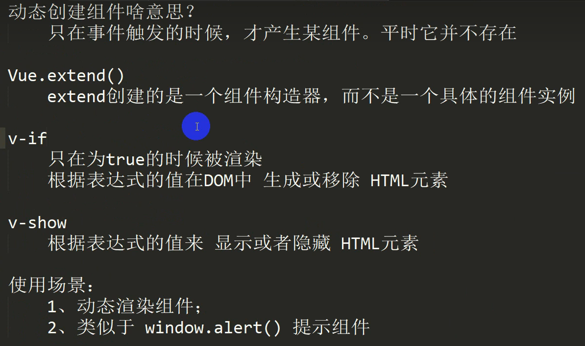

##  Vue

### 首页弹框之后看见底层页面的问题

> 思路：
>
> 给首页内容套一个div ，v-show通过路径的值来决定是否展示，为了避免即刻消失，外加一个transition 解决立刻消失的问题


### 面试官：v-for获取列表前n个数据、中间范围数据、末尾n条数据的方法

#### 1. 获取6到13之间的数据：items.slice(6,13)

```vue
<li v-for="(item,index) in items.slice(6,13)" :title="item.title" :key='index'>
  <a :href="item.url" :title="item.title" class="list-url">
     
  </a>
</li>
```

#### 2. 获取小于0到6之间的数据：（两种）

**items.slice(0,6)**

```vue
<li v-for="(item,index) in items.slice(0,6)" :title="item.title" :key='index'>
   <a :href="item.url" :title="item.title" class="list-url">
     
   </a>
</li>
```

**v-if="index < 6"**

```vue
<li v-for="(item,index) in items" v-if="index < 6" :title="item.title" :key='index'>
   <a :href="item.url" :title="item.title" class="list-url">
     
   </a>
</li>
```

#### 3.获取最后6条数据：items.slice(items.length-6,items.length)

```vue
<li v-for="(item,index) in items.slice(items.length-6,items.length)" :title="item.title" :key='index'>
       <a :href="item.url" :title="item.title" class="list-url">
           
       </a>
</li>
```

#### 4.用过滤的方法过滤这些请求的数据再遍历(获取小于0到6之间的数据)

```js
this.arr = this.arr.filters((item,index)=> index < 6)
```


### `$route` 和 `$router` 的区别

> `$router` 为 `VueRouter` 实例，是一个全局对象，具有：push、replace、go、forward、back等方法
>
> `$route` 是一个跳转的路由对象，每一个路由都会有一个route对象，是一个局部的对象，里面可以获取 `name` 、 `path` 、 `query` 、 `params` 等，我们可以从vue devtools中看到每个路由对象的不同


### 虚拟DOM是什么

> 虚拟 DOM（Virtual DOM）本质上是JS 和 DOM 之间的一个映射缓存，它在形态上表现为一个能够描述 DOM 结构及其属性信息的 JS 对象。它主要存储在内存中。主要来说：
>
> - 1.虚拟dom是一个js对象
> - 2.虚拟dom能够描述真实dom（存在一个对应关系）
> - 3.存储在内存之中
>
> 虚拟DOM是一颗以JS对象（VNode节点）作为基础的树，用对象的属性来描述节点，实际上只是一层对真实DOM的抽象，最终通过一系列的操作使这颗树映射到真实DOM上


### 为什么需要虚拟DOM？

> 如果直接使用直接使用js操作dom，性能会比较低，而且很麻烦，使用虚拟dom操作，会高效很多

### 再说一下虚拟Dom以及key属性的作用

由于在浏览器中操作DOM是很昂贵的。频繁的操作DOM，会产生一定的性能问题。这就是虚拟Dom的产生原因
Virtual DOM本质就是用一个原生的JS对象去描述一个DOM节点。是对真实DOM的一层抽象
VirtualDOM映射到真实DOM要经历VNode的create、diff、patch等阶段


### v-if和v-for为什么避免一起用

`v-for`优先级比`v-if`高

永远不要把 `v-if` 和 `v-for` 同时用在同一个元素上，带来性能方面的浪费（每次渲染都会先循环再进行条件判断）

[(8条消息) 面试官：为什么Vue中的v-if和v-for不建议一起用?_动感超人，的博客-CSDN博客](https://blog.csdn.net/weixin_44475093/article/details/110607035)


### Vue 哪些数组的方法是响应式的？

```js
push() //往数组最后添加元素
pop() //删除数组中最后一个元素
shift() //删除数组中第一个元素
unshift() //在数组最前面添加元素
splice() //删除元素/插入元素/替换元素
    splice(start,length,元素)
    删除元素：第二个参数传入你要删除几个元素（如果没有传，就删除后面所有的元素）
    替换元素：第二个参数，表示我们要替换几个元素，后面是用于替换前面的元素
    插入元素：第二个参数，传入0，并且后面跟上要插入的元素
sort() //数组元素排序
reverse() //数组元素位置倒序
```

这里讲一下哪些数组操作不会引起视图更新？

```js
1.通过索引值修改数组的元素
比如：this.books[0] = "深入浅出vue.js"
 
解决方法：
    1. this.books.splice(0,1,"深入浅出vue.js")//替换
 
    2. Vue.set(要修改的对象，索引值，修改后的值)
       Vue.set(this.books，0，"深入浅出vue.js")
       或者this.$set(this.books,0,"深入浅出vue.js") （这也是全局 Vue.set 方法的别名）
 
2.修改数组的长度
this.books.length = 10
```

[vue中数组是如何实现响应式的？ - 掘金 (juejin.cn)](https://juejin.cn/post/7027078879214829598)


### 什么是mvc和mvvm？以及mvc和mvvm的区别

> MVC：是一种代码[架构](https://so.csdn.net/so/search?q=架构&spm=1001.2101.3001.7020)设计模式，前端中的mvc最主要的作用就是将视图和数据模型进行分离

- **Model（模型）** - 模型代表一个存取数据的对象或 JAVA POJO。它也可以带有逻辑，在数据变化时更新控制器。

- **View（视图）** - 视图代表模型包含的数据的可视化。

- ~~Controller（控制器） - 控制器作用于模型和视图上。它控制数据流向模型对象，并在数据变化时更新视图。它使视图与模型分离开。~~

  ~~Controller层用来调度View层和Model层，将用户界面和业务逻辑合理的组织在一起，起粘合剂的效果。所以Controller中的内容能少则少，这样才能提供最大的灵活性。controller相当于路由的作用。~~
  
- Controller（控制器） - 作用于模型和视图上。控制数据流向模型对象，数据变化时更新视图，它使视图和模型分开，也相当于路由的作用了

> MVVM是Model-View-ViewModel的简写。M表示模型（data中的数据），V表示视图（模板代码），VM表示视图模型（Vue实例），VM是M和V之间的桥梁，通过VM知道双向数据的变化（视图更新通过VM通知数据更新，数据更新通过VM通知更新视图）
> 

它本质上就是MVC 的改进版，整体和mvc差不多，最大的区别就是mvc是单向的，而mvvm是双向的，并且是自动的，也就是数据发生变化自动同步视图，视图发生变化自动同步数据，同时解决了 mvc 中大量的 DOM 操作使页面渲染性能降低，加载速度变慢，影响用户体验。


### 数据代理和数据劫持

数据代理：通过一个对象对另外一个对象中属性的操作（读/写）。

比如说：访问对象A下的属性aa，通过一些方法，变成访问到对象B的属性cc，而这里的aa和cc可能是同名属性。做数据代理的原因，往往就是为了更方便的使用而已。Vue中的data我们可以直接访问是因为通过Object.defineProperty()把data对象中所有属性添加到Vue实例上。为每一个添加到Vue实例上的属性，都指定一个getter/setter。在getter/setter内部去操作（读/写）data中对应的属性。


数据劫持：指的是在访问或者修改对象的某个属性时，通过一段代码拦截这个行为，进行额外的操作或者修改返回结果。也可以说是通过某些方法，在访问对象A的某个属性的时候，能够被监控到，然后在数据被修改时，额外做一些事情，比如重新渲染ui之类的。

参考：[数据劫持（数据代理） - 简书 (jianshu.com)](https://www.jianshu.com/p/87a1ff1d7a3c)

[Vue为什么要使用数据代理呢？ - 知乎 (zhihu.com)](https://www.zhihu.com/question/499869689#:~:text=简单来说，,数据代理 的表现是，访问对象A下的属性aa，通过一些方法，变成访问到对象B的属性cc，而这里的aa和cc可能是同名属性。)


### Vue-Router传递参数的方式有哪些

### Vue如何实现自定义指令

### 如何获取一个组件的元素

### Vue中的传值方式


### Vue生命周期

Vue生命周期总共可以分为8个阶段：创建前后, 载入前后,更新前后,销毁前销毁后，以及一些特殊场景的生命周期

| 生命周期      | 描述                               |
| ------------- | ---------------------------------- |
| beforeCreate  | 组件实例被创建之初                 |
| created       | 组件实例已经完全创建               |
| beforeMount   | 组件挂载之前                       |
| mounted       | 组件挂载到实例上去之后             |
| beforeUpdate  | 组件数据发生变化，更新之前         |
| updated       | 数据数据更新之后                   |
| beforeDestroy | 组件实例销毁之前                   |
| destroyed     | 组件实例销毁之后                   |
| activated     | keep-alive 缓存的组件激活时        |
| deactivated   | keep-alive 缓存的组件停用时调用    |
| errorCaptured | 捕获一个来自子孙组件的错误时被调用 |

作者：梦Sir
链接：https://www.jianshu.com/p/35f8866248f0
来源：简书
著作权归作者所有。商业转载请联系作者获得授权，非商业转载请注明出处。


### Vue.extend 作用和原理

官方解释：

​	Vue.extend 使用基础 Vue 构造器，创建一个“子类”。参数是一个包含组件选项的对象。。其实就是一个子类构造器，可以用来动态渲染组件。

原理：

​	其实就是一个子类构造器 是 Vue 组件的核心 api 实现思路就是**使用原型继承的方法返回了 Vue 的子类**

作用：

​	Vue.extend返回的是一个扩展实例构造器,也就是预设了部分选项的Vue实例构造器，但未曾实例化，可以理解为创建一个子类，然后让它继承Vue身上的一些功能

1、为了性能考虑，在Vue.extend方法内增加了缓存策略。反复调用Vue.extend其实应该返回同一个结果。

2、只要返回结果是固定的，就可以将计算结果缓存，再次调用extend方法时，只需要从缓存中取出结果即可。



[Vue.extend 看完这篇，你就学废了。 - 掘金 (juejin.cn)](https://juejin.cn/post/6890072682864476168)


### Vue.mixin 的使用场景和原理

是什么：

​	mixin本质其实就是一个`js`对象，它可以包含我们组件中任意功能选项，如`data`、`components`、`methods`、`created`、`computed`等等

使用场景：

​	在日常的开发中，我们经常会遇到在不同的组件中经常会需要用到一些相同或者相似的代码，这些代码的功能相对独立，可以通过 Vue 的 mixin 功能抽离公共的业务逻辑，原理类似“对象的继承”，

原理：

​	当组件初始化时会调用 mergeOptions 方法进行合并，采用策略模式针对不同的属性进行合并。当组件存在与`mixin`对象相同的选项的时候，进行递归合并的时候组件的选项会覆盖`mixin`的选项，但是如果相同选项为生命周期钩子的时候，会合并成一个数组，先执行`mixin`的钩子，再执行组件的钩子


###  keep-alive 使用场景和原理

是什么：

​	keep-alive 是 Vue 内置的一个组件，可以实现组件缓存，当组件切换时不会对当前组件进行卸载。防止重新渲染dom。

- 常用的两个属性 include/exclude，允许组件有条件的进行缓存。
- 两个生命周期 activated/deactivated，用来得知当前组件是否处于活跃状态。

使用场景：

​	当我们在某些场景下不需要让页面重新加载时我们可以使用`keepalive`，比如说：从`首页`–>`列表页`–>`商详页`–>`返回到列表页(需要缓存)`–>`返回到首页(需要缓存)`–>`再次进入列表页(不需要缓存)`，这时候可以按需来控制页面的`keep-alive`，可以在路由中设置`keepAlive`属性判断是否需要缓存

​	原理：

在调用created函数时，会将需要缓存的VNode保存在this.cache中，在[Render](https://so.csdn.net/so/search?q=Render&spm=1001.2101.3001.7020)时如果VNode的name符合缓存条件，就从cache中直接取出进行渲染。


### 两种路由模式

> hash模式

特点：地址栏上是有#号的，#号后面的就是hash值，可以通过```location.hash```拿到，#号后面的是不会随着http请求而携带上去的。

实现的原理：通过```location.hash```去改变hash值并通过监听`hashchange`事件，可以知道hash值得改变，然后根据hash值，根据当前路由地址找到对应组件重新渲染

```js
// 渲染对应的路由组件
function render() {
  let hash = location.hash;
  routerView.innerHTML = router[hash]
}

// 页面锚点发送变化
window.addEventListener('hashchange', () => {
  render()
})

// 页面加载
window.addEventListener('DOMContentLoaded', () => {
  
  // 当不存在'#'时重定向到首页#/
  location.hash || (location.hash = "/")
  // 渲染组件
  render()
})

作者：渣渣xiong
链接：https://juejin.cn/post/7004738881778090014
来源：稀土掘金
著作权归作者所有。商业转载请联系作者获得授权，非商业转载请注明出处。
```


> history模式

特点：会有刷新页面404的问题，需要后端配合处理

原理：通过**history.pushState()**方法（或者通过**history.replaceState**）进行改变地址从而实现路由的跳转，通过监听**popstate**事件，可以知道路由的变化，这时候就可以渲染对应的组件了，当然页面也是没有刷新的

```js
window.addEventListener('DOMContentLoaded',()=>{
	console.log('path:'location.pathname);
})

myBtn.addEventListener('click',()=>{
	const state = { name:'user' }
    // 切换路由
	history.pushstate(state,'','user');
	console.log('切换路由到了'，'user');
})
// 知道路由的变化
window.onpopstate(e)=>{
	console.log('onpopstate',e.state,location.pathname);
}
```


### 假如有十万条数据，前端应该怎么处理

虚拟列表：可视区域渲染，不可视区域不渲染，提高


### 说说你对单向数据流和双向数据流的理解

#### 单向数据流

概念：就是说只能从一个方向来修改状态，两个数据流之间相对独立。

vue中的使用：像是父组件通过 props 向子组件传递数据，就是一个单向数据流，数据从父组件流向子组件，但是反过来是不行的。这样可以防止从子组件意外改变父组件的状态。

优点：所有状态的改变可记录、可跟踪，源头易追溯，所有的数据，具有唯一出口和入口，使得数据操作更直观更容易理解，可维护性强等等。

#### 双向数据流

概念：就是说数据的流向是双向的，可以互相改变状态。

vue中的使用：像是双向数据绑定v-model。

优点：数据模型变化与更新，会自动同步到页面上，用户在页面的数据操作，也会自动同步到数据模型。

缺点：用户的操作（如在输入框中输入内容）也可以修改状态。这使改变一个状态有可能会触发一连串的状态的变化，最后很难预测最终的状态是什么样的。使得代码变得很难调试。


[单向数据流和双向数据流 - 掘金 (juejin.cn)](https://juejin.cn/post/6999826653803184135)


### 什么是组合式API，为什么使用他（优点）

什么是：

​	组合式API就是一系列API的集合像我们从vue中按需导入的ref、computed等，我的理解就是相当于实现同个功能的函数和变量的集合，像hook一样引入使用。

优点：

- 使用组合式API可以使我们的代码结构更加的清晰，实现同个需求的代码可以放到一起，不像是Options API那样数据和方法是分开的
- 有些组件需要相同的代码逻辑可以进行很好的复用，而且不用担心命名冲突的问题。
- 组合式API主要基于变量和函数，会有更好的类型推导
- 更好的代码压缩，可以减少生产包体积，因为代码在同一个作用域


### Vue3和Vue2的区别

- vue2是选项式API（Options API），而vue3则是组合式的API（composition API）
- vue2是使用new Vue()创建实例，而vue3是 createApp(组件)

createApp和new Vue()的区别：new Vue()创建的实例是会共享一个vue构造函数对象的，包括全局指令等无法做到完全隔离，也就是说一个项目只有一个根vue实例；createApp方法可以返回一个提供应用上下文的应用实例。不同实例注册的组件无法在不同的实例下使用，可以做到完全隔离。

- vue2组件中只能有一个根标签，vue3可以有多个
- vue2 响应式原理基础是 Object.defineProperty；vue3 响应式原理基础是 Proxy。

- vue3 提供 Suspense 组件，允许程序在等待异步组件加载完成前渲染兜底的内容
- vue3更好的支持ts

[盘点 Vue3 与 Vue2 的区别 - 掘金 (juejin.cn)](https://juejin.cn/post/7067413380922867725)


### 响应式的区别

vue2

- 对象类型是将遍历所有的属性，并使用Object.defiineProperty 来劫持各个属性的gette和setter，在数据发生变动的时候发布消息给订阅者，触发响应的监听回调（因为是遍历耗性能）

- 数组类型：通过重写更新数组的一系列方法来实现拦截。（对数组的变更方法进行了包裹）。

缺点：新增属性、删除属性, 界面不会更新，直接通过下标修改数组, 界面不会自动更新。

vue3

- 基于**Proxy**和**Reflect**，可以原生监听数组，可以监听对象属性的添加和删除。
- 不需要一次性遍历data的属性，可以显著提高性能。
- 因为Proxy是ES6新增的属性，有些浏览器还不支持,只能兼容到IE11 。

[解析Vue2.0和3.0的响应式原理和异同(带源码) - 知乎 (zhihu.com)](https://zhuanlan.zhihu.com/p/125715026)


### computed和watch的区别

1、功能上：computed是计算属性，watch是监听一个值的变化，然后执行对应的回调。

2、是否调用缓存：computed中的函数所依赖的属性没有发生变化，那么调用当前的函数的时候会从缓存中读取，而watch在每次监听的值发生变化的时候都会执行回调。一个有缓存一个没有，在数据变化时执行异步或开销较大的操作时，使用watch

3、是否调用return：computed中的函数必须要用return返回，watch中的函数不是必须要用return。

4、computed默认第一次加载的时候就开始监听；watch默认第一次加载不做监听，如果需要第一次加载做监听，添加immediate属性，设置为true（immediate:true）

5、使用场景：computed----当一个属性受多个属性影响的时候，使用computed-------购物车商品结算。watch----当一条数据影响多条数据的时候，使用watch-------搜索框。


作者：ZMINGYUE。
链接：https://juejin.cn/post/6950833691773894670
来源：稀土掘金
著作权归作者所有。商业转载请联系作者获得授权，非商业转载请注明出处。


### nextTick作用和原理


## React

### 高阶组件

高阶组件（HOC，Higher-Order Components）不是组件，而是一个**函数**，它会接收一个组件作为参数并返回一个经过改造的新组件。使用高阶组件可以实现代码的复用和复用逻辑


## 小程序

### 哪些方法可以用来提高微信小程序的应用速度


小程序整体流程如下图：


流程图.png

#### 加载

提升体验最直接的方法是控制小程序包的大小，常见手段有如下：

```undefined
1.代码包的体积压缩可以通过勾选开发者工具中“上传代码时，压缩代码”选项
2.及时清理无用的代码和资源文件
3.减少资源包中的图片等资源的数量和大小（理论上除了小icon，其他图片资源从网络下载），图片资源压缩率有限
```

**并且可以采取分包加载的操作，将用户访问率高的页面放在主包里，将访问率低的页面放入子包里，按需加载**
 当用户点击到子包的目录时，还是有一个代码包下载的过程，这会感觉到明显的卡顿，所以子包也不建议拆的太大，当然我们可以采用子包预加载技术，并不需要等到用户点击到子包页面后在下载子包。


分包下载流程.png

#### 渲染

关于微信小程序首屏渲染优化的手段如下：

```rust
1.请求可以在页面onLoad就加载，不需要等页面ready后在异步请求数据
2.尽量减少不必要的https请求，可使用 getStorageSync() 及 setStorageSync() 方法将数据存储在本地
3.可以在前置页面将一些有用的字段带到当前页，进行首次渲染（列表页的某些数据--> 详情页），没有数据的模块可以进行骨架屏的占位
```

在微信小程序中，提高页面的多次渲染效率主要在于正确使用setData：

```kotlin
1.不要过于频繁调用setData，应考虑将多次setData合并成一次setData调用
2.数据通信的性能与数据量正相关，因而如果有一些数据字段不在界面中展示且数据结构比较复杂或包含长字符串，则不应使用setData来设置这些数据
3.与界面渲染无关的数据最好不要设置在data中，可以考虑设置在page对象的其他字段下
```

#### 总结

「小程序启动加载性能」：
 **1.控制代码包的大小**
 **2.分包加载**
 **3.首屏体验（预请求，利用缓存，避免白屏，及时反馈**

「小程序渲染性能」：
 **1.避免不当的使用setData**
 **2.使用自定义组件**

链接：https://www.jianshu.com/p/cabcadf59e63


### 简述微信小程序原理？（小程序是如何在微信APP里运行的？）

微信小程序采用 JavaScript、WXML、WXSS 三种技术进行开发,本质就是一个单页面应用，所有的页面渲染和事件处理，都在一个页面内进行，但又可以通过微信客户端调用原生的各种接口

原理:
原理上，微信 App 里包含 javascript 运行引擎。微信 App 里包含WXML/WXSS处理引擎，最终会把界面翻译成系统原生的界面，并展示出来。这样做的目的是为了提供和原生 App 性能相当的用户体验。
原文链接：https://blog.csdn.net/weixin_48787059/article/details/109261052


## webpack

### loader 和 plugin 区别是什么？

- loader就相当于是一个翻译官。webpack本身是只能处理js的，但是我们项目中是有各种的文件类型的，这时候就需要这个”翻译官”的，将这些文件比如说：css、less等转成js。（预处理器）将不同文件处理成webpack能看得的

- plugin即为插件，是一个扩展器，丰富webpack本身，增强功能 ，插件的范围包括，打包优化，代码压缩，甚至可以重新定义环境中的变量。插件的目的是用于解决loader无法实现的其他事。

[webpack 中的 loader 和 plugin 区别是什么？ - 知乎 (zhihu.com)](https://zhuanlan.zhihu.com/p/254898140#:~:text=loader即为文件加载器，操作的是文件，将文件A通过loader转换成文件B，是一个单纯的文件转化过程。,plugin即为插件，是一个扩展器，丰富webpack本身，增强功能 ，针对的是在loader结束之后，webpack打包的整个过程，他并不直接操作文件，而是基于事件机制工作，监听webpack打包过程中的某些节点，执行广泛的任务。)


### Loader

> loader是什么

Loader(加载器) 是 webpack 的核心之一。它用于将不同类型的文件转换为 webpack 可识别的模块。webpack 只能直接处理 javascript 格式的代码。任何非 js 文件都必须被预先处理转换为 js 代码，才可以参与打包。loader（加载器）就是这样一个代码转换器。它由 webpack 的 `loader runner` 执行调用，接收原始资源数据作为参数（当多个加载器联合使用时，上一个loader的结果会传入下一个loader），最终输出 javascript 代码（和可选的 source map）给 webpack 做进一步编译。

第二种说：

文件打包预处理器，webpack首先会去加载指定文件（css、js、html、txt、png等）各种资源文件，然后进行打包，但是webpack本身只能处理js，像css被打包后可能就会运行出错，Loader就派上用场了，Loader其实就是打包预处理器。
预处理：预先处理，webpack会调用各种Loader对非js的资源进行预先处理，处理完成（处理成js能够识别的数据）以后交给webpack进行打包。

[揭秘webpack loader - 知乎 (zhihu.com)](https://zhuanlan.zhihu.com/p/104205895)

常见的loader：

- css-loader

- style-loader

- less-loader

- bable-loader 将es6的语法向下兼容

- postcss-loader 解决css兼容问题

- `vue-loader`：加载 Vue.js 单文件组件

- `cache-loader`: 可以在一些性能开销较大的 Loader 之前添加，目的是将结果缓存到磁盘里

  


#### 图片资源处理和优化

过去在 Webpack4 时，我们处理图片资源通过 `file-loader` 和 `url-loader` 进行处理

现在 Webpack5 已经将两个 Loader 功能内置到 Webpack 里了，我们只需要简单配置即可处理图片资源

```js
use: [
  // 这个是图片相关的
  {
    loader: 'url-loader',
    options: {
      limit: 10000, // 小于10K的图片转成base64编码的dataURL字符串写到代码中
      fallback: 'file-loader',
      name: utils.assetsPath('img/[name].[hash:7].[ext]'), // 其他的图片转移到静态资源文件夹
    },
  },
    
   
  {
    loader: 'image-webpack-loader', // 压缩图片
    options: {
      mozjpeg: {
        //jpeg压缩
        progressive: true,
        quality: 65,
      },
      // optipng.enabled: false will disable optipng
      optipng: {
        //png压缩
        enabled: false,
      },
      pngquant: {
        //png压缩
        quality: [0.65, 0.9],
        speed: 4,
      },
      gifsicle: {
        //gif压缩
        interlaced: false,
      },
      // the webp option will enable WEBP
      //webp: {
      // quality: 75
      //}
    },
  },
];

```

[基于webpack的图片压缩最佳方案 - 掘金 (juejin.cn)](https://juejin.cn/post/6844903925611495437)


### Plugin

常见的plugin：

- HMR，只更新变更的内容，无需重新加载整个页面

- MiniCssExtractPlugin，Css 文件目前被打包到 js 文件中，当 js 文件加载时，会创建一个 style 标签来生成样式，这样对于网站来说，会出现闪屏现象，用户体验不好，我们应该是单独的 Css 文件，通过 link 标签加载性能才好

- CssMinimizerPlugin  css压缩

- UglifyJs 压缩js，是 `vue-cli` 默认使用的压缩代码方式，因为是单线程只在生成环境

- DllPlugin 可以避免打包时对不变的库重复构建，dll：动态链接库

- IgnorePlugin 忽略第三包指定的目录

  

### Webpack打包流程

初始化参数：就是初始化webpack.config.js配置文件的参数

开始编译：初始化compiler对象，注册所有的插件，监听webpack构建的生命周期，通过run方法执行编译

确定入口：根据webpack的配置文件中的entry确定入口

编译模块：使用递归，根据不同的loader来处理不同类型的文件

完成编译并输出：根据entry和output生成chunk（代码块, 一个chunk是由多个模块组合而成，用于代码合并与分割）

打包完成：根据output输出所有的chunk到相应的文件目录


### 模块打包原理知道吗？

Webpack 实际上为每个模块创造了一个可以导出和导入的环境，本质上并没有修改代码的执行逻辑，代码执行顺序与模块加载顺序也完全一致。打包后的文件是一个只执行函数


### webpack打包文件太大怎么办?

webpack 把我们所有的文件都打包成一个 JS 文件，这样即使你是小项目，打包后的文件也会非常大。可以从去除不必要的插件，提取第三方库，代码压缩，代码分割，设置缓存几个方面着手优化。


### webpack和gulp有什么不同？

glup是为了规范前端开发流程(强调)，是一个前端的自动构建工具，glup像是一个流水线，产品的从无到有到需要经历过流水线的控制。适用于多页面应用开发。

webpack是前端资源模块化管理和打包工具，强调模块化。适用于单页面应用开发


### source map是什么？生产环境怎么用？

`source map` 是将编译、打包、压缩后的代码映射回源代码的过程。打包压缩后的代码不具备良好的可读性，想要调试源码就需要 soucre map。

map文件只要不打开开发者工具，浏览器是不会加载的。

线上环境一般处理方案：

`sourcemap`：通过 nginx 设置将 .map 文件只对白名单开放(公司内网)


### 做过的Webpack优化

#### 开发时的优化

- 多进程打包，将`thread-loader`放在比较费时间的loader之前，比如`babel-loader`
- 缓存资源，提高二次构建的速度，使用方法是将`cache-loader`放在比较费时间的loader之前，比如`babel-loader`
- 开启热更新，使用这个插件`HotModuleReplacementPlugin`
- 缩小文件搜索范围，减少打包文件，`exclude`：不需要处理的文件，`include`：需要处理的文件

- 构建区分环境

  - `开发环境`：去除代码压缩、gzip、体积分析等优化的配置，大大提高构建速度

  - `生产环境`：需要代码压缩、gzip、体积分析等优化的配置，大大降低最终项目打包体积

#### 打包时的优化

- CSS代码压缩使用`css-minimizer-webpack-plugin`，效果包括压缩、去重
- JS代码压缩使用`terser-webpack-plugin`，实现打包后JS代码的压缩
- `tree-shaking`简单说作用就是：只打包用到的代码，没用到的代码不打包，而`webpack5`默认开启`tree-shaking`，当打包的`mode`为`production`时，自动开启`tree-shaking`进行优化
- 使用`webpack-bundle-analyzer`可以审查打包后的体积分布，进而进行相应的体积优化
- `IgnorePlugin`：忽略第三方包指定目录，让这些指定目录不要被打包进去
- `noParse`（不解析）提高构建速度，直接告诉webpack不进行解析的库（比如第三方的类库，工具类库等本身比较大的库，使用比较传统的非模块化方式的类库）
- `DllPlugin`可以避免打包时对不变的库重复构建，dll：动态链接库
- `Image Minimizer`如果图片多，对图片进行压缩，减少图片体积
- `webpack-merge`：提取公共配置，减少重复配置代码
- 还有很多

[Webpack配置全解析（优化篇） - 知乎 (zhihu.com)](https://zhuanlan.zhihu.com/p/176840425)

[每个前端都必须要学会的Webpack优化手段 - 掘金 (juejin.cn)](https://juejin.cn/post/7083519723484708878)


### webpack和vite区别

- webpack会先进行打包，等打包完成再开 开发服务器，而vite是先开 开发服务器（不需要分析模块的依赖、不需要编译），等打开时再加载对应的模块，利用的是浏览器支持ES Module，因此在代码中不可以使用CommonJS
- 但是vite生态没有webpack好，webpack有loader和plugin丰富webpack


### 为什么进行打包和构建

- 体积更小(Tree-Shaking、压缩、合并)，加载更快

- 编译高级语言或语法(TS,ES6+,模块化，Scss)

- 兼容性和错误检查(Polyfill、postcss、eslint)

- 集成一些想要的公司的构建规范


## Echarts

[Echarts面试题 - 掘金 (juejin.cn)](https://juejin.cn/post/6844904174669299726)

## 综合

### 对vue的理解

`Vue`是个渐进式轻量级的JavaScript框架，可以用来创建单页应用的Web应用框架。他有几个核心：MVVM模型、组件化、指令系统，还有就是使用了虚拟DOM，不需要去频繁的操作DOM，性能会更好。还有就是对新手比较友好，灵活，有良好的生态系统。就像vue官方网站说的易用、灵活、高效。


对比：

比如React，它也有一定程度的主张，它的主张主要是函数式编程的理念，比如说，你需要知道什么是副作用，什么是纯函数，如何隔离副作用。它的侵入性看似没有Angular那么强，主要因为它是软性侵入。

> 纯函数

1. 纯函数每一次调用时传入同样的参数，返回的都是同样的结果；它不会改变参数的值，也不会改变外部变量的值；它不会依赖于外部的变量，仅依赖于你传入的参数；
2. 纯函数没有其他副作用（side effect）
3. 如果你每次传入的参数一样，但是返回的结果不一样，则不是一个纯函数

> 副作用

让一个函数变得不纯，纯函数什么时候都有稳定的结果，函数不纯就是副作用了。

常见副作用包括：对外部可变数据或变量的修改，外部接口的调用尤其是IO（像是读取磁盘的）

- 对外部可变数据或变量的修改: 全局变量 / 闭包变量 / dom对象 / bom对象的读写操作

- 外部接口的调用尤其是IO：dom对象 / bom对象的方法调用; xhr / fetch这样的网络IO；console / LocalStorage这样的磁盘IO


作者：XxjzZ
链接：https://juejin.cn/post/6905234297360220174
来源：稀土掘金
著作权归作者所有。商业转载请联系作者获得授权，非商业转载请注明出处。


### vue和react的区别

共同点

- 数据驱动视图
- 组件化
- 使用Virtual DOM

不同点

- 核心思想不同

vue渐进式的框架，react推崇函数式编程（纯组件），数据不可变以及单向数据流

- 组件的写法差异

React推荐的做法是JSX + inline style, 也就是把 HTML 和 CSS 全都写进 JavaScript 中,即 all in js; Vue 推荐的做法是 template 的单文件组件格式(简单易懂，从传统前端转过来易于理解),即 html,css,JS 写在同一个文件(vue也支持JSX写法)


[React 和 VUE 的区别和优缺点，项目中改如何选择？ - 知乎 (zhihu.com)](https://zhuanlan.zhihu.com/p/180455618)

————————————————
版权声明：本文为CSDN博主「傲娇的koala」的原创文章，遵循CC 4.0 BY-SA版权协议，转载请附上原文出处链接及本声明。
原文链接：https://blog.csdn.net/xgangzai/article/details/115301290


### 设计模式

> 单例模式

确保一个类只有一个实例，而且自动实例化并向整个系统提供这个实例。构造方法必须是私有的

> 工厂模式

程序设计有一个原则，开闭原则：程序对于拓展是开放的，对于修改时关闭的。

使用创建子类来修改功能。说白了工厂模式就是富士康(提供场地人员制作方法 比如 生产 运输 组装) 富士康里面有苹果的生产线 有华为的生产线  这些生产线来进行具体的 怎么生产，怎么组装，怎么运输。 ------bilibili评论

> 装饰器模式

定义：动态的给一个对象去添加一些额外的功能。

相当于包装了一层盒子去动态拓展功能吗，不去修改原有类的逻辑（也不是继承），这个盒子就是装饰器。（一代机器人和二代机器人）

****

装饰器：`Decorator`是`ES7`的一个新语法。`Decorator`通过对类、对象、方法、属性进行修饰。对其添加一些其他的行为。通俗来说:就是对一段代码进行二次包装。

[Vue中使用装饰器 - 掘金 (juejin.cn)](https://juejin.cn/post/7056717969660837919)

> 观察者模式

定义对象间的一对多的依赖关系，使得每当一个对象状态发生改变时，其相关依赖的对象都可以得到通知并自动更新。

例子就是欠工资的老板有钱通知员工可以还钱给你们了。

> 策略模式

定义一组算法，将每个算法都封装起来，并且使它们之间可以互换。策略模式让算法独立于使用它的客户而变化，也称为政策模式(Policy)

不同的洗衣机算法（标准、快洗等）就是一个策略
