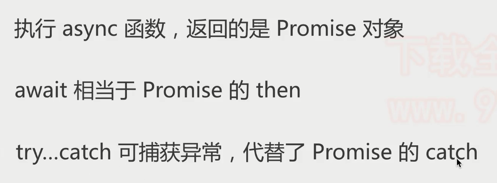
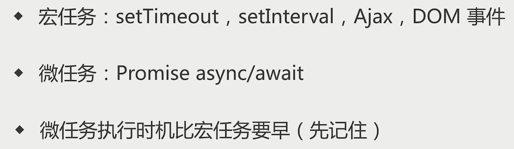

## HTML&CSS

### 行内元素和块级元素都有哪一些？

> display:block/table;有divh1h2 table ul ol p等
> display:inline/inline-block;span img input button

- 行内元素

```html
```

- 行内块元素

```html
```

- 块级元素

```html
```


### html语义化

> ◆让人更容易读懂（增加代码可读性）
> ◆让搜索引擎更容易读懂(SEO)
>
> 举个例子

### margin纵向重叠问题

相邻元素的margin-top和margin-bottom会发生重叠
空白内容的<p></p>也会重叠


### BFC概念

> BFC 即 Block Formatting Contexts (块级格式化上下文)
>
> BFC元素特性表现原则就是，内部子元素不会影响外部的元素
>
> 通俗一点来讲，可以把 BFC 理解为一个封闭的大箱子，箱子内部的元素无论如何翻江倒海，都不会影响到外部。

> BFC全称”Block Formatting Context”, 中文为“块级格式化上下文”。他是流体特性：像div这种块状水平元素，在默认情况下（非浮动、绝对定位等），水平方向会自动填满外部的容器；BFC元素特性表现原则就是，内部子元素不会影响外部的元素。

只要元素满足下面任一条件即可触发 BFC 特性：

- body 根元素
- 浮动元素：float 除 none 以外的值
- 绝对定位元素：position (absolute、fixed)
- display 为 inline-block、table-cells、flex
- overflow 除了 visible 以外的值 (hidden、auto、scroll)


### 什么是弹性布局

解决某元素中“`子元素`”的布局方式，为布局提供最大的灵活性。

设为 `flex` 布局以后，子元素的 `float、clear` 和`vertical-align`属性将失效!!!

`display:flex`; 属性`align-self` 定义子元素的位置。

[什么是弹性布局？弹性布局的具体使用方法 - 简书 (jianshu.com)](https://www.jianshu.com/p/f91389e0d1d2)

[(6条消息) 弹性布局介绍_一念花开丶君临天下的博客-CSDN博客_什么是弹性布局](https://blog.csdn.net/qq_43431024/article/details/100766477)


### （掌握）html5有哪些新特性？

- (1)`Canvas绘图`
- (2)`SVG绘图`
- (3)`地理定位`
- (4)`Web Worker`
- `web worker` 是运行在后台的 JS，独立于其他脚本，不会影响页面的性能。就是为 JavaScript 创造多线程环境，允许主线程创建 Worker 线程，将一些任务分配给后者运行。在主线程运行的同时，Worker 线程在后台运行，两者互不干扰。
- (5)`Web Storage`
- 1.Cookie技术 （ 兼容性好,数据不能超4kb,操作复杂）
- 2.（兼容性差,数据8MB,操作简单）sessionStorage
- 3.localStorage
- (6)`Web Socket`
- WebSocket协议是基于TCP的一种新的网络协议。它实现了浏览器与服务器全双工(full-duplex)通信——允许服务器主动发送信息给客户端。

### 1rem、1em、vw/vh、1px 各自的含义

1. 1rem ；长度单位相对于根元素 html,通常个 html 元素设置一个字体大小 find-size,其他根元素单位就为 rem

2. 1em:

   子元素字体大 小的 em 是相对于父元素字体大小

   元素的width/height/padding/margin 用 em 的话是相对该元素的 fond-size

3. vw/vh :
   全称是 Viewport Width 和 Viewport Height，视窗的宽度和高度，相当于 屏幕宽度和高度的 1%，不过，处理宽度的时候%单位更合适，处理高度的 话 vh 单位更好。

4. 1px :
   px像素（Pixel）。相对长度单位。像素px是相对于显示器屏幕分辨率而言的，一般电脑的分辨率有{1920 * 1024}等不同的分辨率，1920 * 1024 前者是屏幕宽度总共有1920个像素,后者则是高度为1024个像素

5. 浏览器默认字体大小是16px,1rem就是16px.

1rem= 1em= 16px
1em= 16px
1MB= 1040K


### 单页面应用

[(8条消息) 浅谈前端SPA（单页面应用）_huangpb0624的博客-CSDN博客_前端spa](https://blog.csdn.net/huangpb123/article/details/86183453)****


### 重排和重绘

> 重绘：当一个元素的外观发生改变(元素的填充颜色，改变visibility，outline，background等属性)，但没有改变布局,重新把元素外观绘制出来的过程，叫做重绘。

> 重排：当DOM的变化影响了元素的几何信息(元素的的位置和尺寸大小)，浏览器需要重新计算元素的几何属性，将其安放在界面中的正确位置，这个过程叫做重排。耗性能尽量避免
>
> - DOM元素的几何属性变化
> - 页面初始渲染，这是开销最大的一次重排
> - 添加/删除可见的DOM元素
> - 改变元素位置
> - 改变元素尺寸，比如边距、填充、边框、宽度和高度等
> - 改变元素内容，比如文字数量，图片大小等
> - 改变元素字体大小
> - 改变浏览器窗口尺寸，比如resize事件发生时

两者的区别

**重绘不一定导致重排，但重排一定会导致重绘**。

- 重绘不会带来重新布局，并不一定伴随着重排。
- 在实践中，应该尽量减少重排次数和缩小重排的影响范围。有以下几种方法：
- [ ] 将多次改变样式属性的操作合并成一次操作
- [ ] 将需要多次重排的元素，position属性设为absolute或fixed，使其脱离文档流，这样它的变化就不会影响到其他元素
- [ ] 在内存中多次操作节点，完成后再添加到文档中去
- [ ] 如果要对一个元素进行复杂的操作，可以将其display属性设置为none使其隐藏，待操作完成后再显示
- [ ] 在需要经常获取那些引起浏览器重排的属性值时，要缓存到变量


### 页面生成的过程：

1.HTML 被 HTML 解析器解析成 DOM 树；

2.CSS  被 CSS 解析器解析成 CSSOM 树；

3.结合 DOM 树和 CSSOM 树，生成一棵渲染树(Render Tree)，这一过程称为 Attachment；

4.生成布局(Layout)，也就是为每个节点分配一个应出现在屏幕上的确切坐标

5.将布局绘制(paint)在屏幕上，遍历渲染树，显示出整个页面。

第四步和第五步是最耗时的部分，这两步合起来，就是我们通常所说的渲染。


渲染：

在页面的生命周期中，**网页生成的时候，至少会渲染一次。在用户访问的过程中，还会不断触发重排(reflow)和重绘(repaint)**，不管页面发生了重绘还是重排，都会影响性能，最可怕的是重排，会使我们付出高额的性能代价，所以我们应尽量避免。


作者：齐小神
链接：https://juejin.cn/post/6844904083212468238
来源：稀土掘金
著作权归作者所有。商业转载请联系作者获得授权，非商业转载请注明出处。


### 如何实现浏览器内多个标签页之间的通讯

[(8条消息) 实现浏览器内多个标签页面之间通信的四种方法_Love——金哥哥的博客-CSDN博客_浏览器多个标签页之间的通信](https://blog.csdn.net/weixin_46399753/article/details/105211771)


### 解释css sprites ，如何使用？

SS Sprites其实就是把网页中一些背景图片整合到一张图片文件中，再利用CSS的“background-image”，“background- repeat”，“background-position”的组合进行背景定位，background-position可以用数字能精确的定位出背景图片的位置。

CSS Sprites为一些大型的网站节约了带宽，让提高了用户的加载速度和用户体验，不需要加载更多的图片


作者：小李不小
链接：https://www.jianshu.com/p/96b995102817
来源：简书
著作权归作者所有。商业转载请联系作者获得授权，非商业转载请注明出处。


## JS

### Promise、async、await相关

​	

Promise是种异步编程的解决方案，它可以把异步代码写成看起来像同步代码，可以用来解决回调地狱（回调函数多层嵌套）。

Promise本质上是个内置构造函数，Promise的三个状态：pending：初始状态，悬浮未决的；fulfilled：成功状态；rejected：失败状态。状态一旦确定就不会改变

Promise的基本语法：

```js
// 默认pending: 初始状态
var p = new Promise(function (resolve,reject) {
    if("操作成功"){
        resolve();//pending-->fulfilled  异步操作成功的回调函数
    }else{
        reject(); //pending-->reject     异步操作失败的回调函数
    }
})
p.then(data => {//在外面调用then处理成功的逻辑
    console.log("处理成功的逻辑");//fulfilled 
}).catch(err=>{//在外面调用catch处理失败的逻辑
    console.log("失败的逻辑");//reject
})
// then方法会在异步成功后调用，catch方法会在异步失败后调用

then正常返回resolved，里面有报错则返回rejected
catch正常返回也会resolved，里面有报错则返回rejected
```


async返回值是promise对象，而then传过来的参数就是return后面的值

```js
// async写法
async function fun(){
    return 1
}
// promise写法 相当于跟上面代码一样
function fun1(){
    return new Promise((resolve,reject)=>{
        resolve(1);
    })
}
// 直接调用会输出promise对象
fun(); // Promise {<fulfilled>: 1}

fun().then(res=>{
    console.log(res); // 1
})

```



async的常用

```js
// 异步代码像是同步代码
let p1 = new Promise((resolve)=>{
    resolve(1)
})
let p2 = new Promise((resolve)=>{
    resolve(2)
})

async function fun(){
    // 相当于await后面加一个promise对象，然后可以直接拿到promise对象的resolve传的值
    let a = await p1;
    let b = await p2;
    console.log(a); // then中执行的代码
    console.log(b);
}
fun(); // 1 2
```

[JS中的async/await的用法和理解 - 曼施坦因 - 博客园 (cnblogs.com)](https://www.cnblogs.com/liquanjiang/p/11409792.html)


参考：[(6条消息) 带你了解事件循环机制(Event Loop)_**Crazy的博客-CSDN博客_事件循环机制](https://blog.csdn.net/weixin_52092151/article/details/119788483)

[(6条消息) 面试题：说说事件循环机制(满分答案来了)_winty~~的博客-CSDN博客](https://blog.csdn.net/LuckyWinty/article/details/104765786?spm=1001.2101.3001.6650.1&utm_medium=distribute.pc_relevant.none-task-blog-2~default~CTRLIST~default-1-104765786-blog-119788483.pc_relevant_default&depth_1-utm_source=distribute.pc_relevant.none-task-blog-2~default~CTRLIST~default-1-104765786-blog-119788483.pc_relevant_default&utm_relevant_index=2)


### 为什么JS是单线程

#### 1、什么是线程？

线程是CPU调度的最小单位，同时也是进程的最小组成单位。

#### 2、什么是单线程？

进程是可以包含多个线程的，但是如果一个进程上只有一个线程，那么就叫单线程。也就意味着所有任务需要排队，前一个任务结束，才会执行后一个任务。

#### 3、为什么JS是单线程？

交互方式决定单线程模式。JS被设计用来实现用户与浏览器的交互，包括dom的增删改，如果使用多线程模式，会带来很多复杂的同步问题。比如，假定JavaScript同时有两个线程，一个线程在某个DOM节点上添加内容，另一个线程删除了这个节点，这时浏览器应该以哪个线程为准？

总结：为了避免复杂性，从一诞生，JavaScript就是单线程，这已经成了这门语言的核心特征。为了利用多核CPU的计算能力，HTML5提出Web Worker标准，允许JavaScript脚本创建多个线程，但是子线程完全受主线程控制，且不得操作DOM。所以，这个新标准并没有改变JavaScript单线程的本质。
————————————————
版权声明：本文为CSDN博主「花海里没有花」的原创文章，遵循CC 4.0 BY-SA版权协议，转载请附上原文出处链接及本声明。
原文链接：https://blog.csdn.net/qq_41273347/article/details/118945097


### 同步、异步、事件循环

#### 同步、异步

> JavaScript是一门**单线程**的语言，因此，JavaScript在同一个时间只能做一件事，单线程意味着，如果在同个时间有多个任务的话，这些任务就需要进行排队，前一个任务执行完，才会执行下一个任务。
>
> js运行机制：先执行同步代码 后异步代码

**同步任务**

> 同步任务是指在**主线程**上排队执行的任务，形成一个**执行栈**。只有前一个任务执行完毕，才能继续执行下一个任务。
>
> 当我们打开网站时，网站的渲染过程，比如元素的渲染，其实就是一个同步任务

**异步任务**

> 异步任务是指不进入主线程，而进入任务队列（消息队列）的任务，只有任务队列通知主线程，某个异步任务可以执行了，该任务才会进入主线程。
>
> 当我们打开网站时，像图片的加载，音乐的加载，其实就是一个异步任务。是通过回调函数实现的。有以下三种：

1. 普通事件：click、resize
2. 资源加载：load、error
3. 定时器：setInterval、setTimeout
4. **then()** 方法和 **catch()** 方法

```js
// 定时器里面的内容异步 还有事件里面的异步
// 例一
    console.log(1);
    setTimeout(function () {
        console.log(2);
    }, 0)
    console.log(3);
    setTimeout(function () {
        console.log(4);
    }, 0)
    // 输出 1 3 2 4

// 例二
    for (var i = 0; i < 3; i++) {
        console.log(i);
        // 异步 最后执行
        setTimeout(function () {
            console.log(i);
        }, 0)
    }
    // 输出 0 1 2 3 3 3
```

异步任务执行机制

> 1.所有同步任务都在主线程上执行，形成一个执行栈（execution context stack）。
> 2.主线程之外，还存在一个"任务队列"（task queue）。只要异步任务有了运行结果，就在"任务队列"之中放置一个事件。
> 3.一旦"执行栈"中的所有同步任务执行完毕，系统就会读取"任务队列"，看看里面有哪些事件。那些对应的异步任务，于是结束等待状态，进入执行栈，开始执行。
> 4.主线程不断重复上面的第三步。




#### Event Loop 

[(1条消息) 面试题：说说事件循环机制(满分答案来了)_winty~~的博客-CSDN博客](https://blog.csdn.net/LuckyWinty/article/details/104765786?spm=1001.2101.3001.6650.1&utm_medium=distribute.pc_relevant.none-task-blog-2~default~CTRLIST~default-1-104765786-blog-119788483.pc_relevant_default&depth_1-utm_source=distribute.pc_relevant.none-task-blog-2~default~CTRLIST~default-1-104765786-blog-119788483.pc_relevant_default&utm_relevant_index=2)

[(1条消息) 带你了解事件循环机制(Event Loop)_**Crazy的博客-CSDN博客_事件循环机制](https://blog.csdn.net/weixin_52092151/article/details/119788483)

> Event Loop ：是指浏览器或`Node`的一种解决`javaScript`单线程运行时不会阻塞的一种机制，也就是我们经常使用**异步**的原理。
>
> 主线程从”任务队列”中读取事件，这个过程是循环不断的，所以整个的这种运行机制又称为Event Loop（事件循环）。

**1）为什么会有Event Loop **

JavaScript的任务分为两种`同步`和`异步`，它们的处理方式也各自不同，**同步任务**是直接放在主线程上排队依次执行，**异步任务**会放在任务队列中，若有多个异步任务则需要在任务队列中排队等待，任务队列类似于缓冲区，任务下一步会被移到**调用栈**然后主线程执行调用栈的任务。

> **调用栈**：调用栈是一个栈结构，函数调用会形成一个栈帧，帧中包含了当前执行函数的参数和局部变量等上下文信息，函数执行完后，它的执行上下文会从栈中弹出。
>
> 执行栈，也称“调用栈”，是一种拥有 **后进先出** 的数据结构，被用来存储代码运行时创建的所有执行上顺序。
>
> 当 JavaScript 引擎第一次遇到你的脚本时，它会创建一个全局的执行环境并且压入当前执行栈。每当引擎遇到一个函数调用，它会为该函数创建一个新的执行环境并压入栈的顶部。

JavaScript是`单线程`的，单线程是指 js引擎中解析和执行js代码的线程只有一个（主线程），每次只能做一件事情，然而`ajax`请求中，主线程在等待响应的过程中回去做其他事情，浏览器先在事件表注册ajax的回调函数，响应回来后回调函数被添加到任务队列中等待执行，不会造成线程阻塞，所以说js处理ajax请求的方式是异步的。

综上所述，检查调用栈是否为空以及讲某个任务添加到调用栈中的个过程就是event loop，这就是JavaScript实现异步的核心。

**2）浏览器中的 Event Loop**

**Micro-Task 与 Macro-Task**

浏览器端事件循环中的异步队列有两种：macro（宏任务）队列和 micro（微任务）队列。

常见的 macro-task：`setTimeout`、`setInterval`、`script（整体代码）`、`I/O 操作`、`UI 渲染`等。

常见的 micro-task: `new Promise().then(回调)`、`MutationObserve`等。

**requestAnimationFrame**

requestAnimationFrame也属于异步执行的方法，但该方法既不属于宏任务，也不属于微任务。按照MDN中的定义：

> `window.requestAnimationFrame()` 告诉浏览器——你希望执行一个动画，并且要求浏览器在下次重绘之前调用指定的回调函数更新动画。该方法需要传入一个回调函数作为参数，该回调函数会在浏览器下一次重绘之前执行

requestAnimationFrame是GUI渲染之前执行，但在`Micro-Task`之后，不过requestAnimationFrame不一定会在当前帧必须执行，由浏览器根据当前的策略自行决定在哪一帧执行。

#### 终极版

单线程

同步任务和异步任务

全部同步任务在调用栈执行完成之后读取任务队列里面的异步任务，


```js
async function async1() {
  console.log('async start'); // 2
  await async2();
  // 相当于一个宏任务 看上面是什么结果
  console.log('async1 end'); // 9
}

async function async2() {
  console.log('async2'); // 3
  return new Promise(resolve => {
    console.log('async2 promise'); // 4
    setTimeout(() => {
      // 宏任务
      console.log('setTimeout'); // 11
      // resolve('1');
    }, 1000);
    resolve();
  }).then(() => {
    // 微任务
    console.log('async 成功promise'); // 7
  });
}

console.log('script start'); // 1

setTimeout(() => {
  // 宏任务
  console.log('全局setTimeout'); // 10
}, 0);

async1();

new Promise(resolve => {
  console.log('全局promise'); // 5
  resolve();
}).then(() => {
  // 微任务
  console.log('全局成功promise'); // 8
});

console.log('script end'); // 6

// 同步代码执行完毕  call-stack 被清空
// 执行微任务
// 尝试dom渲染
// 触发 Event Loop 执行宏任务

// 需要注意的是 await后面的的任务相当于开启了微任务或者是宏任务 看await后面的promise 有没有宏任务 有就是当做宏任务

```


### 前端怎么压缩图片

> input 读取到 文件 ，使用 FileReader 将其转换为 base64 编码
>
> 新建 img ，使其 src 指向刚刚的 base64
>
> 新建 canvas ，将 img 画到 canvas 上
>
> 利用 canvas.toDataURL/toBlob 将 canvas 导出为 base64 或 Blob
>
> 将 base64 或 Blob 转化为 File
>
> 作者：凉城a
> 链接：https://juejin.cn/post/6940430496128040967
> 来源：稀土掘金
> 著作权归作者所有。商业转载请联系作者获得授权，非商业转载请注明出处。****
>
> [前端实现图片压缩及遇到的问题 - 知乎 (zhihu.com)](https://zhuanlan.zhihu.com/p/143873360)


### 模块化规范

[前端模块化——彻底搞懂AMD、CMD、ESM和CommonJS - 奔跑的瓜牛 - 博客园 (cnblogs.com)](https://www.cnblogs.com/chenwenhao/p/12153332.html#:~:text=AMD%2FCMD区,要的时候才执行。)


### 那些操作会造成内存泄漏？

>内存泄漏（Memory Leak）是指程序中己动态分配的堆内存由于某种原因程序未释放或无法释放，造成系统内存的浪费，导致程序运行速度减慢甚至系统崩溃等严重后果。
>通俗点就是指由于疏忽或者错误造成程序未能释放已经不再使用的内存，不再用到的内存却没有及时释放，从而造成内存上的浪费。

1. 闭包

闭包可以维持函数内局部变量，使其得不到释放。如果闭包如果使用不当，可以导致环形引用。所以要合理使用闭包

2. 意外的全局变量引起的内存泄露

解决：使用严格模式或者将使用过后的全局变量设置为 null 或者将它重新赋值

```js
function fn(){	
	a = "123"; //a成为一个全局变量，不会被回收
}
// 上面的写法等价于
function fn() {
	window.a = '123'
}

function fn() {
	this.a = 'test'
	// 函数自身发生调用，this指向全局对象window
}
foo();

```

3. 未清理的DOM元素引用

```js
var a = document.getElementById('id');
document.body.removeChild(a);
```

不能回收，因为存在变量a对它的引用。虽然我们用removeChild移除了，但是还在对象里保存着#的引用，即DOM元素还在内存里面。
**解决方法**： a = null;

4. 被遗忘的定时器或者回调

```js

var someResouce=getData();
setInterval( function(){
var node= document.getElementById( 'Node');
if(node){
node.innerHTML= JSON.stringify(someResouce)
}
}, 1000)
//这样的代码很常见, 如果 id 为 Node 的元素从 DOM 中移除, 该定时器仍会存在, 同时, 因为回调函数中包含对 someResource 的引用, 定时器外面的 someResource 也不会被释放。
```

5. console

控制台日志记录对总体内存内置文件的影响，也是个重大的问题，同时也是容易被忽略的。记录错误的对象，可以将大量的数据保留在内存中。传递给console.log的对象是不能被垃圾回收，所以没有去掉console.log可能会存在内存泄漏~~~~

6. 怎样避免内存泄露

1）减少不必要的全局变量，或者生命周期较长的对象，及时对无用的数据进行垃圾回收；

2）注意程序逻辑，避免“死循环”之类的 ；

3）避免创建过多的对象 原则：不用了的东西要及时归还。


### javascript 的垃圾回收机制讲一下

定义：指一块被分配的内存既不能使用，又不能回收，直到浏览器进程结束。

JavaScript 在创建对象(对象、字符串等)时会为它们分配内存，不再使用对时会“自动”释放内存，这个过程称为垃圾收集。

> JavaScript具有垃圾收集器，垃圾收集器会按照固定的时间间隔周期性的执行。

最常见的垃圾回收方式有两种： 

标记清除
引用计数
1.标记清除：
原理：是当变量进入环境时，将这个变量标记为“进入环境”。当变量离开环境时，则将其标记为“离开环境”。标记“离开环境”的就回收内存。

垃圾回收器，在运行的时候会给存储在内存中的所有变量都加上标记。
去掉环境中的变量以及被环境中的变量引用的变量的标记。
再被加上标记的会被视为准备删除的变量。
垃圾回收器完成内存清除工作，销毁那些带标记的值并回收他们所占用的内存空间。
2.引用计数
原理：跟踪记录每个值被引用的次数。

声明了一个变量并将一个引用类型的值赋值给这个变量，这个引用类型值的引用次数就是1。
同一个值又被赋值给另一个变量，这个引用类型值的引用次数加1。
当包含这个引用类型值的变量又被赋值成另一个值了，那么这个引用类型值的引用次数减1。
当引用次数变成0时，说明没办法访问这个值了。
当垃圾收集器下一次运行时，它就会释放引用次数是0的值所占的内存。
（注意：当循环引用的时候就会释放不掉内存。）

> 四种常见的内存泄漏：全局变量，未清除的定时器，闭包，以及 dom 的引用

1. 全局变量 不用 var 声明的变量，相当于挂载到 window 对象上。如：b=1; 解决：使用严格模式
2. 被遗忘的定时器和回调函数
3. 闭包
4. 没有清理的 DOM 元素引用


### 什么时候不能使用箭头函数

#### **箭头函数**

箭头函数是和我们工作密切相关的东西；可以说箭头函数的诞生，给我们的工作带来了极大的便利。但是**箭头函数有什么缺点？什么时候不能使用箭头函数？** 这你了解吗?
我们觉得箭头函数很高级，可以规避 this 的问题，所有的场景下都是用箭头函数。在不能使用的场景下使用了，出现了问题，你还不知道是什么问题，那这不是瞎添乱吗！是不是！

这里给大家先提出一个问题：

```js
const obj = {
    name: '张三',
    getName() {
        return this.name
    },
    getName1: () => {
        return this.name
    }
}
obj.__proto__.getName2 = function() {
    return this.name
}
obj.__proto__.getName3 = () => {
    return this.name
}
console.log('普通函数',obj.getName())
console.log('普通函数',obj.getName2())
console.log('箭头函数',obj.getName1())
console.log('箭头函数',obj.getName3())
复制代码
```

大家觉得会输出什么呢？

先悄悄思考一下！

3,2,1 公布答案!


image.png

如果答错了，也别灰心，毕竟网络有着35的延迟，影响着你的操作和思考，看完这篇文章，保证你就不会答错了！

#### **箭头函数有什么缺点？**

1. 没有 arguments,如果要用，可以用 rest 参数代替。这里我们定义一个箭头函数和一个普通函数还有一个使用 rest 参数的箭头函数：

   ```js
   const fn1 = () => {
   console.log('arguments', arguments)
   }
   fn1(100, 200)
   
   function fn2(){
   console.log('arguments', arguments)
   }
   fn2(100, 200)
   
   const fn3 = (...values) => {
   console.log('values', values)
   }
   fn3(100, 200)
   复制代码
   ```

   image.png

2. 无法通过 apply、call、bind 改变this指向 这里我们在定义一个箭头函数和一个普通函数

   ```js
   const fn3 = () => {
   console.log('this', this)
   }
   fn3()
   
   function fn4(){
   console.log('this', this)
   }
   fn4()
   复制代码
   ```

   箭头函数的this就是他父容器的this，不是在执行的时候确定的，而是在定义的时候确定的。

   如上图，我们可以发现，箭头函数的两次执行的 **this 都是指向了 Windows**，**使用call并没有发生改变**，而普通函数**第一次是指向了Windows**，**第二次则是变成了我们传入的**


#### **1. 对象方法中，不适用箭头函数**

```js
const obj = {
    name: '张三',
    getName() {
        return this.name
    },
    getName1: () => {
        return this.name
    }
}
复制代码
```

我们在对象中定义了**普通函数：getName**和**箭头函数 getName1**，接下来我们来调用一下：

```js
console.log('普通函数',obj.getName())
console.log('箭头函数',obj.getName1())
复制代码
```

这里给大家默想3s输出什么？

公布答案：我们发现箭头函数好像并没有获取到值诶！

##### 为什么对象方法中，箭头函数的this指向不是这个对象？

1. **this 永远指向函数的调用者**
2. 在箭头函数中，**this 指向的是定义时所在的对象，而不是使用时所在的对象**。换句话说，箭头函数没有自己的 this，而是继承父作用域中的 this。

`obj.getName()`中`this`指向函数的调用者，也就是`obj`实例，因此`this.name = "张三"`。

`getName1()`通过箭头函数定义，而箭头函数是没有自己的`this`，会继承父作用域的`this`。

因此`obj.getName1()`执行时，此时的作用域指向`window`，而`window`没有定义`age`属性，所有报空。

从例子可以得出：**对象中定义的函数使用箭头函数是不合适的**。

#### **2. 原型方法中，不适用箭头函数**

```js
const obj = {
    name: '张三',
}
obj.__proto__.getName = function() {
    return this.name
}
obj.__proto__.getName1 = () => {
    return this.name
}
复制代码
```

我们又又又在对象中定义了**普通函数：getName**和**箭头函数 getName1**，接下来我们来调用一下：

```js
console.log(obj.getName())
console.log(obj.getName1())
复制代码
```

这里再再再给大家默想3s输出什么？

bang bang bang 公布答案：

##### 为什么？

出现问题的原因是this指向window对象，这和使用箭头函数在对象中定义方法十分类似。

#### **3. 构造函数也不行！**

我们又又又定义了**普通的构造函数：Foo**和**箭头函数 Foo1**，接下来我们来调用一下：

```js
function Foo (name, sex) {
    this.name = name
    this.sex = sex
}
const Foo1 = (name, sex) => {
    this.name = name
    this.sex = sex
}
console.log('普通的构造函数：', new Foo('张三', '男'))
console.log('箭头函数：', new Foo1('张三', '男'))
复制代码
```

不仅不行，还报错了呢！

##### 为什么？

> 构造函数是通过 new 关键字来生成对象实例，生成对象实例的过程也是通过构造函数给实例绑定 this 的过程，而箭头函数没有自己的 this。因此不能使用箭头作为构造函数，也就不能通过 new 操作符来调用箭头函数。

#### **4. 动态上下文中的回调函数**

比如，我们需要给一个按钮添加点击事件：

```js
const btn1 = document.getElementById('btn1')
btn1.addEventListener('click', () => {
    this.innerHTML = 'clicked'
})
复制代码
```

如果我们在回调中不需要使用到 this，那就啥问题也没有，但是！使用到了 this，那么问题就大大的了！

##### **为什么呢？**

**箭头函数的 this 指向的是他的父作用域**（这里就指向了 window），而不是指向这个button。这时候我们需要使用普通函数才可以。

#### **5. Vue 生命周期和 method 中也不能使用箭头函数**

image.png

##### 为什么不行呢？

Vue 本质上是一个对象，我们说过对象方法中，不适用箭头函数。他的本质上的和对象方法中，不适用箭头函数是一样的。

那么我有一个问题：Vue不行，作为大热框架之一的 react 行吗？

回答是：react 行

因为 Vue组件本质上是一个 JS 对象；React 组件（非Hooks）他本质上是一个 ES6 的 class

不信的话我们测试一下就知道了

```js
class Man {
    constructor(name, city) {
        this.name = name
        this.city = city
    }
    getName = () => {
        return this.name
    }
}
const f = new Man('李四','上海')
console.log(f.getName())
复制代码
```

image.png

#### **划重点**

- 要熟练使用箭头函数，也要对函数 **this**（重点） 敏感
- Vue组件本质上是一个 JS 对象；React 组件（非Hooks）他本质上是一个 ES6 的 class，两者不同

The end


### null 和 undefined 究竟有何区别？

[深入探究：null 和 undefined 究竟有何区别？ - 知乎 (zhihu.com)](https://zhuanlan.zhihu.com/p/463090509)


##  Vue

### 首页弹框之后看见底层页面的问题

> 思路：
>
> 给首页内容套一个div ，v-show通过路径的值来决定是否展示，为了避免即刻消失，外加一个transition 解决立刻消失的问题


### 面试官：v-for获取列表前n个数据、中间范围数据、末尾n条数据的方法

#### 1. 获取6到13之间的数据：items.slice(6,13)

```vue
<li v-for="(item,index) in items.slice(6,13)" :title="item.title" :key='index'>
  <a :href="item.url" :title="item.title" class="list-url">
     
  </a>
</li>
```

#### 2. 获取小于0到6之间的数据：（两种）

**items.slice(0,6)**

```vue
<li v-for="(item,index) in items.slice(0,6)" :title="item.title" :key='index'>
   <a :href="item.url" :title="item.title" class="list-url">
     
   </a>
</li>
```

**v-if="index < 6"**

```vue
<li v-for="(item,index) in items" v-if="index < 6" :title="item.title" :key='index'>
   <a :href="item.url" :title="item.title" class="list-url">
     
   </a>
</li>
```

#### 3.获取最后6条数据：items.slice(items.length-6,items.length)

```vue
<li v-for="(item,index) in items.slice(items.length-6,items.length)" :title="item.title" :key='index'>
       <a :href="item.url" :title="item.title" class="list-url">
           
       </a>
</li>
```

#### 4.用过滤的方法过滤这些请求的数据再遍历(获取小于0到6之间的数据)

```js
this.arr = this.arr.filters((item,index)=> index < 6)
```


### `$route` 和 `$router` 的区别

> `$router` 为 `VueRouter` 实例，是一个全局对象，具有：push、replace、go、forward、back等方法
>
> `$route` 是一个跳转的路由对象，每一个路由都会有一个route对象，是一个局部的对象，里面可以获取 `name` 、 `path` 、 `query` 、 `params` 等，我们可以从vue devtools中看到每个路由对象的不同


### 虚拟DOM是什么

> 虚拟 DOM（Virtual DOM）本质上是JS 和 DOM 之间的一个映射缓存，它在形态上表现为一个能够描述 DOM 结构及其属性信息的 JS 对象。它主要存储在内存中。主要来说：
>
> - 1.虚拟dom是一个js对象
> - 2.虚拟dom能够描述真实dom（存在一个对应关系）
> - 3.存储在内存之中
>
> 虚拟DOM是一颗以JS对象（VNode节点）作为基础的树，用对象的属性来描述节点，实际上只是一层对真实DOM的抽象，最终通过一系列的操作使这颗树映射到真实DOM上


### 为什么需要虚拟DOM？

> 如果直接使用直接使用js操作dom，性能会比较低，而且很麻烦，使用虚拟dom操作，会高效很多

### 再说一下虚拟Dom以及key属性的作用

由于在浏览器中操作DOM是很昂贵的。频繁的操作DOM，会产生一定的性能问题。这就是虚拟Dom的产生原因
Virtual DOM本质就是用一个原生的JS对象去描述一个DOM节点。是对真实DOM的一层抽象
VirtualDOM映射到真实DOM要经历VNode的create、diff、patch等阶段


### v-if和v-for为什么避免一起用

`v-for`优先级比`v-if`高

永远不要把 `v-if` 和 `v-for` 同时用在同一个元素上，带来性能方面的浪费（每次渲染都会先循环再进行条件判断）

[(8条消息) 面试官：为什么Vue中的v-if和v-for不建议一起用?_动感超人，的博客-CSDN博客](https://blog.csdn.net/weixin_44475093/article/details/110607035)


### Vue 哪些数组的方法是响应式的？

```js
push() //往数组最后添加元素
pop() //删除数组中最后一个元素
shift() //删除数组中第一个元素
unshift() //在数组最前面添加元素
splice() //删除元素/插入元素/替换元素
    splice(start,length,元素)
    删除元素：第二个参数传入你要删除几个元素（如果没有传，就删除后面所有的元素）
    替换元素：第二个参数，表示我们要替换几个元素，后面是用于替换前面的元素
    插入元素：第二个参数，传入0，并且后面跟上要插入的元素
sort() //数组元素排序
reverse() //数组元素位置倒序
```

这里讲一下哪些数组操作不会引起视图更新？

```js
1.通过索引值修改数组的元素
比如：this.books[0] = "深入浅出vue.js"
 
解决方法：
    1. this.books.splice(0,1,"深入浅出vue.js")//替换
 
    2. Vue.set(要修改的对象，索引值，修改后的值)
       Vue.set(this.books，0，"深入浅出vue.js")
       或者this.$set(this.books,0,"深入浅出vue.js") （这也是全局 Vue.set 方法的别名）
 
2.修改数组的长度
this.books.length = 10
```


[vue中数组是如何实现响应式的？ - 掘金 (juejin.cn)](https://juejin.cn/post/7027078879214829598)


### 什么是mvc和mvvm？以及mvc和mvvm的区别

> MVC：是一种代码[架构](https://so.csdn.net/so/search?q=架构&spm=1001.2101.3001.7020)设计模式，前端中的mvc最主要的作用就是将视图和数据模型进行分离

- **Model（模型）** - 模型代表一个存取数据的对象或 JAVA POJO。它也可以带有逻辑，在数据变化时更新控制器。

- **View（视图）** - 视图代表模型包含的数据的可视化。

- Controller（控制器） - 控制器作用于模型和视图上。它控制数据流向模型对象，并在数据变化时更新视图。它使视图与模型分离开。

  Controller层用来调度View层和Model层，将用户界面和业务逻辑合理的组织在一起，起粘合剂的效果。所以Controller中的内容能少则少，这样才能提供最大的灵活性。controller相当于路由的作用。

> MVVM是Model-View-ViewModel的简写。它本质上就是MVC 的改进版，整体和mvc差不多，最大的区别就是mvc是单向的，而mvvm是双向的，并且是自动的，也就是数据发生变化自动同步视图，视图发生变化自动同步数据，同时解决了 mvc 中大量的 DOM 操作使页面渲染性能降低，加载速度变慢，影响用户体验。和当 Model 频繁发生变化，开发者需要主动更新到 View
> ————————————————
> 版权声明：本文为CSDN博主「搬砖猴哥」的原创文章，遵循CC 4.0 BY-SA版权协议，转载请附上原文出处链接及本声明。
> 原文链接：https://blog.csdn.net/weixin_41819098/article/details/119305249


### 数据代理和数据劫持

数据代理：通过一个对象对另外一个对象中属性的操作（读/写）。

比如说：访问对象A下的属性aa，通过一些方法，变成访问到对象B的属性cc，而这里的aa和cc可能是同名属性。做数据代理的原因，往往就是为了更方便的使用而已。Vue中的data我们可以直接访问是因为通过Object.defineProperty()把data对象中所有属性添加到Vue实例上。为每一个添加到Vue实例上的属性，都指定一个getter/setter。在getter/setter内部去操作（读/写）data中对应的属性。


数据劫持：指的是在访问或者修改对象的某个属性时，通过一段代码拦截这个行为，进行额外的操作或者修改返回结果。也可以说是通过某些方法，在访问对象A的某个属性的时候，能够被监控到，然后在数据被修改时，额外做一些事情，比如重新渲染ui之类的。

参考：[数据劫持（数据代理） - 简书 (jianshu.com)](https://www.jianshu.com/p/87a1ff1d7a3c)

[Vue为什么要使用数据代理呢？ - 知乎 (zhihu.com)](https://www.zhihu.com/question/499869689#:~:text=简单来说，,数据代理 的表现是，访问对象A下的属性aa，通过一些方法，变成访问到对象B的属性cc，而这里的aa和cc可能是同名属性。)


### Vue-Router传递参数的方式有哪些

### Vue如何实现自定义指令

### 如何获取一个组件的元素

### Vue中的传值方式


### Vue生命周期

Vue生命周期总共可以分为8个阶段：创建前后, 载入前后,更新前后,销毁前销毁后，以及一些特殊场景的生命周期

| 生命周期      | 描述                               |
| ------------- | ---------------------------------- |
| beforeCreate  | 组件实例被创建之初                 |
| created       | 组件实例已经完全创建               |
| beforeMount   | 组件挂载之前                       |
| mounted       | 组件挂载到实例上去之后             |
| beforeUpdate  | 组件数据发生变化，更新之前         |
| updated       | 数据数据更新之后                   |
| beforeDestroy | 组件实例销毁之前                   |
| destroyed     | 组件实例销毁之后                   |
| activated     | keep-alive 缓存的组件激活时        |
| deactivated   | keep-alive 缓存的组件停用时调用    |
| errorCaptured | 捕获一个来自子孙组件的错误时被调用 |

作者：梦Sir
链接：https://www.jianshu.com/p/35f8866248f0
来源：简书
著作权归作者所有。商业转载请联系作者获得授权，非商业转载请注明出处。


### Vue.extend 作用和原理

官方解释：

​	Vue.extend 使用基础 Vue 构造器，创建一个“子类”。参数是一个包含组件选项的对象。。其实就是一个子类构造器，可以用来动态渲染组件。

原理：

​	其实就是一个子类构造器 是 Vue 组件的核心 api 实现思路就是**使用原型继承的方法返回了 Vue 的子类**

作用：

​	Vue.extend返回的是一个扩展实例构造器,也就是预设了部分选项的Vue实例构造器，但未曾实例化，可以理解为创建一个子类，然后让它继承Vue身上的一些功能

1、为了性能考虑，在Vue.extend方法内增加了缓存策略。反复调用Vue.extend其实应该返回同一个结果。

2、只要返回结果是固定的，就可以将计算结果缓存，再次调用extend方法时，只需要从缓存中取出结果即可。


[Vue.extend 看完这篇，你就学废了。 - 掘金 (juejin.cn)](https://juejin.cn/post/6890072682864476168)


### Vue.mixin 的使用场景和原理

是什么：

​	mixin本质其实就是一个`js`对象，它可以包含我们组件中任意功能选项，如`data`、`components`、`methods`、`created`、`computed`等等

使用场景：

​	在日常的开发中，我们经常会遇到在不同的组件中经常会需要用到一些相同或者相似的代码，这些代码的功能相对独立，可以通过 Vue 的 mixin 功能抽离公共的业务逻辑，原理类似“对象的继承”，

原理：

​	当组件初始化时会调用 mergeOptions 方法进行合并，采用策略模式针对不同的属性进行合并。当组件存在与`mixin`对象相同的选项的时候，进行递归合并的时候组件的选项会覆盖`mixin`的选项，但是如果相同选项为生命周期钩子的时候，会合并成一个数组，先执行`mixin`的钩子，再执行组件的钩子


###  keep-alive 使用场景和原理

是什么：

​	keep-alive 是 Vue 内置的一个组件，可以实现组件缓存，当组件切换时不会对当前组件进行卸载。防止重新渲染dom。

- 常用的两个属性 include/exclude，允许组件有条件的进行缓存。
- 两个生命周期 activated/deactivated，用来得知当前组件是否处于活跃状态。

使用场景：

​	当我们在某些场景下不需要让页面重新加载时我们可以使用`keepalive`，比如说：从`首页`–>`列表页`–>`商详页`–>`返回到列表页(需要缓存)`–>`返回到首页(需要缓存)`–>`再次进入列表页(不需要缓存)`，这时候可以按需来控制页面的`keep-alive`，可以在路由中设置`keepAlive`属性判断是否需要缓存

​	原理：

在调用created函数时，会将需要缓存的VNode保存在this.cache中，在[Render](https://so.csdn.net/so/search?q=Render&spm=1001.2101.3001.7020)时如果VNode的name符合缓存条件，就从cache中直接取出进行渲染。


## 小程勋

### 哪些方法可以用来提高微信小程序的应用速度

小程序启动会常常遇到如下图场景：


小程序首次启动.png


 这是因为，小程序首次启动前，微信会在小程序启动前为小程序准备好通用的运行环境，如运行中的线程和一些基础库的初始化。
 然后才开始进入启动状态，展示一个固定的启动界面，界面内包含小程序的图标、名称和加载提示图标。此时，微信会在背后完成几项工作：
**1.下载小程序代码包**
**2.加载小程序代码包**
**3.初始化小程序首页**
 下载到的小程序代码包不是小程序的源代码，而是编译、压缩、打包之后的代码包。
 整体流程如下图：


流程图.png


#### 二、手段

围绕上图小程序的启动流程， 我们可以从加载、渲染两个纬度进行切入：

加载

提升体验最直接的方法是控制小程序包的大小，常见手段有如下：


```undefined
1.代码包的体积压缩可以通过勾选开发者工具中“上传代码时，压缩代码”选项
2.及时清理无用的代码和资源文件
3.减少资源包中的图片等资源的数量和大小（理论上除了小icon，其他图片资源从网络下载），图片资源压缩率有限
```

**并且可以采取分包加载的操作，将用户访问率高的页面放在主包里，将访问率低的页面放入子包里，按需加载**
 当用户点击到子包的目录时，还是有一个代码包下载的过程，这会感觉到明显的卡顿，所以子包也不建议拆的太大，当然我们可以采用子包预加载技术，并不需要等到用户点击到子包页面后在下载子包。


分包下载流程.png


#### 渲染

关于微信小程序首屏渲染优化的手段如下：


```rust
1.请求可以在页面onLoad就加载，不需要等页面ready后在异步请求数据
2.尽量减少不必要的https请求，可使用 getStorageSync() 及 setStorageSync() 方法将数据存储在本地
3.可以在前置页面将一些有用的字段带到当前页，进行首次渲染（列表页的某些数据--> 详情页），没有数据的模块可以进行骨架屏的占位
```

在微信小程序中，提高页面的多次渲染效率主要在于正确使用setData：


```kotlin
1.不要过于频繁调用setData，应考虑将多次setData合并成一次setData调用
2.数据通信的性能与数据量正相关，因而如果有一些数据字段不在界面中展示且数据结构比较复杂或包含长字符串，则不应使用setData来设置这些数据
3.与界面渲染无关的数据最好不要设置在data中，可以考虑设置在page对象的其他字段下
```

除此之外，对于一些独立的模块我们尽可能抽离出来，这是因为自定义组件的更新并不会影响页面上其他元素的更新。
 各个组件也将具有各自独立的逻辑空间。每个组件都分别拥有自己的独立的数据、setData调用。

#### 三、总结

「小程序启动加载性能」：
 **1.控制代码包的大小**
 **2.分包加载**
 **3.首屏体验（预请求，利用缓存，避免白屏，及时反馈**

「小程序渲染性能」：
 **1.避免不当的使用setData**
 **2.使用自定义组件**

这篇文章是转载：JS每日一题
 微信公众号：**JS每日一题**


作者：顺其自然AAAAA
链接：https://www.jianshu.com/p/cabcadf59e63
来源：简书
著作权归作者所有。商业转载请联系作者获得授权，非商业转载请注明出处。


### 简述微信小程序原理？（小程序是如何在微信APP里运行的？）

小程序简介
小程序是一种全新的连接用户与服务的方式，它可以在微信内被便捷地获取和传播，同时具有出色的使用体验。

微信小程序采用 JavaScript、WXML、WXSS 三种技术进行开发,本质就是一个单页面应用，所有的页面渲染和事件处理，都在一个页面内进行，但又可以通过微信客户端调用原生的各种接口

原理:
原理上，微信 App 里包含 javascript 运行引擎。微信 App 里包含WXML/WXSS处理引擎，最终会把界面翻译成系统原生的界面，并展示出来。这样做的目的是为了提供和原生 App 性能相当的用户体验。
————————————————
版权声明：本文为CSDN博主「酥唯」的原创文章，遵循CC 4.0 BY-SA版权协议，转载请附上原文出处链接及本声明。
原文链接：https://blog.csdn.net/weixin_48787059/article/details/109261052

## nodejs

### 内存泄漏是什么，以及原因

内存泄漏：由于疏忽未能释放已经不在使用的内存，如果内存泄漏的位置比较关键，那么随着处理的进行会产生更多的无用内存，这些无用的内存会 使服务器响应变慢

原因：


## 网络

### 说下HTTP状态码？

分类：

> 1xx 服务器收到请求
>
> 2xx 请求成功，如200
>
> 3xx 重定向，如302
>
> 4xx 客户端错误，如404
>
> 5xx 服务端错误，如500

常见状态码：

> 200：请求成功
>
> 301：永久重定向（配合location，浏览器自动处理）
>
> 302：临时重定向（配合location，浏览器自动处理）配合例子介绍
>
> 304：资源未被修改（重要） 本地缓存还有效
>
> 
>
> 404：资源未找到
>
> 403：没有权限
>
> 500：服务器错误
>
> 504：网关超时


### http常见的headers有哪些？

Request Headers

> Accept：定义客户端（浏览器）可接受的响应内容类型（数据格式）；
>
> Accept-charset：定义客户端可接受的字符集；
>
> Accept-Encoding：定义客户端可接受的编码方式（压缩算法），比如打包方式--gzip 等；
>
> Accept-Languange：浏览器可接收的语言，如zh-CN；
>
> Connection：keep-alive 一次TCP连接重复使用；
>
> cookie：由服务器通过 set-cookie 设置的 cookie；
>
> Content-Length：请求体的长度；
>
> Content-Type：请求体的数据类型：Content-Type: application/x-www-form-urlencoded；
>
> Date：发送该请求的日期和时间；
>
> Host：所请求的服务器地址；
>
> Referrer：表示页面是从哪个地链接过来的，可以用来统计网页上的链接访问量；
>
> User-Agent：显示客户端的身份标识；
>
> If-Modified-Since：用于协商缓存，取自 Response haders 中的 Last-Modified 字段。服务器通过对比这两个字段判断缓存是否有效；
>
> If-None-Match：用于协商缓存，取自 Response Headers 中的 E-tag 字段。服务器通过对比这两个字段判断缓存是否有效；

Response Headers

> Access-Control-Allow-Origin：指定哪些网站以跨域资源共享（CORS）；
>
> Content-Encoding：响应资源的编码方式；
>
> Content-Language：响应资源所使用的语言；
>
> Content-Length：响应资源的长度；
>
> Content-type：响应内容的数据类型（格式）；
>
> Date：消息被发送时的日期和时间；
>
> Location：用于重定向；
>
> Set-Cookie：用于设置客户端的 cookie ；
>
> Status：用来说明当前 Http 连接的状态；
>
> Last-Modified：服务器返回给客户端，下次请求通过在 Resquest Headers 中的 If-Modified-Since 字段携带过来。
>
> E-tag：服务器返回给客户端，下次请求通过在 Resquest Headers 中的 If-None-Matched 字段携带过来。
>
> Cache-Control：
>
> max-age：缓存有效期，浏览器自己通过计时判断缓存是否过期。如果未过期则命中强制缓存。
>
> no-cache：不使用强制缓存，直接进入协商缓存。
>
> no-store：不使用缓存，每次请求都会进行 http 请求。
>
> 

缓存的相关的

> 协商缓存的
>
> response
>
> Last-Modified：资源最后的修改时间，服务器返回给客户端，下次请求通过在 Resquest Headers 中的 If-Modified-Since 字段携带过来。
>
> E-tag：资源的唯一标识，服务器返回给客户端，下次请求通过在 Resquest Headers 中的 If-None-Matched 字段携带过来。
>
> request
>
> If-Modified-Since：用于协商缓存，取自 Response haders 中的 Last-Modified 字段。服务器通过对比这两个字段判断缓存是否有效；
>
> If-None-Match：用于协商缓存，取自 Response Headers 中的 E-tag 字段。服务器通过对比这两个字段判断缓存是否有效；

强制缓存的

> Cache-Control：可以控制强制缓存的逻辑 有一下可能
>
> - max-age：23423        单位是秒，缓存有效期，浏览器自己通过计时判断缓存是否过期。如果未过期则命中强制缓存。
> - no-cache：不使用强制缓存，直接进入协商缓存。
> - no-store：不使用缓存，每次请求都会进行 http 请求。
> - private
> - public
>
> Expires：同为控制缓存过期（渐渐被上面Cache-Control代替）老，担兼容两个写法

自定义的请求头


### 什么是Restful API

传统的methods

- get 获取服务器的数据
- post 向服务器提交数据

现在的methods

- get 获取数据
- post 新建数据，比如说数据还没有 新的去创建
- patch/put 更新数据
- delete 删除数据

Restful API

> 传统API设计：把每个url当做一个功能
>
> Restful API设计：把每个url当做一个唯一资源（主要看methods和唯一表示）


### 描述下http缓存机制（重要）

[http面试必会的：强制缓存和协商缓存 - 掘金 (juejin.cn)](https://juejin.cn/post/6844903838768431118)


### get和post区别

1. GET提交的数据放在URL中，POST则不会。这是最显而易见的差别。这点意味着GET更不安全（POST也不安全，因为HTTP是明文传输抓包就能获取数据内容，要想安全还得加密）
2. GET回退浏览器无害，POST会再次提交请求（GET方法回退后浏览器再缓存中拿结果，POST每次都会创建新资源）
3. GET提交的数据大小有限制（是因为浏览器对URL的长度有限制，GET本身没有限制），POST没有
4. GET可以被保存为书签，POST不可以。这一点也能感受到。
5. GET能被缓存，POST不能
6. GET只允许ASCII字符，POST没有限制
7. GET会保存再浏览器历史记录中，POST不会。这点也能感受到。

总之，两者之间没有本质区别，区别就在于数据存储的位置。各自有适用环境，根据需求选择合适的方法即可。


### 请求方法

客户端发起 HTTP 请求，服务器响应客户端请求，客户端可以对服务器端的资源进行操作，例如查询、添加、删除等，但具体执行哪种操作喃？

这就是请求方法存在的意义，它规定了客户端的某种操作指令，用来告诉服务器端我需要进行哪种操作，常见的请求方法有：

- GET ：获取资源，常用于读取或下载资源
- HEAD ：请求一个与 GET 请求的响应相同的响应，只返回请求头，没有响应体，多数由 JavaScript 发起
- POST ：用于将实体（body）提交到指定的资源，通常导致状态或服务器上的副作用的更改
- PUT ：用请求有效载荷替换目标资源的所有当前表示。
- DELETE ：删除指定的资源。
- CONNECT ：建立一个到由目标资源标识的服务器的隧道，多用于 HTTPS 和 WebSocket 。
- OPTIONS ：预检，用于描述目标资源的通信选项。通过该请求来知道服务端是否允许跨域请求。
- TRACE ：沿着到目标资源的路径执行一个消息环回测试，多数线上服务都不支持
- PATCH ：用于对资源应用部分修改。

GET 请求方法应该是 HTTP 所有请求方法中最开始出现的了，它表示从服务器获取资源

POST 请求方法是 HTTP 所有协议中除 GET 之外最常使用的请求方法了，它表示向指定的服务器资源提交数据，提交数据存放在 HTTP 报文中的 body 中，通常导致状态或服务器上的副作用的更改


### POST 方法比 GET 方法安全？

在 HTTP 协议里，所谓的“安全”是指请求方法不会对服务器上的资源进行修改，“破坏”服务器上的资源

按照这种定义，GET 请求方法是安全的，它对服务器资源执行的仅仅是只读操作，也是幂等的

> 幂等指多次执行相同的操作，结果也都是相同的，即多次“幂”后结果“相等”

POST 请求方法是不安全的，它会修改服务器上的资源，在 RFC 里的语义，POST 是指“新增或提交数据”，多次提交数据会创建多个资源，所以不是幂等的

总结：

- GET：安全，幂等
- POST：不安全，不幂等

> 对于传输来说，GET 和 POST 报文在传输上都是不安全的，因为 HTTP 在网络上是明文传输的，想要安全传输就得加密，也就是 HTTPS

[(4条消息) 你真的了解 GET 和 POST 吗，它们的区别是什么？_前端瓶子君的博客-CSDN博客](https://blog.csdn.net/lunahaijiao/article/details/119833898#:~:text=对于传输来说，GET 和 POST 报文在传输上都是不安全的，因为 HTTP 在网络上是明文传输的，想要安全传输就得加密，也就是,HTTPS 2. POST 方法会产生两个 TCP 数据包？)


## 浏览器方面

### 浏览器架构

进程：启动一个程序的时候，操作系统会为程序创建一个内存空间，用来存放代码，运行中的数据、文件、执行任务的主线程

线程：依附于进程，可以使用多个线程处理任务


### url到渲染出页面的整个过程

1. DNS解析：域名->IP地址

----中间一大堆-----

2. 浏览器根据IP像服务器发http请求

----也是一大堆处理----

3. 服务处理http请求，并返回给浏览器

----又是一大堆处理----

4. 页面渲染过程

根据HTML代码通过HTML解析器生成DOM树

根据CSS代码通过CSS解析器生成CSSOM

将DOM树和CSSOM结合成Render tree

~~然后布局，就是将节点放到浏览器界面的对应位置~~

~~最后进行绘制，把页面渲染到页面~~

根据Render tree生成页面

遇到script标签，暂停渲染，先加载并执行js代码，完成再继续（js线程和渲染线程运行在同一个进程里面，也是拓展里面）

再继续渲染直到完成


参考：

[javascript单线程与浏览器的渲染 - 知乎 (zhihu.com)](https://zhuanlan.zhihu.com/p/475645248)

[多进程浏览器、多线程页面渲染与js的单线程 - 地铁程序员 - 博客园 (cnblogs.com)](https://www.cnblogs.com/yiyi17/p/8645830.html)

拓展：

**GUI渲染线程**

- 负责渲染浏览器界面，解析HTML，CSS，构建DOM树和RenderObject树，布局和绘制等。
- 当界面需要重绘（Repaint）或由于某种操作引发回流(reflow)时，该线程就会执行
- 注意，**GUI渲染线程与JS引擎线程是互斥的**，当JS引擎执行时GUI线程会被挂起（相当于被冻结了），GUI更新会被保存在一个队列中**等到JS引擎空闲时**立即被执行。

**JS引擎线程**

- 也称为JS内核，负责处理Javascript脚本程序。（例如V8引擎）
- JS引擎线程负责解析Javascript脚本，运行代码。
- JS引擎一直等待着任务队列中任务的到来，然后加以处理，一个Tab页（renderer进程）中无论什么时候都只有一个JS线程在运行JS程序
- 同样注意，**GUI渲染线程与JS引擎线程是互斥的**，所以如果JS执行的时间过长，这样就会造成页面的渲染不连贯，导致页面渲染加载阻塞。


### 浏览器内核（渲染进程）

```
GUI渲染线程
```

- 负责渲染页面，布局和绘制
- 页面需要重绘和回流时，该线程就会执行
- 与js引擎线程互斥，防止渲染结果不可预期

```
JS引擎线程
```

- 负责处理解析和执行javascript脚本程序
- 只有一个JS引擎线程（单线程）
- 与GUI渲染线程互斥，防止渲染结果不可预期

```
事件触发线程
```

- 用来控制事件循环（鼠标点击、setTimeout、ajax等）
- 当事件满足触发条件时，将事件放入到JS引擎所在的执行队列中

```
定时触发器线程
```

- setInterval与setTimeout所在的线程
- 定时任务并不是由JS引擎计时的，是由定时触发线程来计时的
- 计时完毕后，通知事件触发线程

```
异步http请求线程
```

- 浏览器有一个单独的线程用于处理AJAX请求
- 当请求完成时，若有回调函数，通知事件触发线程


### window.onload 和 DOMContentLoaded 的区别

- 在文档加载完成后会触发 `load` 事件。此时，在文档中的所有对象都在 DOM 中，所有图片、脚本、链接以及子框都加载完成了。

- 当纯 HTML 被完全加载以及解析时，**`DOMContentLoaded`** 事件会被触发，而不必等待样式表，图片或者子框架完成加载。


### 性能优化方面

优化原则：多使用内存、缓存或其他方法；减少CPU计算量，减少网络加载耗时（空间换时间）

让加载更快

- 减少资源体积：压缩代码（本地webpack 中的 optimization.minimizer 服务器端：gzip）
- 减少访问次数：合并代码（Webpack 可以将多种静态资源 js、css、less 转换成一个静态文件，减少了页面的请求），SSR服务器端渲染，缓存
- 使用更快的网络：CDN内容分发网络（根据区域，就近）
- SSR：将网页和数据一起加载，一起渲染，非SSR先加载网页，再加载数据，再渲染数据

让渲染更快（感觉有点）

- CSS放在head，JS放在body最下面
- 尽早开始执行JS，用DOMContentLoaded触发
- 懒加载（图片懒加载，上滑加载更多）
- 对DOM查询进行缓存
- 频繁DOM操作，合并到一起插入DOM结构
- 节流（throttle）和防抖（debounce）
- 利用http缓存机制：文件内容不变hash不变，url不变，这样触发http缓存机制，304使用缓存

防抖：频繁多次触发事件，只执行最后一次（输入框）

```js
function debounce(fn, delay = 500) {
    let timer = null
    return function() {
        if(timer) {
            clearTimeout(timer)
        } 
        timer = setTimeout(() => {
            fn.apply(this, arguments)
            timer = null
        }, delay)
    }
}

// 处理事件的函数
function fn() {
    console.log('我要处理一堆事情')
}
```

节流：一段事件内执行一次，也就是限制执行次数（滚动和拖拽事件）

```js
function throttle(fn, delay = 200) {
    let timer = null
    return function() {
        if(timer) {
            return
        }
        timer = setTimeout(() => {
            // fn() 为了this指向和事件对象存在
            fn.apply(this, arguments)
            timer = null
        }, delay)
    } 
}

// 处理事件的函数
function fn() {
    console.log('我要处理一堆事情')
}
```


### require和import的区别

- 当两者混用时，优先引入import引入的文件。因为import是在编译模块时运行的，而require是在运行时运行的

- require是**CommonJS** 规范，import是**ES6** 规范

- **import/export 在浏览器中无法直接使用**，我们需要在引入模块的 <script> 元素上添加type="module" 属性

- ### [require/exports 输出的是一个值的拷贝，import/export 模块输出的是值的引用](https://link.zhihu.com/?target=https%3A//es6.ruanyifeng.com/%23docs/module-loader%23ES6-%E6%A8%A1%E5%9D%97%E4%B8%8E-CommonJS-%E6%A8%A1%E5%9D%97%E7%9A%84%E5%B7%AE%E5%BC%82)

- CommonJS 模块的`require()`是同步加载模块，ES6 模块的`import`命令是异步加载，有一个独立的模块依赖的解析阶段。


### 前端安全方面

`XSS`(`Cross-Site Scripting`，**跨站脚本攻击**)是一种代码注入攻击。攻击者在目标网站上注入恶意代码，当被攻击者登陆网站时就会执行这些恶意代码，这些脚本可以读取 `cookie，session tokens`，或者其它敏感的网站信息，对用户进行钓鱼欺诈，甚至发起蠕虫攻击等。

`CSRF`（`Cross-site request forgery`）**跨站请求伪造**：攻击者诱导受害者进入第三方网站，在第三方网站中，向被攻击网站发送跨站请求。利用受害者在被攻击网站已经获取的注册凭证，绕过后台的用户验证，达到冒充用户对被攻击的网站执行某项操作的目的。

链接：https://juejin.cn/post/6989422484722286600


- XSS跨站脚本预防：把尖括号<>换成&lt和&gt
- XSRF跨站请求伪造预防：使用post接口，增加验证密码指纹短信验证


### 使用iframe的缺点

- iframe会阻塞主页面的onload事件

- iframe和主页面共享连接池，而浏览器对相同域的连接有限制，所以会影响页面的并行加载。

- iframe框架结构很迷惑，如果嵌套多个iframe页面的货出现多个滚动条，用户体验差；

- 代码复杂，不容易被搜索引擎搜索到，所以iframe不利于搜索引擎优化，很多搜索引擎爬虫还不能很好的处理iframe的内容；

- 很多移动设备无法完全显示框架，设备兼容性差；

- iframe框架页面会增加服务器的http请求，对于大型网站是不可取的
  
