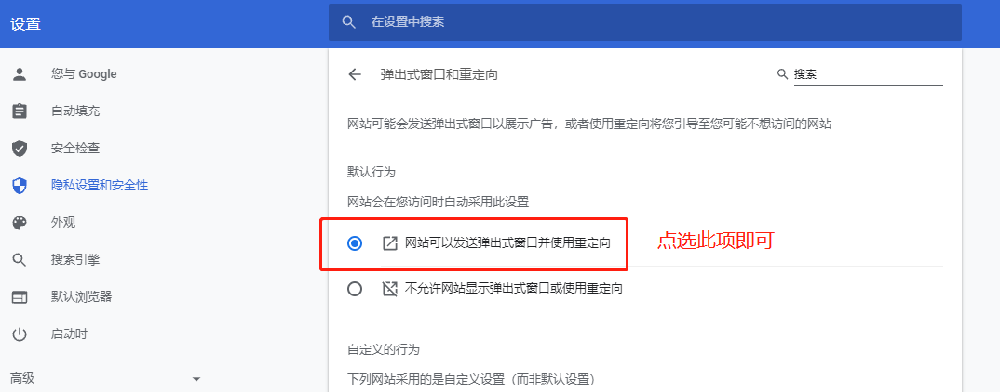
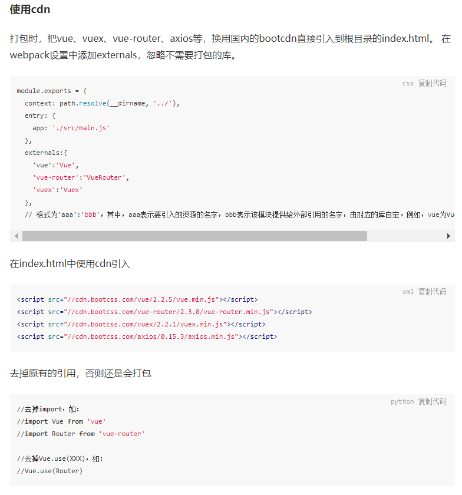
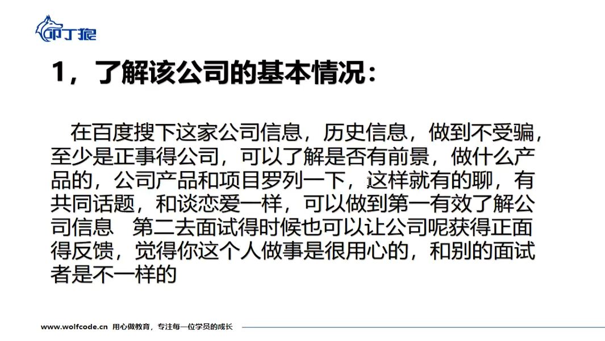
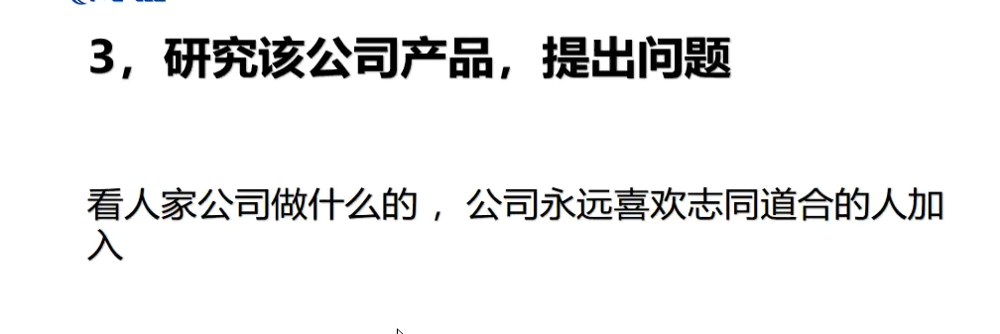
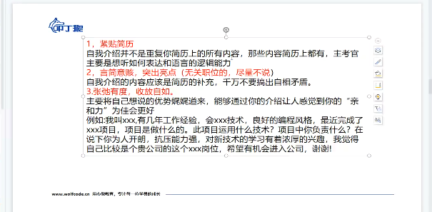
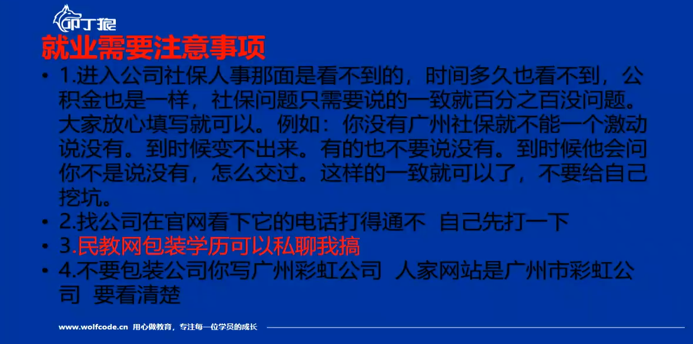

# 之前的收藏

## 用户退出登录或删除token不展示用户信息

如果在其他页面检测不到可以在最大的App页面，使用watch监听路由路径($route.path)，并利用变量使key值变化得到重载组件，让用户信息得到最新状态。

```js
watch:{
    "$route.path":{
        if(!localStorage.getItem("x-auth-token")){
            // 组件所绑定的key
              this.num++
            }    
      	}
    }
},
```


## 登录弹框

利用一个isShowXxx变量来控制某个盒子的显示和隐藏，同时也可以用这一个变量控制类名，使其显示不同样式，思维不用太死，换种想法可能少写不少代码

### 获取验证码

1. 验证手机号（正则、工具库）
2. 验证滑块（利用第三方、最后根据他的条件判断）
3. 点击发送请求，开启倒数定时器
4. 到点关闭定时器

```js
// data中的数据 /
//      count: 60,
//      maxCount: 60,

countDown() {
	// 这样优化 就可以只写一个值 cout写什么都无所谓
	this.count = this.maxCount;
	let timer = setInterval(() => {
		this.count--;
		// 当count等于0的时候 清除定时器 count重置
		if (this.count == 0) {
			clearInterval(timer);
			this.isShowCount = false;
			// this.count = 60;
		}
	}, 1000);
},
        
async getSMSode() {
	if (this.verifyFn()) return;

	// async的写法
	let res = await SendSMSAPI({
		phone: this.phoneVal,

	if (!res) return;
	// 成功的提示
	alert(res.message);

	// 上面验证成功 按钮变成倒计时
	this.isShowCount = true;
	// 调用倒计时方法
	this.countDown();
},
```


### 微信扫码登录

获取二维码获取微信二维码

在  public/index.html  的head标签中引入：

```html
<script src="https://res.wx.qq.com/connect/zh_CN/htmledition/js/wxLogin.js"></script>
```

把Login.vue文件中展示二维码图片的盒子上添加  id=“weixin”  ,将来获取的微信二维码会以iframe的方式嵌入到这个盒子中：

```html
<div id="weixin" class="qrcode" v-show="!isShowForm">
     二维码
</div>
```

在点击切换到微信登录的函数中：

```js
	weixinClick(){// 点击切换微信扫码登录这一项，并向微信扫码登录
            this.isShowForm=false;

            // 微信登录第一步：申请微信登录二维码
            let _this = this;
            new WxLogin({
                id: "weixin",
                appid: "xxxxxx",  // 这个appid要填死
                scope: "snsapi_login",
                // 扫码成功后重定向的接口
                redirect_uri: "https:xxxxxxxxx",
                // state填写编码后的url
                state: encodeURIComponent(window.btoa("http://127.0.0.1:8080" + _this.$route.path)),
                // 调用样式文件
                href: "",
            });

        },
```

#### 微信二维码样式调整

用node执行js文件，同级放css文件：

```js
// data-url.js
var fs = require('fs');

// function to encode file data to base64 encoded string
function base64_encode(file) {
    // read binary data
    var bitmap = fs.readFileSync(file);
    // convert binary data to base64 encoded string
    return 'data:text/css;base64,'+new Buffer(bitmap).toString('base64');
}

console.log(base64_encode('./wxlogin.css'))
```


```shell
node data-url.js
```

得到：

```
data:text/css;base64,Lyogd3hsb2dpbi5jc3MgKi8NCi5pbXBvd2VyQm94IC50aXRsZSwgLmltcG93ZXJCb3ggLmluZm97DQogIGRpc3BsYXk6IG5vbmU7DQp9DQoNCi5pbXBvd2VyQm94IC5xcmNvZGV7DQogIG1hcmdpbi10b3A6IDIwcHg7DQp9
```

把它填到上面的href属性，隐藏头部尾部。

最后调整页面iframe外层盒子的样式，使二维码居中

```css
#weixin{
    /* background-color: #fcf; */
    display: flex;
    justify-content: center;
    margin-top: -20px;
}
```

**完成至此已经可以进行扫码登录了。**

如果扫码跳转的时候被谷歌浏览器被拦截，需要修改谷歌浏览器设置。

打开谷歌浏览器设置，搜索 “**弹出式窗口和重定向**”，




### 扫码的过程之间发生了什么

#### 授权流程说明

微信OAuth2.0授权登录让微信用户使用微信身份安全登录第三方应用或网站，在微信用户授权登录已接入微信OAuth2.0的第三方应用后，第三方可以获取到用户的接口调用凭证（access_token），通过access_token可以进行微信开放平台授权关系接口调用，从而可实现获取微信用户基本开放信息和帮助用户实现基础开放功能等。 微信OAuth2.0授权登录目前支持authorization_code模式，适用于拥有 server 端的应用授权。该模式整体流程为：

```text
1. 第三方发起微信授权登录请求，微信用户允许授权第三方应用后，微信会拉起应用或重定向到第三方网站，并且带上授权临时票据 code 参数；
2. 通过 code 参数加上 AppID 和AppSecret等，通过 API 换取access_token；
3. 通过access_token进行接口调用，获取用户基本数据资源或帮助用户实现基本操作。

4. 之后就是后端的处理和网站的业务逻辑
```

获取access_token时序图：


### 微信扫码登录——临时票据code换取token

1. 首先扫码拿到地址的code之后，在topbar这个组件的created这个钩子函数通过（this.$route.query.code）获取到地址栏的code（code是用户扫了二维码后，页面重定向后，向地址后面拼接的code）。
2. 判断有无这个地址栏code没有就不进行微信登录请求，如果有就发送微信登录请求（有code才去换取token）
3. 请求之后拿到结果会得到三种情况：（需要看文档知道各种情况，没有就找人）

> res.code为```0```的情况
>
> 表示成功拿到token，做相应的操作：
>
> - 提示用户登录成功
> - 保存token到localStorage里面
> - 登录状态值切换成true
> - 将地址栏的code去掉（可以用路由重新跳转）

> res.code为```400```的情况
>
> 表示微信二维码过期（超过规定时间没有将地址栏code发起请求），做相应的操作：
>
> - 将后端返回的message提示用户
> - 重新打开登录框，让用户重新扫码登录

> res.code为```407```的情况
>
> 表示微信没有绑定手机号（后端拿到code给微信匹配然后微信返回数据，后端查看数据库匹配这个微信有没有绑定手机号，没有返回407,和uuid，让我们拿这个uuid去让用户重新用手机号登录绑定微信），做响应的操作：
>
> - 将后端返回的message提示用户
> - 保存uuid到localStorage那里，以便登录的时候，可以携带这个uuid
> - 重新打开登录框，让用户进行登录

4. 这时候在手机号登录页面，当点击登录的时候，判断本地存储中有没有uuid

> 有与没有uuid请求的接口是不一样的
>
> 有：就发起携带uuid的请求
>
> 没有：就直接按原本的方式携带手机号和验证码进行请求
>
> 拿到结果之后，要是没有业务逻辑失败，做相应操作：
>
> - 提示用户登录成功
> - 关闭登录窗口
> - 将token值保存到本地中
> - 登录状态值的切换
> - 将uuid和地址栏的code清除


参考：[微信小程序授权登录最佳实践 - 掘金 (juejin.cn)](https://juejin.cn/post/6844903641820708871)


## 关于响应拦截器响应码放行优化处理

> 之前是在判断条件那里写了一大长串，这样如果还需要添加的话可拓展性不行，而且并不是每个请求都是需要放行这些响应码的，只有部分特殊的才需要这样的处理

```js
if (res.data.code !== 0 && res.data.code !== 400 && res.data.code !== 407) {
    // 弹框提醒
      store.dispatch('handleToast/asyncChangeIsShowToast', { msg: res.data.message, status: 2 });
    // 一定有返回值 
      return false;
}
```

> 所以可以写成这样 拓展性会好一点，但是依旧每个请求都会放行这些响应码

```js
let arr = [0,400,407];
if (!arr.includes(res.data.code)) {
      // 弹框提醒错误
      store.dispatch('handleToast/asyncChangeIsShowToast', { msg: res.data.message, status: 2 });
      // 一定有返回值;
      return false;
}
```

> 思路：可以将这个数组存到vuex中，因为不是每个请求都需要去开放这个 400 和 407 两个res.code，只有需要开放什么res.code，让它发请求前修改这个数组即可，其他就正常开放 ```0```这个res.code

request.js中的代码

```js
// 看起来暂时没什么问题的实现
	// 拿到vuex中存code的数组
    let codeArr = store.state.handleRequest.codeArr;
	// 初始化这个arr
    let arr = [0];
    // 如果数组长度大于1 那么就对arr重新赋值
    if (codeArr.length > 1) {
      // console.log('重新赋值了', codeArr);
      arr = codeArr;
      setTimeout(() => {
        // 重新让数codeArr变成空数组[]，不让影响下一次判断
        store.commit('handleRequest/changeCodeArr', []);
      }, 0);
    }

    if (!arr.includes(res.data.code)) {
      // 弹框提醒错误
      store.dispatch('handleToast/asyncChangeIsShowToast', { msg: res.data.message, status: 2 });
      // 一定有返回值;
      return false;
    }
```

vuex中的代码

```js
export default {
  namespaced: true,
  state: {
    codeArr: [0],
  },
  mutations: {
    changeCodeArr(state, val) {
      state.codeArr = val;
    },
  },
};
```

再发请求前，调用方法指定放行哪些res.code

```js
// 请求前让这个放行这些res.code
  this.changeCodeArr([0, 400, 407]);
```


## 长列表懒加载

思路：

- 为需要的页面在页面挂载完毕之后添加滚动事件，滚动事件里面，通过 当前页面的**可视窗口的高度**和**滚动条的滚动距离**的和是不是大于或者等于**文档完整的高度** 减去一定的距离（不一定完全到底才触发，快到底就可以）

- 到达底部之后还要判断是不是没有数据了（列表长度），没数据展示没有数据了，有就往下执行。

- 到这里需要对其进行节流处理（滚动事件频繁触发），避免多加载了。通过一个变量```isLoading```控制为false时加载，true就不能继续加载，也是通过这个来做的节流吗，只有false才会进入，进入就将```isLoading```改为true，等定时器结束改为false，这样每次就只开一次定时器了。
- 对数据的加载也是类似分页的处理，通过page代表页数，size代表要多加载的列表条数，每一次滚动到底部就让page加一，通过page *  size知道要拿到要展示的条数，还要 判断刚好下一页不够完整的size条数据，没有就不追加进展示列表
- 最后记得移除事件的监听

```js
// data中的数据
data{
    return {
        // 列表数组
        goodsList:[],
        // 用来展示的goodsList
        goodsListShow:[],
        // 加载页数
        page:1,
        // 每一页条数
        size:8,
        // isLoading表示是不是正在加载
        isLoading:false,

        // isNoData表示是不是没有数据了，  true表示真的没有数据了
        isNoData:false
    }
}
```

```js
// 监听和移除
mounted(){
    // 添加滚动事件的监听
    window.addEventListener("scroll",this.scrollFn)
  },
  beforeDestroy(){
    // 删除全局事件
    window.removeEventListener("scroll",this.scrollFn)
},
```

```js
// 主要的懒加载事件
methods:{
    scrollFn(){  // 频繁触发的事件
    // 节流：利用一个变量，控制不要在一段时间（setTimeout）内重复执行某一段代码
        // console.log("已经在滚动了！");
        // 需求：来到地步了才来加载
        // 判断，是不是到底部了

        // if(到底部了){
        // if(窗口高度 + 超出窗口的页面高度 == 总页面高度){
        if(getClientHeight() + getScrollTop() >= getScrollHeight()-20){
          console.log("到底部了");
          
          // 在加载之前先判断是不是没有数据了
          if(this.goodsListShow.length>=this.goodsList.length){
              // 如果真的没有数据了
              this.isNoData = true
              return
          }

          // 此时的加载必须保证 isLoading 为false，如果是true就不能继续加载
          if(!this.isLoading){
            this.isLoading = true;
            // 加载: 在goodsList中取出8条，push到 goodsListShow
            this.page++;
			// // 延迟一会 加载处理
            setTimeout(()=>{
              // 假设要第2页数据， let i = 8;   i<16;
              // 假设要第3页数据， let i = 16;   i<24;
              for(let i = this.size*(this.page-1); i<this.size*this.page; i++){
                // 最后一页的时候不一定是8条，this.goodsList[i]有可能是undefined
                this.goodsList[i] ? this.goodsListShow.push(this.goodsList[i]) : ""; 
              }
              
              // 后面可以再进行下一页加载
              this.isLoading = false
            },500)
          }
        }
    },
}
```


# Vue3酒店后台

[酒店后台管理系统、客栈管理、入住会员、房间管理、房源、房型、订单、报表、酒店企业、短信模板、积分、打印、交接班、住宿、入住、锁房、收支流水、房间销售、消费项目、酒店管理、渠道销售、支付管理、连锁酒店_PM_北辰的博客-CSDN博客_酒店后台管理系统](https://blog.csdn.net/PM_beichen/article/details/116154809)


### 在router.beforeEach中根据后端返回的数据进行权限验证和使用addRoutes动态生成路由表

登录成功之后跳转到home页面时在router.beforeEach中，带着token请求用户的信息，里面包含权限，拿到后端返回的数据，根据

数据遍历生成路由表（一些不需要权限的路由页面，比如登录页、首页、404页面等），然后使用addRoutes动态的添加路由（刷新有问题判断是否用用户信息决定重新发请求）（进去后404问题，使用vue提供的addRoutes添加了动态路由以后，404页面的路由设置不在路由的末尾了，这时候在最后加上404页面）刷新白屏问题：

```js
 next({
    ...to, // next({ ...to })的目的,是保证路由添加完了再进入页面 (可以理解为重进一次)
    replace: true // 重进一次, 不保留重复历史
  })
```

[解决Vue项目中使用addRoutes出现的bug - 掘金 (juejin.cn)](https://juejin.cn/post/7001788378211418143)****

登录流程和懒加载原理

登录：收集用户名，密码验证点击登录后端验证返回token，我们保存token下一次请求携带到请求头

懒加载：webpack打包后把路由对应的每个组件生成一个js文件，等组件被加载的时候才去执行这个js


### 对axios网络请求进行二次封装，统一设置响应头和处理错误和统一管理api

封装axios可以方便后期的维护和降低开发成本，可以统一管理失败的请求结果。

首先创建一个axios实例，来定义baseURL和请求过期时间，然后通过这个实例定义请求拦截器，在请求之前所有的请求都会经过这一个拦截器里面，在这里面可以使用携带请求头开启loading等，然后就是响应拦截器，所有返回的数据都会经过这里面，我们可以对一些错误在这里进行统一的处理和提示和关闭loading，并且决定放行哪些状态码让我们单独处理，还有一些没请求成功的也是在这里处理


### 对响应拦截器中，需要特殊处理的响应码放行的优化处理

因为有些状态码是需要特殊处理的，这时需要优化放行，定义一个数组放到vuex中，在需要特殊处理的地方将状态码传入vuex中的数组，根据数组中的状态码放行对应的状态码，默认不处理就放行200


### 对公共使用到的分页逻辑和请求数据封装成自定义hook

因为数据多的时候多个页面都是需要用到分页和请求表单的数据，而逻辑基本都是差不多的，所以封装成自定义hook，返回当前页、总页数、修改页数方法、表格数据等，引入hook传入请求的api和请求的参数即可


### 通过一个变量控制组件是编辑顾客信息还是添加顾客信息状态

因为编辑和添加用的是同一个组件，而且只是内容不同，编辑是有编辑的信息的，而添加是空的，所以通过变量知道是添加的话就把数据清空，编辑就根据id拿到对应的那条数据展示 


### 对报表和用户分布的数据使用echarts中的饼图和地图可视化处理


### 使用watch监听route.path的变化生成对应的面包屑

监听route.path 根据路由的变化拿到route.path 将其用split分割成数据拿到一级和二级面包屑的英文  通过生成的权限列表进行遍历对比拿到我想要的一级面包屑和二级面包屑的中文和路径，

后面发现这样做太麻烦了，改用在动态生成路由表的时候就在meta那里加个title属性存放面包屑，利用计算属性 拿到 route.mathed的数组（里面包含了每一级的），面包屑就可以使用数组遍历生成。

使用computed计算route.matched生成路由配置数据


### 解决白屏优化

使用路由懒加载和ui组件库的按需引入




# 项目--微信小程序


sass

[SASS用法指南 - 阮一峰的网络日志 (ruanyifeng.com)](https://ruanyifeng.com/blog/2012/06/sass.html)

### 下拉触底更新

利用小程序的上拉触底事件onReachBottom，设置一个范围，到了这个范围就重新发请求，像分页的那种请求，每次请求的size固定 当前页就加一，如果总页数和当前页数相同就是说明没有数据了，判断当前页是不是小于总页数，来显示加载中，然后相等的时候显示没有数据。

```js
let pageSize = 10;//每页加载的数据量
let pageNum = 1;//当前页
let totalPage = 0;//总页数
let resultData = [];
```

[微信小程序开发--上拉加载更多(分页加载) - 掘金 (juejin.cn)](https://juejin.cn/post/7029497008993861663)


### 适配苹果安全区域

使用wx.getSystemInfo去

**解决思路：**

**为了适配所有的手机机型，我们需要获取到底部小黑条的高度，给固定在底部的view设置padding-bottom，增加高度；（有些手机默认是没有底部这个区域的，没有的话padding-bottom就设置为0）**

 解决方法：

1.首先，我们需要在app.js里面，获取到底部小黑条区域的高度（小黑条区域高度=屏幕高度-安全区域的bottom值，安全区域指的是内容可见区域）：

```js
 
App({
  globalData: {
    bottomLift: 0
  },
  onLaunch() {
    //获取当前设备信息
    wx.getSystemInfo({
      success: res => {
        this.globalData.bottomLift = res.screenHeight - res.safeArea.bottom;
      },
      fail(err) {
        console.log(err);
      }
    })
  }

```

2.在确认订单页面进行设置：

order-confirm.wxml

```wxml
<view class="fixed-bottom" style="padding-bottom:{{bottomLift}}px">
    //代码内容已省略
</view>
```


order-confirm.js

```js
const app = getApp()
Page({
  data: {
     bottomLift: app.globalData.bottomLift
  }
})
order-confirm.wxss

.fixed-bottom{
  display: flex;
  align-items: center;
  font-size: 30rpx;
  color: #666;
  padding: 20rpx;
  border-top: 2rpx solid #ddd;
  background-color: #fff;
  width: 710rpx;
  position: fixed;
  left: 0;
  bottom: 0;
}这样子就可以解决上面的问题啦~
————————————————
版权声明：本文为CSDN博主「summer_my_sunshine」的原创文章，遵循CC 4.0 BY-SA版权协议，转载请附上原文出处链接及本声明。
原文链接：https://blog.csdn.net/summer_my_sunshine/article/details/119350865
```


### 网络请求的封装

wx.request()

请看我的掘金


### 点击复制

通过setClipboardData设置系统剪贴板的内容。调用成功后，会弹出 toast 提示"内容已复制"，持续 1.5s移动端的
wx.getClipboardData获取系统剪贴板的内容

```js
wx.setClipboardData({
  data: 'data',
  success (res) {
    wx.getClipboardData({
      success (res) {
        console.log(res.data) // data
      }
    })
  }
})
```


### 实现左右滑动切换

移动

样式的话是先把竖着的排列，通过display：flex来横向排列，然后使用vw * 数据的长度来决定多宽，通过transform: translate(-${100 * current*}vw)

- 使用onTouchStart事件和onTouchEnd拿到触摸的起点和结束点（存起来startX和endX）（小程序的话就是touchStart，通过e.changedTouches[0].clientX拿到）
- 在onTouchEnd事件的那个方法计算起点和终点的距离，判断startX-endX的距离是否超过指定的距离，再判断哪个大来识别是往哪边划，最后还要通过数据的长度判断是否已经到最右侧。

[微信小程序怎么实现tab左右滑动切换功能 - 开发技术 - 亿速云 (yisu.com)](https://www.yisu.com/zixun/375385.html)


小程序

使用scroll-view标签的scroll-x属性实现tab栏横向滚动，设置scroll-left可以设置滚动条的位置，然后通过swiper组件将滑动的内容放到swiper-item里面就是每一项的内容，通过设置scroll-left可以每次的tab选项居中。

[微信小程序滚动Tab实现左右可滑动切换 - web开发 - 亿速云 (yisu.com)](https://www.yisu.com/zixun/187205.html)


### 客服问题

需要将 [button](https://developers.weixin.qq.com/miniprogram/dev/component/button.html) 组件 `open-type` 的值设置为 `contact`，当用户点击后就会进入客服会话，如果用户在会话中点击了小程序消息，则会返回到小程序，开发者可以通过 `bindcontact` 事件回调获取到用户所点消息的页面路径 `path` 和对应的参数 `query`

[客服消息 | 微信开放文档 (qq.com)](https://developers.weixin.qq.com/miniprogram/dev/framework/open-ability/customer-message/customer-message.html)


### 调起用户授权信息

通过getUserInfo去调起弹窗

```js
// 必须是在用户已经授权的情况下调用
wx.getUserInfo({
  success: function(res) {
    var userInfo = res.userInfo
    var nickName = userInfo.nickName
    var avatarUrl = userInfo.avatarUrl
    var gender = userInfo.gender //性别 0：未知、1：男、2：女
    var province = userInfo.province
    var city = userInfo.city
    var country = userInfo.country
  }
})
```


### 收集客户端错误返回服务端


### 获取位置的api


## 微信公众号网页

[如何使用vue开发公众号网页_vue.js_脚本之家 (jb51.net)](https://www.jb51.net/article/212046.htm#_label0)

[Vue项目对接微信公众号踩坑日记_是L啊的博客-CSDN博客_vue 微信公众号](https://blog.csdn.net/qq_41590119/article/details/121374173)


# 项目--React移动端


使用发布订阅，在网络请求前弹出加载中，在结束或者失败结束提高用户体验


React-Router-Dom


### 封装自定义提示框toast

思路：我是先考虑的是功能是做弹出提示，然后就是要暴露出什么，提示信息，提示类型、是否提示或者提示的时间，然后做一个toast组件，之后把提示数据存到redux中，通过redux中的数据确定展示的toast是的样式，之后做一个自定义hook而且返回函数（但是修改redux中的数据需要useDispatch这个hook来修改redux中的数据，hook只能使用在函数的最外层，任何别的位置都会报错。），使用dispatch触发在redux中的显示提示框方法和传入提示数据，并在toast组件中设置定时器使用dispatch触发在redux中的框隐藏的方法


### 使用Suspense等待组件的加载，并指定期间展示loading页面


### 判断单选和多选的答案选择是否确

定义一个空数组用来装选择的答案，通过后端返回的变量判断多选还是单选，单选直接放进数据，多选再通过indexOf是否等于-1判断数组里面是否有这个答案，再次点击就删除这个答案（不勾选）


数量比较多，也是分页一样懒加载


### 使用自定义hook触发toast

### 有些题目多的横向懒加载

### 不同类型的题目展示不同的组件


# Vue2管理系统

### 根据权限列表，使用自定义函数实现按钮级权限控制

根据用户信息中的btns字段 自定义一个函数 传入对应名字的按钮，使用indexOf判断数组里面有没有这个  按钮使用v-if显示和隐藏，小于-1隐藏，大于-1显示


### 使用 keep-alive 实现对配件、员工列表等进行缓存

使用keep-alive身上的属性

[vue学习011:按钮级权限控制 - 简书 (jianshu.com)](https://www.jianshu.com/p/e50633a9005e?u_atoken=a16610ab-ebc2-4b8f-838d-462645008756&u_asession=01olbsNu3VPvUZ7VaQRTOi1cxf1PH8Uzq1o-jCh4ynwdQ73BzUHY6TnqMaH2K6hvC3X0KNBwm7Lovlpxjd_P_q4JsKWYrT3W_NKPr8w6oU7K8BaOveEmzJGOQvGhxi331IslvTX-jMTLEIhdGFg3rxgWBkFo3NEHBv0PZUm6pbxQU&u_asig=05_gA_ZE-974KaLp64DiQFLEYuy57g1tEZFuCcA9_x3jAPqaF90r-lGu2k2sAWJdT_EviarjL5DUca9qEXqjem75yq-usEmR9Q8eTcYZrU8ne3X6LX9wtISU8Rsr7GRLVt1XoKqjZJdRe-mAWv6kTNkDZ125J_41Zp_m_6mbsSVuX9JS7q8ZD7Xtz2Ly-b0kmuyAKRFSVJkkdwVUnyHAIJzU8jbiPOSdSm9jZL_yyoYgWK42CZhr0ixFaZVbhGgzx_6FPw117USKdEPc8n7HkzU-3h9VXwMyh6PgyDIVSG1W_oiTVwyuzZb3I7P5Z2Pw3h4c0g9zEGGygqGkD8zIaRck6AQjOokrT_hQW-Tr7tA22IlIIxMz_Spqoimbz7D427mWspDxyAEEo4kbsryBKb9Q&u_aref=1cN2ACUwP7BescdlFdSYCOqmCII%3D)

[Vue 3 任意传送门——Teleport - 掘金 (juejin.cn)](https://juejin.cn/post/6874720017863147527)


# 自我介绍

### 人事

你好，我叫xxx，今年25岁，来自广东肇庆，毕业于广东培正学院，今天是想来面试贵公司web前端岗位的。我在前端这个行业也有两年半多的工作经验了，最开始接触前端是在我读大学，大二的时候要上html和css相关的课，那时候跟着老师去做这些页面，觉得挺好玩的，所以那时候就喜欢上了前端并且去学习，到现在的话也掌握了不少的技能，像是vue全家桶，ts，原生微信小程序等；

​	在上一家公司的话主要是做一些旧项目维护和新项目的开发，最近一个项目的话，是一个酒店的后台管理系统，主要是用来做记录酒店每个房间的入住、退房和打扫情况，还有就是对顾客的预约和顾客的信息，酒店楼层、酒店房间的管理等，我主要负责的是登录模块、还有就是对用户的增加删除、修改等模块，其次是对用户信息使用可视化使其更直观的展示等。	

​	这2年多的工作以及学习的时间里，我发现我性格还是比较沉稳的，也学到了不少，平时工作之余我会记录一些我遇到的问题或者比较有趣的东西，然后发到github上，也会去逛逛掘金、简书等论坛拓展一下自己的知识面，偶尔也会跟朋友打打乒乓球放松放松。我的介绍就到这，谢谢。


您好，我叫陈嘉亮，来自广东揭阳，今天来是想面试贵公司的前端开发岗位，我的前端兴趣来源于大学期间去参加一个校园互联网+大会，认识很多厉害的大牛，看到很炫酷的css特效，而且竞争对手的技术颠覆了我对前端只是网页的概念，因此我确定了职业方向。
从接触前端至今有2年多时间了，期间写的最多的就是静态页面，在上家公司主要职责是对公司产品拖拽组件的模块开发、项目的优化和维护，因为算是一个中小型的项目，涉及到的只是框架有vue2、vue3、TS等技术栈，我从最初进去辅助他们开发和维护项目，到后面独立开发面包屑、分页等模块。从了解到熟悉项目的开发流程和逻辑，到最后完成了项目，所以还是比较有成就感的，项目如期完成的同时，是对公司负责，同时也是对自己负责。
这2年多的工作以及学习的时间里，我主要做的是管理系统、微信小程序等中小型项目的开发，我觉得时间检验以及项目的检验，也为我具备了成长上独立性和抗压能力。以上就是我的个人介绍，谢谢！

### 技术面

你好，我叫梁俊锋，在前端有两年多的工作经验了，到目前为止我掌握的有vue全家桶，axios、ts和js，熟练使用htmlcss编写页面等，在这两年的工作和学习过程中，我从最初进去辅助他们维护和开发到独立开发让我学到了很多，在上一家公司的话主要是做一些旧项目维护和新项目的开发，最近一个项目的话，是一个酒店的后台管理系统，主要是用来做记录酒店每个房间的入住、退房和打扫情况，还有就是对顾客的预约和顾客的信息，酒店楼层、酒店房间的管理等，我主要负责的是登录模块、还有就是对用户的增加删除、修改等模块，其次是对用户信息使用可视化使其更直观的展示等。	












# 技术

### 路由导航做了什么？？

首先我这边是判断是否token和权限存在vuex中的权限列表长度是否是0，是的话就重新发起拿用户信息的请求，拿到权限列表存到token，然后动态生成权限列表，再使用addRoute动态生成路由表，然后如果有token要去登录页面的话，就放行。如果没有token和不是去登录页面就跳到登录页面

### 权限列表怎么生成的？

后端返回的是一堆数组，然后自己菜单是通过pid确定的，通过这个生成多个对象，对象里面是一个数组存放二级菜单，经过后端处理成这样的结构数据后，动态生成路由表就方便了


