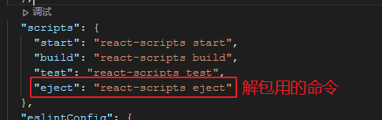

# Vue项目

## 一、脚手架搭建（Vue2）和清空非必要文件

```bash
vue create projectname
```

- `views` 下面的文件只保留 `Home.vue` ，其余删除，删除 `components/HelloWorld.vue`，并且 `Home.vue` 中不再引入 `HelloWorld` 组件。
- 删除 `src/assets` 下的图片，换成我们的img文件夹。
- 将 `router/index.js` 中 `about` 的路由注释掉。
- 删除 `App.vue` 中的less。

## 二、样式初始化

安装初始化样式库reset-css：

```bash
npm i reset-css 或者   yarn add reset-css
```

安装成功后在main.js中引入即可：

```js
import "reset-css"
```

## 三、引入第三方组件库（如需要）

看官方文档：[组件 | Element](https://element.eleme.cn/#/zh-CN/component/installation)

配置好按需引入后，在src目录下，新建一个plugins文件夹，可以统一管理外部引用的插件等，新建一个element.js，说明是elementUI的，在里面进行引入

```js
// 像是这样 
import Vue from 'vue';
import { Button } from 'element-ui'

Vue.use(Button)
```

以及在main.js引入

```js
import './plugins/element'
```

## 四、安装axios，封装

> 安装：yarn add axios
>
> 新建一个request文件夹封装axios拦截器和统一接口管理

一个request.js 存放拦截器等

```js
// 可以解决请求头不能统一处理
import axios from 'axios';
// 创建axios实例
const instance = axios.create({
  // 请求路径的抽取
  baseURL: 'http://192.168.113.249:8081/cms',
  // 这个时间是每次请求的过期时间
  timeout: 20000,
});

/*
分析一个函数
	什么时候执行这个函数？
	有无参数 参数的意思
	有无返回值
*/
// interceptors 拦截器
// 请求拦截器----拦截每一次请求
instance.interceptors.request.use(
  config => {
    // 什么时候执行这个函数？ 每次请求发出去之前执行
    // config 本次请求的相关信息
    // console.log(config);

    // 这个函数里面要做什么 可以做一些请求之前的准备工作 例如设置请求头，携带token

    // 必须要返回config 才能真正发起请求
    return config;
  },
  err => {
    // 抛出错误
    return Promise.reject(err);
  }
);

// 响应拦截器
instance.interceptors.response.use(res => {
  // 什么时候执行这个函数？ 后端返回数据，并且在组件内部接收到之前执行这个函数
  // res是什么 是axios给我们封装好的一个响应对象

  // 这个函数作用：对后端数据进行统一处理
  // console.log('响应拦截器的res：', res);
  // console.log(res.data);

  // 依旧需要返回res对象，组件内部才能拿到这个res相关的数据
  return res.data;
});

export default instance;
```

一个api.js统一存放接口

```js
// 统一管理项目中所有的接口路径

import instance from './request';

// 这样写有问题 因为每次有一个请求就会运行这里的代码 如果有多个接口那就是相当于我只想请求这一个 但是全部都请求了 所以要写成函数形式 不让他加载这个文件时就执行
// export const JingponAPI = instance.get('/products/recommend');
// 不考虑this指向 尽量使用箭头函数

// 精品推荐
export const JingponAPI = () => instance.get('/products/recommend');

// 热门兑换
export const HotGoolsAPI = () => instance.get('/products/hot');
```


## 五、前端跨域配置

我们对 `vue.config.js` 进行配置：

```js
module.exports = {
    devServer: {
        // 要进行代理的请求
        proxy: {
            // 真正访问的服务器地址
            '/api': {
                target: "http://kumanxuan1.f3322.net:8881/cms", // 里面是目标地址
                // 真正访问的路径
                pathRewrite: {
                    // 匹配 /api 替换成 空
                    '^/api': ''
                }
            }
        }
    }
}
```

request.js中:

```js
const instance = axios.create({
    baseURL: "/api",
    timeout: 5000
})
```

记得配置完需要重启服务器！！

## 六、项目环境变量配置

项目目录下新建两个文件，分别是开发环境和生产环境下的两个不同配置

.env.dev

```
NODE_ENV=development
VUE_APP_BASE_URL=http://192.168.113.249:8081/cms
VUE_APP_STATE_URL=http://127.0.0.1:8080
```

.env.prod

```
NODE_ENV = production
VUE_APP_BASE_URL = http://kumanxuan1.f3322.net:8881/cms
VUE_APP_STATE_URL="后端给的地址"
```

```js
process.env.NODE_ENV 监听当前是生成环境还是开发环境
process.env.NODE_ENV==='development'// 开发环境

.env 默认全局配置文件
.env.development 开发环境配置文件
.env.production 生产环境配置文件
 
文件名为Vue的约定，不可随意更改
 
配置环境变量格式
 
VUE_APP_{自定义环境变量名} = {值}
 
其中“VUE_APP_”是规定的环境变量名前缀，如果变量名不是以此开头，则在程序中不能调用此环境变量
 
 
例如在.env文件中写入：
VUE_APP_UserNumber = 12345
VUE_APP_UserString = "ABCDE"
XJL = "XJL"
process是nodeJs的全局变量，其中包含了env的属性，Vue项目启动时会自动读取.env文件中的环境变量

 
即可在Vue.js中可如此调用:
console.log(process.env.VUE_APP_UserNumber);
console.log(process.env.VUE_APP_UserString);
console.log(process.env.XJL);
 

运行后，console输出:

12345
ABCDE
undefined
Vue 源码会根据 process.env.NODE_ENV 决定是否启用生产环境模式，默认情况为开发环境模式。在 webpack 与 Browserify 中都有方法来覆盖此变量，以启用 Vue 的生产环境模式，同时在构建过程中警告语句也会被压缩工具去除。

 
如果是开发模式，Vue会自动读取.env和.env.development两个文件，.env.development文件内定义的环境变量会覆盖.env文件内同名的环境变量;如果是生产环境则是.env.production 文件内定义的环境变量会覆盖.env文件内同名的环境变量.
 
例如：
.env文件内容
VUE_APP_UserNumber = 12345
VUE_APP_UserString = "ABCDE"
VUE_APP_From = ".env"
 

.env.development文件内容

VUE_APP_From = ".env.development"
 

.env.production文件内容

VUE_APP_From = ".env.production"
 

在Vue.js中可如此调用:

console.log(process.env.VUE_APP_UserNumber);
console.log(process.env.VUE_APP_UserString);
console.log(process.env.From);
 

开发模式下输出：

12345
ABCDE
.env.development
 

生产模式下输出:

12345
ABCDE
.env.production
```


在package.json中修改启动命令：

```json
"serve": "vue-cli-service serve --open --mode dev",
"serve:pro": "vue-cli-service serve --open --mode prod",
```

在vue.config.js中换成：

```js
'/api': {
    target: process.env.VUE_APP_BASE_URL,
    pathRewrite: {
        '^/api': ''
    }
}
```

## 常见问题

### 点击同个路由报错

```js
// 在路由文件加上这个
// 解决同个路由点击报错问题
//获取原型对象上的push函数
const originalPush = VueRouter.prototype.push;
//修改原型对象中的push方法
VueRouter.prototype.push = function push(location) {
  return originalPush.call(this, location).catch(err => err);
};
```


# React项目

## 官方脚手架搭建（TS版）和 清空非必要文件

```bash
npx create-react-app projectname --template typescript 
或
yarn create react-app projectname --template typescript
```

src文件夹只留```index.tsx```，其他删除


## 进行项目解包

因为我们使用less进行样式预处理，所以我们必须在webpack.config.js里面进行配置，但是我们发现在项目里面并没有看到这样的一个文件。原因是我们使用脚手架创建的项目，已经帮我们进行了一些重要的设置，如非必要，脚手架不希望我们修改配置了。

所以我们需要进行项目的解包。解包的命令可以在 `package.json > scripts` 中找到



但是此时如果我们直接解包，会无法成功。因为解包是一个不可逆的过程，我们最好进行一次版本管理。所以我们先使用git先把之前的修改进行保存。

```
git add .
git commit -m '解包前的备份'
```

然后我们就可以进行解包了。

```
npm run eject
或者
yarn eject
```

解包完成后我们会在根目录看到一个config文件夹，这个config文件夹就是我们要进行配置的地方。


## 下载项目所需的依赖

项目中我们需要使用到的依赖比较多，所以我们先一次性下载好所有的依赖。

less和less-loader

```bash
npm i less less-loader --save--dev
# 或者
yarn add less less-loader --save--dev
```

react-router-dom

```bash
npm i react-router-dom@6 --save
# 或者
yarn add react-router-dom@6 --save
```

redux和react-redux

```bash
npm i redux react-redux --save
# 或者
yarn add redux react-redux --save
```

axios

```bash
npm i axios --save
# 或者
yarn add axios --save
```

mui , mui的[官网](https://mui.com/)

```bash
npm install @mui/material @emotion/react @emotion/styled
# 或者
yarn add @mui/material @emotion/react @emotion/styled
```

postcss-px-to-viewport（处理移动端）

```bash
npm i postcss-px-to-viewport --save-dev
# 或者
yarn add postcss-px-to-viewport --save-dev
```

## 配置移动端屏幕适配

在前端的发展过程中，最认可的屏幕适配方案主要有两个。比较老的是 `media + rem` , 比较新的是 `viewport` ，我们这个项目采用 `viewport` 。

也就是说我们使用 `vw` + `vh` 来进行屏幕适配。但是其实我们这个项目中只需要使用 `vw` 就够了。

我们在 `config/webpack.config.js` 里面进行配置。找到 `postcss-loader` 节点，在这个节点的 `plugins` 节点的里面添加下面的配置.

```js
require('postcss-px-to-viewport')({
    viewportWidth: 1125, // 视口宽度，根据设计图的大小
    viewportHeight: 1000, // 视口高度，根据设计图的大小
    unitPrecision: 6,// 保留小数点
    viewportUnit: 'vw', // 单位
    selectorBlackList: [], // 排除的类
    minPixelValue: 1, // px的最小单位
    mediaQuery: false, // 排除媒体查询
    landscapeUnit: 'vw', // 横屏单位
    fontViewportUnit: 'vw' // 字体属性单位
})
```

值得注意的是 `plugins` 节点有一个三元判断，需要在两个分支上都添加这段代码。

## 配置less-loader

我们下载好了less-loader后，需要在 `config/webpack.config.js` 里面进行配置。找到 `module/rules` 节点，在最后一个 `sass-loader` 后添加less-loader的配置

```json
{
    test: /\.less$/,
    use: getStyleLoaders({}, 'less-loader')
}
```

然后我们在 `src/assets/style` 目录下新建一个 `common.less` 文件，加入下面的代码，然后在`index.tsx`中引入就可以看到在页面上能正常使用less了。

```less
#root {
    font-size: 38px;
    font-family: NotoSansHans;
    color: #333333;
}
```

## 配置 @ 指向

首先还是找到 `config/webpack.config.js` 里面，找到 `resolve/alias` 节点，在最后添加下面代码：

```js
"@": path.join(__dirname, "../src")
```

这一步的作用是为了让webpack在编译代码的时候把 `@` 编译成对应的目录。

然后找到 `tsconfig.json` , 在 `compilerOptions` 节点的最后添加

```json
"baseUrl": "./",
"paths": {
    "@/*": ["src/*"]
}
```

这一步的作用是为了ts在静态检查的时候能正确找到 `src` 目录

> 注意：以上修改 webpack.config.js 的所有步骤，都需要重启脚手架方能生效。

## 解决移动端的点击延迟

我们通常会使用fastclick解决移动端的点击延迟问题。在 `index.html` 里面添加如下代码。

```jsx
<title>IT猿题库</title>
<script src="https://as.alipayobjects.com/g/component/fastclick/1.0.6/fastclick.js"></script>
<script>
  if ('addEventListener' in document) {
    document.addEventListener('DOMContentLoaded', function() {
      FastClick.attach(document.body);
    }, false);
  }
  if(!window.Promise) {
    document.writeln('<script src="https://as.alipayobjects.com/g/component/es6-promise/3.2.2/es6-promise.min.js"'+'>'+'<'+'/'+'script>');
  }
</script>
```

> 如果网络不是很好的同学可以把 `fastclick.js` 和 `promise.min.js` 下载到本地，再引入。

## 配置路由

我们在src目录下新建一个`router`文件夹，然后在里面新建一个`index.tsx`。路由配置如下：

```tsx
const router = (
  <BrowserRouter>
    <Routes>
      <Route path="/login" element={<Login />}></Route>
      <Route path="/" element={<App />}>
        <Route path="home" element={<Home />}></Route>
        <Route path="fast" element={<Fast />}></Route>
        <Route path="mine" element={<Mine />}></Route>
        <Route path="select" element={<SelectPractice />}></Route>
        <Route path="practice" element={<Practice />}></Route>
      </Route>
    </Routes>
  </BrowserRouter>
);
export default router;
```

然后自己在views目录下新建路由对应的组件，在入口的`index.tsx`中渲染我们的路由。

```tsx
import router from "./router";

const rootEl = document.getElementById("root");
const root = ReactDOM.createRoot(rootEl!);
root.render(router);
```

## 配置Store

项目中肯定会有部分数据需要共享的，所以我们需要使用react-redux进行全局数据共享。

先在`src`目录上新建`store`目录，在里面新建 `index.ts` 文件，写入下面代码。

```tsx
import { createStore } from "redux";
import { IStoreAction, IStoreState } from "../types/store";

const defState: IStoreState = {};

const reducer = (state = defState, action: IStoreAction) => {
  state = JSON.parse(JSON.stringify(state));
  return state;
};

const store = createStore(reducer);

export default store;

```

其中 `IStoreState` 和 `IStoreAction` 是两个`interface` ，我们需要在 `src/types` 目录下新建一个 `store.d.ts` 进行声明。

`.d.ts` 文件用于声明一些全局可用的类型数据。

```ts
import { Action } from "redux";

interface IStoreState {}

interface IStoreAction extends Action<string> {
  pyload: any;
}
```

最后在入口的`index.tsx`里面使用 `Provider` 组件进行数据共享。

```tsx
import router from "./router";
import { Provider } from "react-redux";
import store from "./store";

const rootEl = document.getElementById("root");
const root = ReactDOM.createRoot(rootEl!);
root.render(<Provider store={store}>{router}</Provider>);
```

## 请求配置

在 `src/api` 目录里面新建 `request.ts`

```ts
import axios from "axios";

const request = axios.create({
  baseURL: "/api",
  timeout: 5000,
});

request.interceptors.request.use(
  (config) => {
    return config;
  },
  (err) => Promise.reject(err)
);
request.interceptors.response.use(
  (res) => {
    return res.data;
  },
  (err) => Promise.reject(err)
);

export default request;
```

然后我们需要解决请求跨域的问题，推荐使用`wepack`的代理。我们直接修改 `config/webpackDevServer.config.js` 里面的配置. [【参考地址】](https://www.webpackjs.com/configuration/dev-server/#devserver-proxy)

```ts
module.exports = function (proxy, allowedHost) {
  const disableFirewall =
    !proxy || process.env.DANGEROUSLY_DISABLE_HOST_CHECK === 'true';

  proxy = {
    ...proxy,
    '/api': {
      target: 'https://www.ahsj.link/rambo', // 后台服务地址以及端口号
      changeOrigin: true, //是否跨域
      pathRewrite: { '^/api': '/' },
      secure: false
    }
  }
```

然后我们在 `src/api` 目录下新建 `index.ts` ，用来导出请求用的 api。

```ts
import request from "./request";

export const LoginApi = (params: ILoginParams) =>  request.post("/1024/login", params);
```

其中 `ILoginParams` 是一接口，我们在 `src/types` 目录下新建一个 `api.d.ts` 声明。

```ts
interface ILoginParams {
  username: string;
  password: string;
}
```

但是我们如果在请求的地方想要得到后端返回的数据，ts会检测不到，所以我们需要给所有API都设置对应的返回值。

已经知道我们所有的请求返回的数据都有 `errCode` / `message` / `data` 三个属性。所以我们需要定义一个用于接收请求返回值的 `interface`，在 `api.d.ts` 里面定义它。

因为  `errCode` 和 `message` 我们都知道是固定的，但是对于 `data` 来说，不同的接口返回的数据不同，我们就先给个泛型，以便在需要的时候再给一个指定的返回值。

```ts
interface IAxiosResponseData<T> {
  data: T;
  errCode: number;
  message: string;
}
```

但是我们需要真正需要使用的类型是需要在请求的 `then` 方法中接收到的数据，而 `then` 方法需要的是一个 `Promise`包着的数据，所以我们还定义一个类型别名以方便我们在请求时规定返回值。

```ts
type IResonseData<T> = Promise<IAxiosResponseData<T>>;
```

至此我们就可以把 `api.ts`里面的数据接口方法进行修改

```ts
export const LoginApi = (params: ILoginParams): IResonseData<string> => request.post("/1024/login", params);
```

这样我们就能在调用 `LoginApi` 这个方法的时候从 `then` 中知道 `data` 是一个 `string`;


# 小程序项目


# 组件的封装

## Vue组件

## React组件

toast组件思路：

- 分析组件需要的数据以及暴露的数据（提示信息、提示类型、是否显示和展示(isShow)时间等）
- 组件放到入口文件根文件那里（index.tsx或main.tsx）
- 多个组件用（数据传递），把传的数据放redux里存储
- 在组件内使用存起来的isShow变量控制toast的显示隐藏（useSelector）
- 在redux中定义修改组件的暴露数据的方法，使用dispatch触发
- 让组件停止两秒消失（定时器）（防抖）
- 为了简单使用和复用封装成自定义hook（返回函数）

toast组件

```tsx
// toast组件 toast.tsx

/**
 *
 * 提示框是一个公共组件 在多个页面都要用到   单独封装
 *
 * 封装组件的思路：
 * 		1. 考虑什么功能
 * 			需要提示用户一些信息的时候 显示出来
 * 		2. 有功能推断出，这个组件需要向外暴露出什么属性
 * 			a.提示信息
 * 			b.提示类型
 * 			c.是否显示提示
 *
 * 		3. 实现功能
 */

import { Alert } from '@mui/material';
import React from 'react';
import { useDispatch, useSelector } from 'react-redux';

let time: NodeJS.Timeout; // 这个类型 这是一个 定时器

export default function Toast() {
  // 拿到store的数据 type和message 已经存到了 redux，所以直接从redux获取就行
  const { type, message, isShow } = useSelector((state: IRootState) => state.toastData);
  const dispatch = useDispatch();

  // 解决弹窗的bug 是因为每次都开了定时器触发了HIDE_TOAST这个 虽然都是false 但是会触发试图更新 这时候只要加个判断就可以了

  // 防抖 每次点击都有两秒时间
  clearTimeout(time);
  if (isShow) {
    time = setTimeout(() => {
      dispatch({ type: 'HIDE_TOAST' });
    }, 2400);
  }

  return (
    <div style={{ display: isShow ? 'block' : 'none', position: 'absolute', top: '0', left: '0', width: '100%' }}>
      <Alert severity={type}>{message}</Alert>
    </div>
  );
}

```

ts接口

```ts
// 组件类型限制
type AlertColor = 'success' | 'info' | 'warning' | 'error';

interface IRootState {
  // 专门用于让全局的toast组件存储对应的数据的
  toastData: IToastData;
  isShowLoading: boolean;
}

interface IToastData {
  type: AlertColor;
  message: string;
  isShow?: boolean;
}

interface IToastAction extends IAction {
  payload: IToastData;
}
```

redux中的数据

```ts
import { AlertColor } from '@mui/material';
import { createStore } from 'redux';

// 1. 创建一个 store ， 并导出
// 2. 在index.tsx 入口文件里面 使用Provider 进行数据的共享

const toastData: IToastData = {
  type: 'success',
  message: '你好啊',
  isShow: false,
};

const defVal: IRootState = {
  toastData,
};

const reducer = (state = defVal, action: IAction) => {
  state = JSON.parse(JSON.stringify(state));

  switch (action.type) {
    case 'SHOW_TOAST':
      const { type, message } = action.payload as IToastData;
      state.toastData.type = type;
      state.toastData.message = message;
      state.toastData.isShow = true;
      break;
    // 多少秒后隐藏
    case 'HIDE_TOAST':
      state.toastData.isShow = false;
      break;
  return state;
};

const store = createStore(reducer);
export default store;

```

封装自定义hook

```tsx
// 自定义hook cusHook
import { useDispatch } from 'react-redux';
import { Dispatch } from 'redux';

export default function useToast() {
  const dispatch = useDispatch<Dispatch<IToastAction>>();
  // 为什么返回函数 为了在函数组件内可以使用 在if中不能使用的问题
  // hook只能在自定义hook和函数组件内使用
  return (type: AlertColor, message: string) => {
    dispatch({
      type: 'SHOW_TOAST',
      payload: { type, message },
    });
  };
}

```

